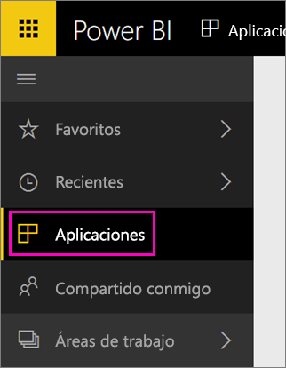

Una vez completada la importación, la nueva aplicación aparecerá en la página Aplicaciones.

1. Seleccione **Aplicaciones** en el panel de navegación de la izquierda > seleccione la aplicación.
   
     
2. Para formular una pregunta, puede escribir en el cuadro de Preguntas o haga clic en un icono para abrir el informe subyacente. 

