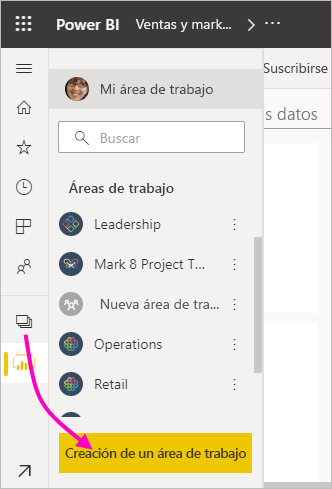
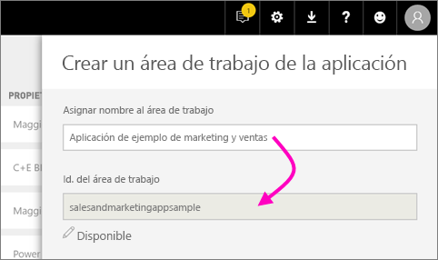
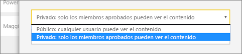
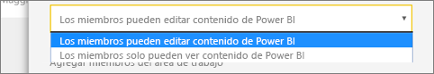
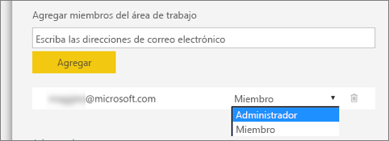

1. Comience por crear el área de trabajo. Seleccione **Áreas de trabajo** > **Crear un área de trabajo**. 
   
     
   
    Aquí colocará el contenido en el que está colaborando con sus compañeros.

2. En el banner **Va a crear un área de trabajo actualizada**, haga clic en **Revertir al área de trabajo clásica**. 

    

3. Asigne un nombre al área de trabajo. Si el **Id. de área de trabajo** correspondiente no está disponible, puede editarlo para tener un identificador único.
   
     La aplicación tendrá el mismo nombre.
   
     

3. Tiene que establecer algunas opciones. Si elige **Pública**, cualquier persona de la organización puede ver el contenido del área de trabajo. **Privada** significa que solo los miembros del área de trabajo pueden ver su contenido.
   
     
   
    No puede cambiar la configuración pública o privada una vez creado el grupo.

4. También puede elegir si los miembros pueden **editar** o tener acceso de **solo lectura**.
   
     
   
     Agregue solo personas al área de trabajo para que puedan modificar el contenido. Si solo van a ver el contenido, no las agregue al área de trabajo. Puede incluirlas cuando publique la aplicación.

5. Agregue las direcciones de correo electrónico de las personas que desea que tengan acceso al área de trabajo y seleccione **Agregar**. No se pueden agregar alias de grupo, solo individuales.

6. Decida si cada persona es un miembro o un administrador.
   
     
   
    Los administradores pueden editar el área de trabajo y agregar otros miembros. Los miembros pueden editar el contenido del área de trabajo, a menos que tengan acceso de solo lectura. Los administradores y los miembros pueden publicar la aplicación.

7. Seleccione **Guardar**.

Power BI crea el área de trabajo y la abre. Aparece en la lista de áreas de trabajo de las que es miembro. Dado que es un administrador, puede seleccionar los puntos suspensivos (...) para volver atrás y realizar cambios, agregar nuevos miembros o cambiar sus permisos.

