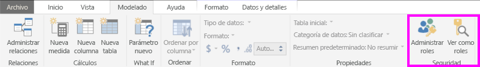
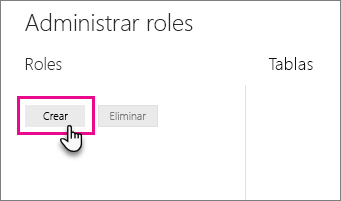
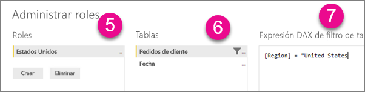
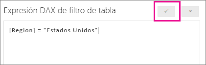

## Definir roles y reglas en Power BI Desktop
Puede definir roles y reglas en Power BI Desktop. Al publicar en Power BI, publica también definiciones de roles.

Para definir los roles de seguridad, siga estos pasos.

1. Importar datos en el informe de Power BI Desktop o configurar una conexión de DirectQuery.
   
   > [!NOTE]
   > No puede definir roles en Power BI Desktop para conexiones dinámicas de Analysis Services. Debe hacerlo en el modelo de Analysis Services.
   > 
   > 
1. Seleccione la pestaña **Modelado**.
2. Seleccione **Administrar roles**.
   
   
4. Seleccione **Crear**.
   
   
5. Proporcione un nombre para el rol. 
6. Seleccione la tabla a la que quiere aplicar una regla DAX.
7. Escriba las expresiones DAX. Esta expresión debe devolver true o false. Por ejemplo: [Id. de entidad] = "Valor".
   
   > [!NOTE]
   > Puede usar *username()* en esta expresión. Tenga en cuenta que *username()* tiene el formato *DOMINIO\usuario* en Power BI Desktop. En el servicio Power BI y en Power BI Report Server, está en el formato del nombre principal de usuario (UPN). Como alternativa, puede usar *userprincipalname()*, que siempre devuelve el usuario en el formato de su nombre principal de usuario, *username\@contoso.com*.
   > 
   > 
   
   
8. Después de haber creado la expresión DAX, puede seleccionar la casilla encima del cuadro de expresión para validar la expresión.
   
   
9. Seleccione **Guardar**.

No puede asignar usuarios a un rol en Power BI Desktop. Los asigna en el servicio Power BI. Para habilitar la seguridad dinámica en Power BI Desktop, puede usar las funciones DAX *username()* y *userprincipalname()*. Las relaciones deben estar configuradas correctamente. 

