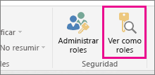
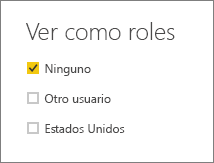
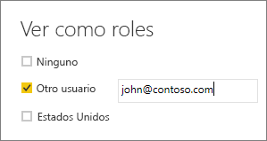

## Validar los roles en Power BI Desktop
Después de haber creado los roles, pruebe sus resultados en Power BI Desktop.

1. Seleccione **Ver como roles**. 

    

    En **Ver como roles** se muestran los roles que ha creado.

    

3. Seleccione un rol que haya creado > **Aceptar** para aplicar ese rol. Los informes representan los datos pertinentes para ese rol. 

4. También puede seleccionar **Otro usuario** y proporcionar un usuario determinado. Es mejor proporcionar el nombre principal de usuario (UPN), ya que es el que usarán el servicio Power BI y Power BI Report Server.

    

1. Seleccione **Aceptar** y el informe se representará en función de lo que pueda ver ese usuario. 

En Power BI Desktop, **Otro usuario** solo muestra resultados diferentes si está usando la seguridad dinámica basada en expresiones DAX. 

