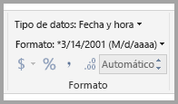
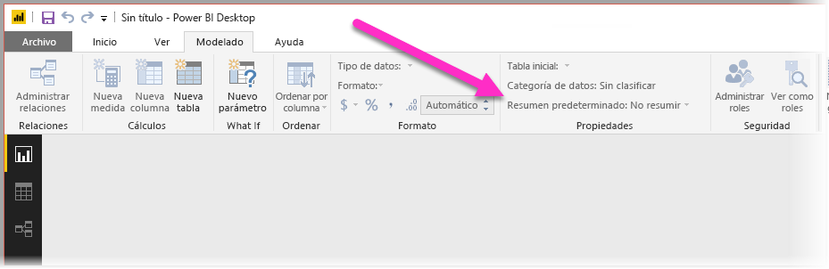
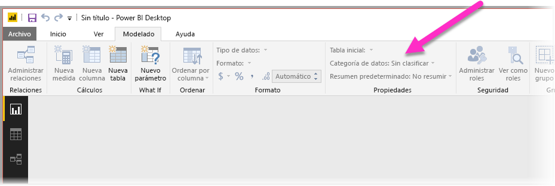
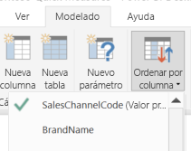

# Procedimientos recomendados para optimizar Preguntas y respuestas en Power BI
El uso del lenguaje natural y frases comunes para formular preguntas sobre los datos resulta muy eficaz. Esto es todavía más eficaz cuando los datos responden a esas preguntas, que es lo que Preguntas y respuestas de Power BI hace.

Para que Preguntas y respuestas sea capaz de interpretar correctamente la gran cantidad de preguntas que es capaz de responder, Preguntas y respuestas debe realizar suposiciones sobre el modelo. Si la estructura del modelo no cumple uno o varios de estos supuestos, debe ajustarlo. Estos ajustes para Preguntas y respuestas son las mismas optimizaciones recomendadas para cualquier modelo en Power BI, independientemente de que use o no Preguntas y respuestas.

En las siguientes secciones, se describe cómo ajustar el modelo para que funcione correctamente con Preguntas y respuestas en Power BI.

## Ajustes automáticos que hace Preguntas y respuestas

### Tablas de medida

En las versiones anteriores de Preguntas y respuestas, las tablas de medida confundirían a Preguntas y respuestas, ya que la tabla subyacente estaba desconectada. Ahora Preguntas y respuestas trabaja justo con tablas de medidas.

### Nombres de tabla en conflicto con nombres de columna

En las versiones anteriores de Preguntas y respuestas, si una tabla y una columna tuvieran el mismo nombre, la tabla tendría preferencia. Este problema se ha solucionado, por lo que ya no tiene que corregir este problema en los modelos.

## Pasos manuales para mejorar Preguntas y respuestas

### Use las nuevas herramientas de Preguntas y respuestas para corregir sus preguntas

Con las herramientas de Preguntas y respuestas, puede enseñar sus principales términos comerciales a Preguntas y respuestas, y corregir las preguntas que los usuarios finales planteen. A veces, algunas preguntas siguen sin poder resolverse porque los datos tienen la forma incorrecta o faltan datos. En este caso, lea las otras secciones a continuación que le ayudarán en la optimización. Obtenga más información sobre las [herramientas de Preguntas y respuestas](q-and-a-tooling-intro.md).

## Agregar las relaciones que faltan

Si el modelo no tiene relaciones entre tablas, ni los informes de Power BI ni Preguntas y respuestas pueden interpretar cómo combinar esas tablas. Las relaciones son la piedra angular de un modelo adecuado. Por ejemplo, no se puede preguntar por las "ventas totales de los clientes de Seattle" si falta la relación entre la tabla de *pedidos* y la de *clientes*. Las siguientes imágenes muestran ejemplos de un modelo que necesita ajustes y de un modelo que está preparado para Preguntas y respuestas. 

**Necesita ajustes**

En la primera imagen, no hay ninguna relación entre las tablas Customers (Clientes), Sales (Ventas) y Products (Productos).

**Preparado para Preguntas y respuestas**

En la primera imagen, las relaciones se definen entre las tablas.

## Cambiar el nombre de tablas y columnas

La elección de tablas y columnas es importante para Preguntas y respuestas. Por ejemplo, supongamos que tiene una tabla denominada *ResumenDeClientes* que contiene una lista de sus clientes. Tendría que hacer preguntas como "Enumerar los resúmenes de clientes de Chicago" en lugar de "Enumerar los clientes de Chicago". 

Aunque Preguntas y respuestas puede realizar una separación de palabras básica y detectar plurales, da por supuesto que los nombres de tablas y columnas reflejan con precisión su contenido.

Aquí tenemos otro ejemplo. Imagine que tiene una tabla denominada *Plantilla* que contiene nombres y apellidos y números de empleado. Tiene otra tabla llamada *Empleados* que contiene números de empleado, números de trabajo y fechas de inicio. Las personas familiarizadas con el modelo pueden entender esta estructura. Cualquier otra persona que pida el “recuento de empleados” va a obtener un recuento de las filas de la tabla “Empleados”. Es probable que el resultado no sea lo que tenían en mente, porque es un recuento de todos los trabajos que alguna vez ha tenido cada empleado. Sería mejor cambiar el nombre de esas tablas para que reflejen realmente su contenido.

**Necesita ajustes**

Los nombres de tabla, como *StoreInfo* (Información del almacén) y *Product List* (Lista de productos) deben funcionar.

**Preparado para Preguntas y respuestas**

Las tablas denominadas *Store* (Almacén) y *Products* (Products) funcionan mejor.

## Corregir los tipos de datos incorrectos

Los datos importados pueden tener tipos de datos incorrectos. En concreto, las columnas *fecha* y *número* que se importan como *cadenas* no se interpretan en Preguntas y respuestas como fechas y números. Asegúrese de seleccionar el tipo de datos correcto en el modelo de Power BI.

## Marcar las columnas año e identificador como No resumir

Power BI agrega activamente las columnas numéricas de forma predeterminada, por lo que preguntas como "total de ventas por año" pueden resultar ser un total general de las ventas junto con un total general de años. Si tiene columnas específicas para las que no desea que Power BI exhiba este comportamiento, establezca la propiedad **Default Summarization** (Resumir por) de la columna en **Don´t Summarize** (No resumir). Esté atento a las columnas **año**, **mes**, **día** e **identificador**, ya que en dichas columnas se encuentran los problemas más frecuentes. En otras columnas en las que no tiene sentido sumar, como *edad*, también puede resultar ventajoso establecer **Resumir por** en **No resumir** o en **Media**. Encontrará esta opción en la pestaña **Modelado**.

## Elegir una categoría de datos para cada columna fecha y geografía

La **categoría de datos** proporciona información semántica adicional sobre el contenido de una columna más allá de su tipo de datos. Por ejemplo, puede marcar una columna de enteros como un código postal y una columna de cadena como una ciudad, país o región, y así sucesivamente. Preguntas y respuestas usa esta información de dos maneras importantes: Para la selección de la visualización y para los sesgos del lenguaje.

Primero, Preguntas y respuestas usa la información de la **categoría de datos** para ayudar a tomar decisiones sobre qué tipo de presentación visual se va a utilizar. Por ejemplo, reconoce que las columnas con las **categorías de datos** fecha y hora suelen ser una buena elección para el eje horizontal de un gráfico de líneas o como eje de reproducción de un gráfico de burbujas. Y supone que los resultados que contienen las columnas con las **categorías de datos** geográficos pueden representarse correctamente en un mapa.

En segundo lugar, Preguntas y respuestas hace algunas suposiciones sobre cómo suelen hablar los usuarios de las columnas fecha y geografía para entender ciertos tipos de preguntas. Por ejemplo, el "cuándo" en "¿Cuándo se contrató a John Smith?" se puede asignar casi con certeza a una columna de fecha y el "Brown" en "Recuento de clientes en Brown" es más probable que sea una ciudad que un color de pelo.

## Elegir Ordenar por columna para las columnas pertinentes

La propiedad **Ordenar por columna** permite la ordenación de una columna por una columna diferente en su lugar automáticamente. Por ejemplo, cuando pregunte "Ordenar clientes por la talla de camisa", probablemente deseará que la columna Talla de camisa se ordene por el número de talla subyacente (XS, S, M, L, XL) en lugar de alfabéticamente (L, M, S, XL, XS).

## Normalizar el modelo

Puede estar tranquilo, no estamos sugiriendo que deba cambiar la forma de todo el modelo. Sin embargo, algunas estructuras son tan difíciles que no se controlan adecuadamente en Preguntas y respuestas. Si lleva a cabo una normalización básica de la estructura del modelo, la facilidad de uso de los informes de Power BI aumenta considerablemente, así como la exactitud de los resultados de Preguntas y respuestas.

Siga esta regla general: cada "cosa" única sobre la que el usuario habla debe estar representada exactamente por un objeto del modelo (tabla o columna). Por lo que, si los usuarios hablan de clientes, debe haber un objeto *cliente*. Y si los usuarios hablan de ventas, debe haber un objeto *ventas*. Parece simple, ¿verdad? Dependiendo de la forma de los datos de partida, puede serlo. Hay funcionalidades para dar forma a datos enriquecidos disponibles en el **Editor de consultas** si las necesita, aunque muchas de las transformaciones más sencillas pueden realizarse simplemente mediante cálculos en el modelo de Power BI.

Las secciones siguientes contienen algunas transformaciones comunes que es posible que deba realizar.

### Crear nuevas tablas para entidades de varias columnas

Si tiene varias columnas que actúan como una sola unidad distinta dentro de una tabla mayor, se deben dividir dichas columnas en su propia tabla. Por ejemplo, supongamos que tiene una columna de nombre de contacto, cargo del contacto y teléfono del contacto en la tabla *Compañías*. Un diseño mejor sería tener una tabla *Contactos* aparte que contenga el nombre, el cargo y el teléfono, y un vínculo que lleve de vuelta a la tabla *Compañías*. De esta forma, es mucho más fácil realizar preguntas sobre los contactos por una parte y por la otra sobre las compañías de las que son el contacto, y mejora la flexibilidad de presentación.

**Necesita ajustes**

**Preparado para Preguntas y respuestas**

### Dinamizar para eliminar bolsas de propiedades

Si tiene *bolsas de propiedades* en el modelo, debe reestructurarlos para tener una única columna por cada propiedad. Las bolsas de propiedades, aunque resultan útiles para administrar un gran número de propiedades, sufren de una serie de limitaciones inherentes para la que ni Power BI ni Preguntas y respuestas están diseñados para solucionar.

Por ejemplo, considere una tabla *DatosDemográficosCliente* con las columnas Identificador del cliente, Propiedad y Valor, donde cada fila representa una propiedad diferente del cliente (por ejemplo: edad, estado civil, ciudad, etcétera). Sobrecargar el significado de la columna Valor en función del contenido de la columna Propiedad hace imposible que Preguntas y respuestas interprete la mayoría de las consultas que hacen referencia a ella. Una pregunta sencilla, como "Mostrar la edad de cada cliente" podría funcionar, ya que podría interpretarse como "Mostrar los clientes y datos demográficos de cliente donde la propiedad es edad". Sin embargo, la estructura del modelo simplemente no admite preguntas ligeramente más complejas, como "edad media de los clientes en Chicago". Aunque los usuarios que crean directamente informes de Power BI a veces pueden encontrar maneras interesantes de obtener los datos que están buscando, Preguntas y respuestas solo funciona cuando cada columna tiene solo un único significado.

**Necesita ajustes**

**Preparado para Preguntas y respuestas**

### Unir para eliminar particiones

Si ha creado particiones en los datos en varias tablas o ha dinamizado valores en varias columnas, será difícil o imposible que los usuarios puedan realizar algunas operaciones comunes. Considere en primer lugar una creación de particiones de una tabla típica: una tabla *Ventas2000-2010* y una tabla *Ventas2011-2020*. Si todos los informes importantes están restringidos a una década específica, probablemente lo pueda dejar de este modo para los informes de Power BI. Sin embargo, la flexibilidad de Preguntas y respuestas dará lugar a que los usuarios esperen respuestas a preguntas como "ventas totales por año". Para que esta consulta funcione, debe unir los datos en una sola tabla del modelo de Power BI.

De igual forma, considere una columna de valor dinamizado típica: una tabla *RecorridoLibro* que contiene las columnas Autor, Libro, Ciudad1, Ciudad2 y Ciudad3. Con una estructura como esta, incluso preguntas sencillas como "recuento de libros por ciudad" no se pueden interpretar correctamente. Para que esta consulta funcione, debe crear una tabla *CiudadesRecorridoLibro* independiente que una los valores de ciudad en una sola columna.

**Necesita ajustes**

**Preparado para Preguntas y respuestas**

### División de columnas con formato

Si el origen desde el que se importan los datos contiene columnas con formato, los informes de Power BI (y Preguntas y respuestas) no toman el interior de la columna para analizar su contenido. Por tanto, si tiene una columna **Dirección completa**, por ejemplo, que contiene la dirección, ciudad y país, debería dividirla en las columnas Dirección, Ciudad y País para que los usuarios puedan consultarlas individualmente.

**Necesita ajustes**

**Preparado para Preguntas y respuestas**

De forma similar, si tiene columnas de nombre completo para una persona, agregue las columnas **Nombre** y **Apellidos** por si algún usuario desea formular preguntas mediante nombres parciales. 

### Creación de nuevas tablas para columnas de varios valores

De modo similar, si el origen desde el que se importan los datos contiene columnas con varios valores, los informes de Power BI (y Preguntas y respuestas) no toman el interior de la columna para analizar su contenido. Por lo que si tiene, por ejemplo, una columna Compositor que contiene los nombres de varios compositores de una canción, debería dividirla en varias filas en una tabla *Compositores* independiente.

**Necesita ajustes**

**Preparado para Preguntas y respuestas**

### Desnormalizar para eliminar las relaciones inactivas

La única excepción a la regla "la normalización es mejor" se produce cuando hay más de una ruta para ir de una tabla a otra. Por ejemplo, supongamos que tiene una tabla *Vuelos* con las columnas Id.CiudadOrigen e Id.CiudadDestino, cada una de las cuales está relacionada con la tabla *Ciudades*. Una de esas relaciones debe marcarse como inactiva. Dado que en Preguntas y respuestas solo se usan relaciones activas, no podrá realizar preguntas sobre el origen o el destino, en función de lo que elija. En cambio, si desnormaliza las columnas de nombre de ciudad de la tabla *Vuelos*, podrá hacer preguntas como: "enumerar los vuelos para mañana con ciudad de origen Seattle y ciudad de destino San Francisco".

**Necesita ajustes**

**Preparado para Preguntas y respuestas**

### Agregar sinónimos a tablas y columnas

Este paso se aplica específicamente a Preguntas y respuestas (y no a los informes de Power BI en general). Los usuarios suelen tener una variedad de términos que se usan para hacer referencia a la misma cosa, como ventas totales, ventas netas o total de ventas netas. Puede agregar estos sinónimos a tablas y columnas en el modelo de Power BI. 

Este paso puede ser importante. Incluso con nombres de columnas y tablas sencillos, los usuarios de Preguntas y respuestas formulan preguntas utilizando el vocabulario que les viene a la mente. No eligen de una lista predefinida de columnas. Cuantos más sinónimos significativos agregue, mejor será la experiencia de los usuarios con el informe. Para agregar sinónimos, en Power BI Desktop, vaya a la vista de modelo, seleccione la pestaña Modelado y seleccione un campo o una tabla. En el panel Propiedades se muestra el cuadro **Sinónimos**, donde puede agregar sinónimos.

 Tenga cuidado al agregar sinónimos. Agregar el mismo sinónimo a más de una columna o tabla introduce ambigüedad. Preguntas y respuestas usa el contexto siempre que sea posible para elegir entre sinónimos ambiguos, pero no todas las preguntas tienen suficiente contexto. Por ejemplo, cuando el usuario pregunta "recuento de los clientes", si tiene tres elementos con el sinónimo "cliente" en el modelo, podría no obtener la respuesta que está buscando. En estos casos, asegúrese de que el sinónimo principal es único, ya que es lo que se usa en la redefinición. Puede alertar al usuario de la ambigüedad (por ejemplo, una redefinición de "mostrar el número de registros de clientes archivados") y mostrar sugerencias sobre lo que desean preguntar de manera diferente.
