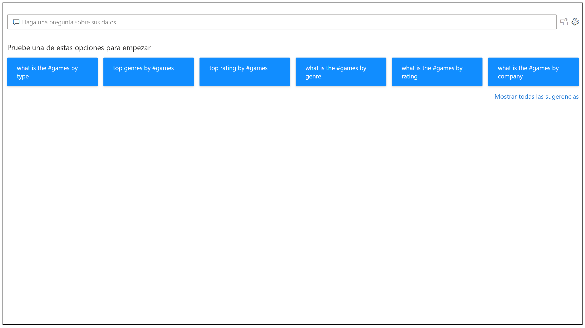
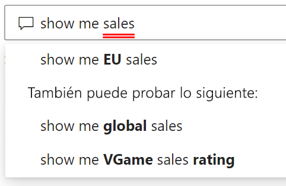
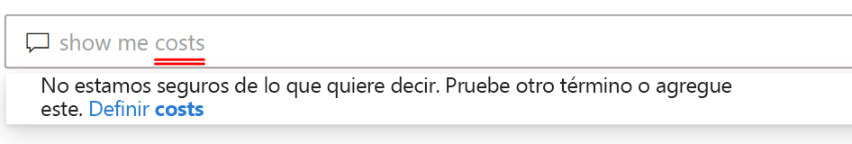

# Introducción a Preguntas y respuestas de Power BI

A veces, la manera más rápida de obtener una respuesta a partir de los datos es realizar una búsqueda en los datos con un lenguaje natural. La característica Preguntas y respuestas de Power BI le permite explorar los datos con sus propias palabras mediante lenguaje natural. Preguntas y respuestas es una característica interactiva, incluso divertida. A menudo, una pregunta conduce a otras a medida que las visualizaciones revelan rutas interesantes. La formulación de la pregunta es solo el principio. Recorra sus datos, perfeccione o amplíe su pregunta, descubra valiosa información nueva, profundice al máximo en los detalles y obtenga una visión más amplia. La experiencia es interactiva y rápida, con tecnología de almacenamiento en memoria. 

Preguntas y respuestas de Power BI es gratis y está disponible para todos los usuarios. En Power BI Desktop, los diseñadores de informes pueden usar Preguntas y respuestas para explorar los datos y crear visualizaciones. En el servicio Power BI, todo el mundo puede explorar los datos con Preguntas y respuestas. Si tiene permisos para editar un panel o un informe, también puede anclar los resultados de Preguntas y respuestas.

## Uso de Preguntas y respuestas

Incluso antes de comenzar a escribir, Preguntas y respuestas muestra una nueva pantalla con sugerencias que le ayudarán a realizar la pregunta. Comience con una de las preguntas sugeridas o escriba sus propias preguntas. Preguntas y respuestas admite una amplia gama de preguntas, entre las que se incluyen, entre otras:

- **Formular preguntas naturales** ¿Qué ventas tienen el mayor beneficio?
- **Usar el filtrado de fechas relativas** Mostrar las ventas del último año
- **Devolver solo los N principales** Los 10 productos principales por ventas
- **Proporcionar un filtro** Mostar ventas en EE. UU.
- **Proporcionar condiciones complejas** Mostar ventas donde la categoría de producto es la categoría 1 o la categoría 2
- **Devolver un objeto visual específico** Mostar ventas por producto como gráfico circular
- **Usar agregaciones complejas** Mostar la mediana de las ventas por producto
- **Ordenar resultados** Mostar los 10 países principales por ventas ordenadas por código de país
- **Comparar datos** Mostar fecha por total de ventas frente a costo total
- **Ver tendencias** Mostar ventas a lo largo del tiempo

### Autocompletar

A medida que escribe su pregunta, Preguntas y respuestas de Power BI muestra sugerencias oportunas y contextuales para ayudarle a ser productivo rápidamente con el lenguaje natural. A medida que escribe, obtiene comentarios y resultados inmediatos. La experiencia es similar a escribir en un motor de búsqueda.

### Subrayados en color rojo y azul

Preguntas y respuestas muestra palabras con subrayados que le ayudarán a ver las palabras que el sistema entendió y las que no reconoció. Un subrayado azul sólido indica que el sistema ha encontrado una coincidencia correcta de la palabra con un campo o valor del modelo de datos. En el ejemplo siguiente se muestra que Preguntas y respuestas ha reconocido la palabra *Ventas de la UE*.

A menudo, cuando escribe una palabra en Preguntas y respuestas, se marca con un subrayado rojo. Un subrayado rojo puede indicar uno de los dos posibles problemas. El primer tipo de problema se clasifica como *confianza baja*. Si escribe una palabra no precisa o ambigua, el campo aparece subrayado en rojo. Un ejemplo podría ser la palabra "Ventas". Varios campos pueden contener la palabra "Ventas", por lo que el sistema utiliza un subrayado rojo para pedirle que elija el campo que desea. Otro ejemplo de confianza baja podría ser si escribe la palabra "Área", pero la columna que coincide es "Región". Preguntas y respuestas de Power BI reconoce palabras que significan lo mismo, gracias a la integración con Bing y Office. Preguntas y respuestas subraya la palabra en rojo para que sepa que no es una coincidencia directa.

El segundo tipo de problema se da cuando Preguntas y respuestas no reconoce la palabra. Podría encontrar este problema con un término específico del dominio que no se menciona en ningún lugar de los datos o si los campos de datos se denominan incorrectamente. Un ejemplo podría ser el uso de la palabra "Costos", aunque no exista en ningún lugar de los datos. La palabra está en el diccionario, pero Preguntas y respuestas marca este término con un subrayado rojo.

> [!NOTE]
> Puede personalizar los colores de subrayado azul y rojo en el panel **Formato visual** de Preguntas y respuestas. Además, en el artículo [Herramientas de Preguntas y respuestas](q-and-a-tooling-teach-q-and-a.md) se explica *Enseñanza de Preguntas y respuestas*, que se usa para definir los términos que Preguntas y respuestas no reconoció.

### Resultados de la visualización

A medida que escribe su pregunta, Preguntas y respuestas intenta interpretar y visualizar la respuesta al instante. Como parte de las actualizaciones más recientes, Preguntas y respuestas ahora intenta interpretar la pregunta y trazar los campos automáticamente en el eje correcto. Por ejemplo, si escribe "Ventas por año", Preguntas y respuestas detecta que el año es un campo de fecha y siempre da prioridad a la colocación de este campo en el eje X. Si desea cambiar el tipo de visualización, escriba "como *tipo de gráfico* después de la pregunta. Actualmente, Preguntas y respuestas admite estos tipos de visualizaciones:

- Gráfico de líneas
- Gráfico de barras
- Matriz
- Tabla
- Tarjeta
- Área
- Gráfico circular
- Gráfico de dispersión o de burbujas
 

## Agregar Preguntas y respuestas a un informe

Puede agregar Preguntas y respuestas a un informe en Power BI Desktop o el servicio Power BI de dos maneras diferentes:

- Agregar un objeto visual Preguntas y respuestas.
- Agregar un botón Preguntas y respuestas.

Para agregar el objeto visual Preguntas y respuestas a un informe, seleccione el nuevo icono de **Preguntas y respuestas** y, a continuación, seleccione el nuevo objeto visual Preguntas y respuestas en el panel Visualización. O bien, haga doble clic en cualquier lugar del lienzo del informe para insertar el objeto visual Preguntas y respuestas.

Para agregar un botón, en la cinta de opciones **Inicio**, seleccione **Botones** > **Preguntas y respuestas**. Puede personalizar por completo la imagen del botón Preguntas y respuestas.

> [!NOTE]
> Al iniciar Preguntas y respuestas desde el botón, todavía usa el antiguo Preguntas y respuestas. Las versiones posteriores de Power BI cambiarán este comportamiento.

## Uso de Preguntas y respuestas para paneles

De forma predeterminada, Preguntas y respuestas está disponible en la parte superior de los paneles. Para usar Preguntas y respuestas, escriba en el cuadro **Formular una pregunta sobre los datos**.

## Pasos siguientes

Puede integrar el lenguaje natural en los informes de varias maneras. Para más información, consulte estos artículos:

* [Objeto visual Preguntas y respuestas](../visuals/power-bi-visualization-q-and-a.md)
* [Procedimientos recomendados de Preguntas y respuestas](q-and-a-best-practices.md)
