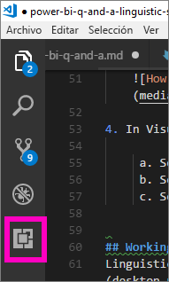
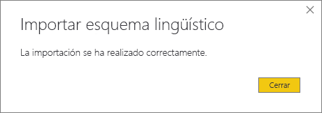

# <a name="edit-qa-linguistic-schema-and-add-phrasings-in-power-bi-desktop"></a>Editar el esquema lingüístico de preguntas y respuestas y agregar expresiones en Power BI Desktop 
El uso del lenguaje natural y frases comunes para formular preguntas sobre los datos resulta muy eficaz. Más eficaz aún cuando sus datos responden. Cuando se formula una pregunta a las preguntas y respuestas de Power BI, se realiza el máximo esfuerzo por responderla correctamente, Pero, para mejorar aún más las interacciones de Preguntas y respuestas, puede mejorar las respuestas. Una forma consiste en editar el esquema lingüístico. 

Todo empieza con los datos de empresa.  Cuanto mejor sea el modelo de datos, más fácil será para los usuarios obtener respuestas de calidad. Una forma de mejorar el modelo consiste en agregar un esquema lingüístico que defina y clasifique la terminología y las relaciones entre los nombres de tabla y de columna del conjunto de datos. Power BI Desktop es donde se administran los esquemas lingüísticos. 

Las preguntas y respuestas conllevan dos procesos:  El primero es la preparación o *modelado*.  El segundo es la formulación de preguntas y exploración de datos, o *consumo*. En algunas compañías, los empleados en puestos de *modelador de datos* o administrador de TI pueden ser quienes se encarguen de ensamblar los conjuntos de datos, crear los modelos de datos y publicarlos en Power BI.  Otro grupo de empleados puede ser el que "consuma" los datos en línea.  En otras empresas, en cambio, estos roles son intercambiables. 

Este artículo está destinado a los modeladores de datos, las personas que optimizan los conjuntos de datos para proporcionar la mejor opción de resultados de Preguntas y respuestas. 

## <a name="what-is-a-linguistic-schema"></a>¿Qué es un esquema lingüístico?
En un esquema lingüístico se describen términos y frases que las preguntas y respuestas deben comprender con respecto a los objetos de un conjunto de datos, como partes de oraciones, sinónimos y expresiones que guardan relación con el conjunto de datos en cuestión. Al importar un conjunto de datos o conectarse a él, Power BI crea un esquema lingüístico basado en la estructura de dicho conjunto de datos. Cuando se formula una pregunta a preguntas y respuestas, se buscan coincidencias y relaciones en los datos para averiguar cuál es el propósito de la pregunta. Así, por ejemplo, se buscan sustantivos, verbos, adjetivos, expresiones y otros elementos. También se buscan posibles relaciones, por ejemplo, qué columnas son complementos de un verbo. 

Probablemente esté familiarizado con las partes de la oración (si no, vea abajo), pero *expresión* puede ser un término nuevo.  Por expresión se entiende la forma en la que hablamos (o creamos *expresiones*) sobre las relaciones entre elementos. Por ejemplo, para describir la relación entre clientes y productos, podríamos decir "los clientes compran productos"; para describir la relación entre cliente y edad, podríamos decir "la edad señala los años de cada cliente", o, para describir la relación entre clientes y números de teléfono, podríamos decir simplemente "los clientes tienen números de teléfono".

Estas expresiones pueden presentarse en una variedad de formas y tamaños. Así, algunas encajan directamente con relaciones en el modelo de datos; otras tienen que ver con las columnas y las tablas que contienen, y otras guardan relación con varias tablas y columnas en relaciones complejas. En todos los casos, describen cómo podemos relacionar cosas usando términos cotidianos.

Los esquemas lingüísticos se guardan en formato .yaml. Este formato está relacionado con el ampliamente conocido formato JSON, si bien proporciona una sintaxis más flexible y fácil de leer. Los esquemas lingüísticos se pueden editar, exportar e importar a Power BI Desktop.

## <a name="prerequisites"></a>Requisitos previos

- Si aún no ha leído el artículo sobre cómo [mejorar el modelo de datos de preguntas y respuestas](q-and-a-best-practices.md), probablemente convenga hacerlo antes de nada. En él encontrará muchas sugerencias para diseñar y mejorar el modelo de datos, así como una sección importante sobre cómo agregar sinónimos.  
- Descargue los [archivos .yaml y .pbix de ejemplo](https://go.microsoft.com/fwlink/?linkid=871858).   
- Instale un editor de archivos .yaml. Se recomienda usar [Visual Studio Code](https://code.visualstudio.com/).

### <a name="set-up-an-editor-for-yaml-files"></a>Configuración de un editor de archivos .yaml
Se recomienda usar Visual Studio Code para editar los archivos .yaml de un esquema lingüístico. Visual Studio Code admite archivos .yaml de fábrica y se puede ampliar para garantizar expresamente el formato de esquema lingüístico de Power BI.
1. Instale [Visual Studio Code](https://code.visualstudio.com/).    

2. Seleccione el esquema lingüístico de ejemplo que guardó anteriormente: [archivo .yaml](https://go.microsoft.com/fwlink/?linkid=871858) (SummerOlympics.lsdl.yaml).    
4. Seleccione **Visual Studio Code** y **Always use this app to open .yaml files** (Usar siempre esta aplicación para abrir archivos .yaml).

    

4. En Visual Studio Code, instale la extensión de compatibilidad de YAML de Red Hat.    
    a. Seleccione la pestaña **Extensiones** (la última a la izquierda) o presione Ctrl+Mayús+X.    
        
    b. Busque "yaml" y seleccione **YAML Support by Red Hat** (Compatibilidad de YAML de Red Hat) en la lista.    
    c. Seleccione **Instalar > Volver a cargar**.


## <a name="working-with-linguistic-schemas"></a>Trabajar con esquemas lingüísticos

Hay dos maneras de trabajar con esquemas lingüísticos. Una forma consiste en editar, importar y exportar el archivo .yaml con la cinta de opciones de Power BI Desktop. Esta manera se trata en el artículo [Experiencia con las herramientas de Preguntas y respuestas](q-and-a-tooling-intro.md) de Power BI. No tendrá que abrir el archivo .yaml para mejorar Preguntas y respuestas. 

Otro método para editar un esquema lingüístico es exportar y editar el archivo .yaml directamente.  Cuando se edita el archivo .yaml de un esquema lingüístico, etiquetamos las columnas de la tabla como elementos gramaticales diferentes y definimos las palabras que normalmente se usarían para plantear una pregunta. Por ejemplo, se indican las columnas que son el asunto y el objeto del verbo. Se agregan palabras alternativas que los compañeros pueden usar para hacer referencia a tablas, columnas y medidas en el modelo. 


Para poder editar un esquema lingüístico, hay que abrirlo en Desktop (exportarlo) desde Power BI Desktop. Se considera importación cuando el archivo .yaml se guarda de nuevo en la misma ubicación.  Pero también se pueden importar otros archivos .yaml en su lugar.  Este es el caso, por ejemplo, si ya tenemos un conjunto de datos parecido al que hemos dedicado un gran esfuerzo agregándole fragmentos de oraciones, identificando relaciones y creando expresiones y sinónimos. Puede usar ese archivo .yaml en un archivo de Power BI Desktop distinto. 

Las preguntas y respuestas usan toda esta información junto con las mejoras que hayamos realizado para proporcionar una mejor respuesta, funciones de autocompletar y resumen de las preguntas.

## <a name="edit-a-linguistic-schema"></a>Editar un esquema lingüístico
Cuando se exporta el esquema lingüístico desde Power BI Desktop en primer lugar, un motor de preguntas y respuestas genera automáticamente la mayor parte o todo el contenido del archivo. Estas entidades, palabras (sinónimos), relaciones y expresiones generadas se designan con una etiqueta **State: Generated** (Estado: Generado). Se incluyen en el archivo principalmente con fines informativos, pero pueden ser un punto de partida útil para realizar sus propios cambios. 

> [!NOTE]
> El archivo .yaml de ejemplo de este tutorial no contiene etiquetas **State: Generated** (Estado: Generado) o **State: Deleted** (Estado: Eliminado), puesto que se ha preparado especialmente para este tutorial. Para ver estas etiquetas, abra un archivo .pbix sin editar en la vista Relaciones y exporte el esquema lingüístico.


Al importar el archivo de esquema lingüístico en Power BI Desktop, cualquier elemento marcado como **State: Generated** (Estado: generado) se omite y, posteriormente, se vuelve a generar. Por lo tanto, si desea cambiar parte del contenido generado, quite también la etiqueta **State: Generated** (Estado: Generado). De forma similar, si desea quitar algún contenido generado, deberá cambiar la etiqueta **State: Generated** (Estado: Generado) a **State: Deleted** (Estado: Eliminado) para que no se regenere cuando importe el archivo de esquema lingüístico.

### <a name="export-then-import-a-yaml-file"></a>Exportación e importación de un archivo .yaml

1. Abra el conjunto de datos en la vista Modelo de Power BI Desktop. 
2. En la pestaña **Modelado**, seleccione **Esquema lingüístico** > **Exportar esquema lingüístico**.
3. Guárdelo. El nombre de archivo finaliza con .lsdl.yaml.
4. Ábralo en Visual Code u otro editor.
4. En la pestaña **Modelado** de Power BI Desktop, seleccione **Esquema lingüístico** > **Importar esquema lingüístico**. 
6. Vaya a la ubicación donde guardó el archivo .yaml editado y selecciónelo. Aparecerá un mensaje que le indicará que el archivo .yaml del esquema lingüístico se ha importado correctamente.

    

## <a name="phrasings-in-the-linguistic-schema"></a>Agregar expresiones al esquema lingüístico
De nuevo, por "expresión" se entiende la forma en la que hablamos ("frases") sobre las relaciones entre elementos. Por ejemplo, para describir la relación entre clientes y productos, podríamos decir "los clientes compran productos";

## <a name="where-do-phrasings-come-from"></a>¿De dónde proceden las expresiones?
Power BI agrega muchas expresiones sencillas al esquema lingüístico automáticamente en función de la estructura del modelo y de algunas suposiciones basadas en los nombres de columna. Por ejemplo:
- La mayoría de las columnas están relacionadas con su tabla contenedora, con expresiones simples como "los productos tienen descripciones".
- Las relaciones de modelo dan como resultado expresiones predeterminadas para ambas direcciones de la relación, como "los pedidos tienen productos" y "los productos tienen pedidos".
- Basándose en los nombres de columna, algunas relaciones de modelo son capaces de dar con expresiones predeterminadas más complejas, como "los pedidos se han enviado a ciudades".

Con todo, los usuarios tienen infinidad de formas de expresarse sobre las cosas que no es posible adivinar en las preguntas y respuestas. Por lo tanto, conviene agregar sus propias expresiones manualmente.

## <a name="why-add-phrasings"></a>¿Por qué agregar expresiones?
El primer motivo para agregar una expresión es porque se define un término nuevo. Por ejemplo, si queremos poder pedir "contar los clientes de más edad", antes hay que enseñar a las preguntas y respuestas lo que significa "edad". Para ello, agregaríamos una expresión como "la edad señala los años de cada cliente".

La segunda razón para agregar una expresión es porque acaba con la ambigüedad. La búsqueda básica de palabras clave es capaz de discernir esto solo cuando las palabras tienen más de un significado. Por ejemplo, "vuelos a Chicago" no es lo mismo que "vuelos desde Chicago", pero en Preguntas y respuestas no se podrá saber a cuál nos estamos refiriendo a menos que agreguemos las expresiones "los vuelos proceden de las ciudades de salida" y "los vuelos van a las ciudades de llegada". De igual modo, Preguntas y respuestas solo comprenderá la distinción entre "coches que John vende a Mary" y "coches que John ha comprado a Mary" si agregamos las expresiones "los clientes compran coches a empleados" y "los empleados venden coches a clientes".

El último motivo para agregar una expresión es porque mejora la reformulación. Así, en vez de plantear algo impreciso a Preguntas y respuestas del tipo "Mostrar los clientes y sus productos", sería mucho más claro si se dijera "Mostrar los clientes y los productos que han comprado" o "Mostrar los clientes y los productos que han revisado", dependiendo de cómo se entienda la pregunta. Si se agregan expresiones personalizadas, las reformulaciones serán más explícitas e inequívocas.


## <a name="kinds-of-phrasings"></a>Tipos de expresiones
Para entender los distintos tipos de expresiones, antes es preciso recordar algunos términos de gramática básicos:
- Un *sustantivo* es una persona, lugar o cosa. 
    Ejemplos: coche, niño, Martín, condensador de flujo
- Un *verbo* es una acción, estado o condición. 
    Ejemplos: sombrear, estallar, devorar, expulsar
- Un *adjetivo* es una palabra descriptiva que modifica un sustantivo. 
    Ejemplos: potente, mágico, dorado, robado
- Una *preposición* es una palabra que se usa antes de un sustantivo para relacionarlo con un sustantivo, verbo o adjetivo anterior. Ejemplos: de, para, sobre, desde.
-  Un *atributo* es una cualidad o característica de algo.
-  Un *nombre* es una palabra o un conjunto de palabras por el que se conoce o denomina a una persona, animal lugar o cosa.   


### <a name="attribute-phrasings"></a>Expresiones de atributo
Las expresiones de atributo son el motor de las preguntas y respuestas, y se usan cuando una cosa actúa como un atributo de otra. Son simples y sencillas, y realizan la mayor parte del "trabajo pesado" cuando no se han definido frases más sutiles o detalladas. Las expresiones de atributos se describen mediante el verbo básico "tener" ("los productos tienen categorías" y "los países anfitriones tienen ciudades anfitrionas"). También permiten automáticamente preguntas con las preposiciones "de" y "para" ("categorías de productos", "complementos para productos"). Las expresiones de atributo se usan en preguntas de este tipo:

- ¿Qué clientes tienen pedidos?
- Enumerar ciudades por país en ascendente
- Mostrar pedidos que tienen té
- Enumerar clientes con pedidos
- ¿Qué es la categoría de cada producto?
- Contar pedidos de Robert King    

Power BI genera la gran mayoría de expresiones de atributo necesarias en el modelo, en función de las relaciones del modelo y el contenido de la tabla o columna. Normalmente, no es necesario crearlas personalmente.
Este es un ejemplo del aspecto de una expresión de atributo del esquema lingüístico:

```json
product_has_category:
  Binding: {Table: Products}
  Phrasings:
  - Attribute: {Subject: product, Object: product.category}
```
 
### <a name="name-phrasings"></a>Expresiones de nombre
Las expresiones de nombre son útiles si el modelo de datos tiene una tabla que contiene objetos con nombre, como nombres de deportistas y nombres de cliente. Por ejemplo, una expresión "los nombres de producto son nombres de producto" es fundamental para poder usar nombres de producto en preguntas. Las expresiones de nombre también permiten el funcionamiento de "denominado" como un verbo (por ejemplo, "enumerar los clientes denominados John Smith"). Sin embargo, es más importante sobre todo cuando se usa junto con otras expresiones para permitir que un valor de nombre se pueda usar para hacer referencia a una fila en concreto de la tabla. Por ejemplo, en "Clientes que han comprado té", Preguntas y respuestas es capaz de distinguir que el valor "té" hace referencia a la fila completa de la tabla de productos, y no simplemente a un valor de la columna de nombres de productos. Las expresiones de nombre se usan en preguntas de este tipo:    
- ¿Qué empleados tienen por nombre Óscar Mota?
- ¿Quién tiene por nombre Pedro Armijo?
- Deportes de Fernand De Montigny
- Contar deportistas cuyo nombre es Isabel
- ¿Qué ha comprado Óscar Mota?

Suponiendo que utiliza una convención de nomenclatura que distingue entre mayúsculas y minúsculas para las columnas de nombre en el modelo (por ejemplo, "Nombre" o "NombreProducto" en lugar de "NbrPrd"), Power BI genera la mayoría de expresiones de nombre necesarias en el modelo automáticamente, por lo que normalmente no es necesario crearlas personalmente.

Este es un ejemplo del aspecto de una expresión de nombre del esquema lingüístico:

```json
employee_has_name:
  Binding: {Table: Employees}
  Phrasings:
  - Name:
      Subject: employee
      Name: employee.name
```

 
### <a name="adjective-phrasings"></a>Expresiones de adjetivo
Las expresiones de adjetivo definen los nuevos adjetivos que se usan para describir cosas en el modelo. Por ejemplo, la expresión "los clientes satisfechos son clientes con una puntuación > 6" es necesaria para poder formular cosas como "enumerar clientes satisfechos en Des Moines". Existen varias formas de componer expresiones de adjetivo para su uso en diversas situaciones.

Las *expresiones de adjetivo sencillas* definen un adjetivo nuevo según una condición, como, por ejemplo, "los productos desusados son productos donde estado = D". Las expresiones de adjetivo sencillas se usan en preguntas de este tipo:
- ¿Qué productos están desusados?
- Enumerar productos desusados
- Enumerar pomos de puerta dorados
- Productos que están pendientes

Este es un ejemplo del modo en que una expresión de adjetivo sencilla busca en el esquema lingüístico:

product_is_discontinued:

```json
Binding: {Table: Products}
  Conditions:
  - Target: product.discontinued
    Operator: Equals
    Value: true
  Phrasings:
  - Adjective:
      Subject: product
      Adjectives: [discontinued]
```

Las *expresiones de adjetivo de medida* definen un adjetivo nuevo basado en un valor numérico que indica el grado en el que dicho adjetivo se aplica, como "las longitudes indican cómo de largos son los ríos" y "las regiones pequeñas tienen áreas de terreno pequeñas". Las expresiones de adjetivo de medida se usan en preguntas de este tipo:
- Enumerar ríos largos
- ¿Qué ríos son los más largos?
- Enumerar las regiones o países más pequeños que ganaron el oro en baloncesto
- ¿Cómo es de largo el río Bravo?

Este es un ejemplo del modo en que una expresión de adjetivo de medida busca en el esquema lingüístico:

river_has_length:

 ```json
Binding: {Table: Rivers}
  Phrasings:
  - Adjective:
      Subject: river
      Adjectives: [long]
      Antonyms: [short]
      Measurement: river.length
```

Las *expresiones de adjetivo dinámicas* definen un conjunto de adjetivos nuevos según los valores de una columna en el modelo, como "los colores describen productos" y "los eventos tienen géneros de evento". Las expresiones de adjetivo dinámicas se usan en preguntas de este tipo:
- Enumerar productos rojos
- ¿Qué productos son verdes?
- Mostrar eventos deportivos para mujeres
- Contar problemas que están activos

Este es un ejemplo del modo en que una expresión de adjetivo dinámico busca en el esquema lingüístico:

product_has_color:
```json
Binding: {Table: Products}
  Phrasings:
  - DynamicAdjective:
      Subject: product
      Adjective: product.color
```

 
### <a name="noun-phrasings"></a>Expresiones de sustantivo
Las expresiones de sustantivo definen nuevos sustantivos que describen subconjuntos de cosas en el modelo. Incluyen a menudo algún tipo de condición o medida específica del modelo. Por ejemplo, en un modelo Olimpiadas, seguramente lo mejor sea agregar expresiones que distinguen campeones de medallistas, deportes de pelota de deportes de agua, equipos de individuos, las distintas categorías de deportistas por edad (juvenil, sénior), etc. En una base de datos de películas, probablemente queramos agregar expresiones de sustantivo como "fiascos son películas donde los beneficios netos < 0", de forma que podamos formular frases como "número de fiascos por año". Existen dos formas de componer expresiones de sustantivo para su uso en diversas situaciones.

Las *expresiones de sustantivo sencillas* definen un sustantivo nuevo según una condición, como "los contratistas son empleados donde tiempo completo = false" y "campeón es un deportista con un recuento de medallas > 5". Las expresiones de sustantivo sencillas se usan en preguntas de este tipo:

- ¿Qué empleados son contratistas?
- Contar contratistas en Portland
- ¿Cuántos campeones hubo en 2016?

Este es un ejemplo del modo en que una expresión de nombre sencilla busca en el esquema lingüístico:

employee_is_contractor:

```json
Binding: {Table: Employees}
  Conditions:
  - Target: employee.full_time
    Operator: Equals
    Value: false
  Phrasings:
  - Noun:
      Subject: employee
      Nouns: [contractor]
```

Las *expresiones de sustantivo dinámicas* definen un conjunto de sustantivos nuevos según los valores de una columna del modelo, como "los puestos de trabajo definen subconjuntos de empleados". Las expresiones de sustantivo dinámicas se usan en preguntas de este tipo:

- Enumerar cajeros en Chicago
- ¿Qué empleados son camareros?
- Enumerar árbitros de 1992

Este es un ejemplo del modo en que una expresión de sustantivo dinámica busca en el esquema lingüístico employee_has_job:

 ```json
Binding: {Table: Employees}
  Phrasings:
  - DynamicNoun:
      Subject: employee
      Noun: employee.job
```

### <a name="preposition-phrasings"></a>Expresiones preposicionales
Las expresiones preposicionales sirven para describir con preposiciones el modo en que las cosas se relacionan en el modelo. Por ejemplo, la expresión "las ciudades están en países" mejora la comprensión de frases como "contar las ciudades en Washington". Algunas expresiones preposicionales se crean automáticamente cuando una columna se reconoce como una entidad geográfica. Las expresiones preposicionales se usan en preguntas de este tipo:

- Contar clientes en Nueva York
- Enumerar libros sobre lingüística
- ¿En qué ciudad está Robert King?
- ¿Cuántos libros son de Stephen Pinker?
 
Este es un ejemplo del modo en que una expresión preposicional busca en el esquema lingüístico customers_are_in_cities:

 ```json
Binding: {Table: Customers}
  Phrasings:
  - Preposition:
      Subject: customer
      Prepositions: [in]
      Object: customer.city
```

 
### <a name="verb-phrasings"></a>Expresiones verbales
Las expresiones verbales sirven para describir con verbos el modo en que las cosas se relacionan en el modelo. Por ejemplo, la expresión "los clientes compran productos" mejora la comprensión de preguntas como "¿quién ha comprado queso?" y "¿qué ha comprado John?". Las expresiones verbales son los tipos de expresión más flexibles de todas en tanto suelen relacionar entre sí más de dos cosas, como en "los empleados venden productos a clientes". Las expresiones verbales se usan en preguntas de este tipo:

- ¿Quién vende qué a quién?
- ¿Qué empleado ha vendido té a John?
- ¿A cuántos clientes ha vendido té Mary?
- Enumerar los productos que Mary ha vendido a John.
- ¿Qué productos desusados han vendido empleados de Boston a clientes de Chicago?

Las expresiones verbales también pueden contener frases preposicionales, lo que las hace más flexibles aún, como "los deportistas ganan medallas en competiciones" o "los clientes reciben reembolsos de productos". Las expresiones verbales con expresiones preposicionales se usan en preguntas de este tipo:

- ¿Cuántos deportistas han ganado una medalla de oro en Barcelona 92?
- ¿Qué clientes han recibido un reembolso por la compra de queso?
- ¿En qué competición ha ganado una medalla de bronce Danell Leyva?

Algunas expresiones verbales se crean automáticamente cuando se identifica que una columna contiene un verbo y una preposición.

Este es un ejemplo del modo en que una expresión verbal busca en el esquema lingüístico customers_buy_products_from_salespeople:

```json
Binding: {Table: Orders}
  Phrasings:
  - Verb:
      Subject: customer
      Verbs: [buy, purchase]
      Object: product
      PrepositionalPhrases:
      - Prepositions: [from]
        Object: salesperson
```

### <a name="relationships-with-multiple-phrasings"></a>Relaciones con varias expresiones
Con frecuencia, una misma relación se puede describir de más de una forma. En este sentido, pues, una misma relación puede tener más de una expresión. Es habitual que la relación entre una entidad de tabla y una entidad de columna tenga tanto una expresión de atributo como otro tipo de expresión. Por ejemplo, en la relación entre cliente y nombre del cliente, posiblemente le interese tener tanto una expresión de atributo (por ejemplo, "los clientes tienen nombres") como una expresión de nombre (por ejemplo, "los nombres de los clientes son nombres de cliente") para que, así, sea viable formular ambos tipos de pregunta.

Este es un ejemplo del modo en que una relación entre dos expresiones busca en el esquema lingüístico customer_has_name:

  ```json
Binding: {Table: Customers}
  Phrasings:
    - Attribute: {Subject: customer, Object: customer.name}
    - Name:
        Subject: customer
        Object: customer.name
```

Otro ejemplo podría ser agregar la expresión alternativa "los empleados venden productos a clientes" a la relación "los clientes compran productos a los empleados". Cabe mencionar que no es necesario agregar variaciones, como "los empleados venden productos *a clientes*" o "los productos son vendidos a clientes *por empleados*", ya que las preguntas y respuestas deducen automáticamente las variaciones de "por" y "a" del sujeto pasivo y el complemento indirecto.

## <a name="considerations-and-troubleshooting"></a>Consideraciones y solución de problemas
Si realiza un cambio en un archivo .lsdl.yaml que no respeta el formato del esquema lingüístico, verá subrayados ondulados de validación para señalar dónde está el problema: 


¿Tiene más preguntas? [Pruebe la comunidad de Power BI](https://community.powerbi.com/)
