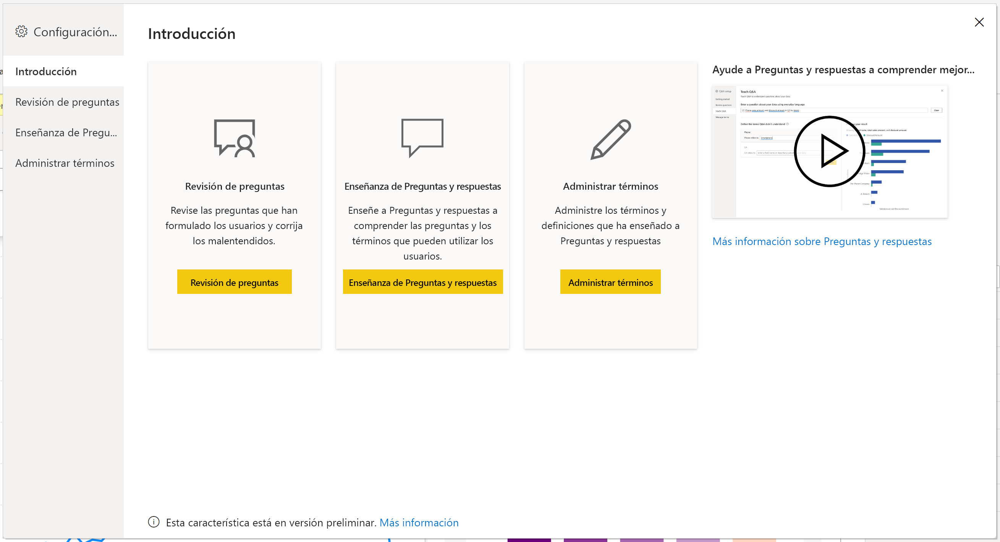
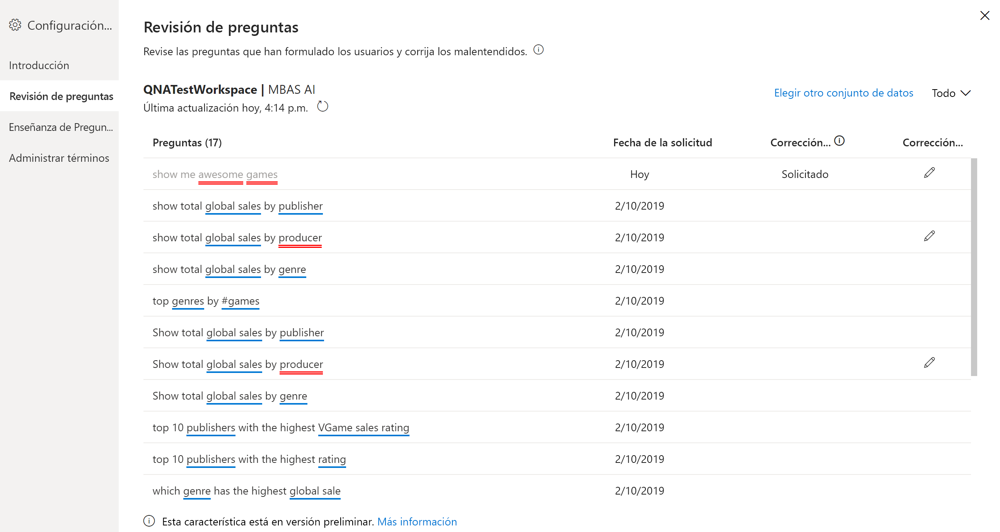
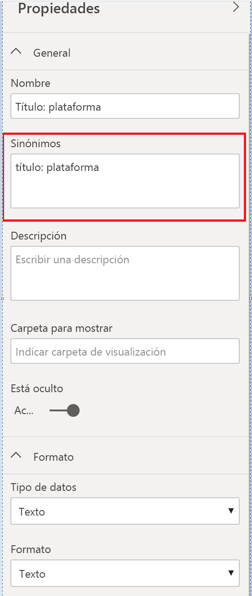

# Introducción a las herramientas de Preguntas y respuestas para entrenar a Preguntas y respuestas de Power BI (versión preliminar)

Con las *herramientas* de Preguntas y respuestas de Power BI, puede mejorar la experiencia del lenguaje natural para los usuarios. Como diseñador o administrador, puede interactuar con el motor de lenguaje natural y hacer mejoras en tres áreas: 

- Revisar las preguntas que han formulado los usuarios.
- Enseñar a Preguntas y respuestas para comprender las preguntas.
- Administrar los términos que ha enseñado a Preguntas y respuestas.

Además de estas funcionalidades de herramientas dedicadas, la pestaña **Modelado** de Power BI Desktop ofrece más opciones:  

- Sinónimos
- Etiquetas de fila
- Ocultar en Preguntas y respuestas
- Configuración del esquema lingüístico (avanzado)

## Introducción a las herramientas de Preguntas y respuestas

Las herramientas de Preguntas y respuestas solo están disponibles en Power BI Desktop y actualmente solo admiten el modo de importación.

1. Abra Power BI Desktop y use Preguntas y respuestas para crear un objeto visual. 
2. En la esquina del objeto visual, seleccione el icono de engranaje. 

    

    Se abre la página de introducción.  

    

### Revisión de preguntas

Seleccione **Revisión de las preguntas** para ver una lista de los conjuntos de valores que se usan en el servicio Power BI para el inquilino. En la página **Revisión de las preguntas** también se muestra el propietario del conjunto de datos, el área de trabajo y la última fecha de actualización. Desde aquí puede seleccionar un conjunto de datos y ver qué preguntas han formulado los usuarios. Los datos también muestran palabras que no se han reconocido. Todos los datos que se muestran aquí son de los últimos 28 días.

### Enseñanza de Preguntas y respuestas

La sección **Enseñanza de Preguntas y respuestas** permite entrenar a Preguntas y respuestas para que reconozca palabras. Para empezar, escriba una pregunta que contenga una o varias palabras que Preguntas y respuestas no reconozca. Preguntas y respuestas le pide la definición de ese término. Escriba un filtro o un nombre de campo que se corresponda con lo que representa la palabra. Preguntas y respuestas vuelve a interpretar la pregunta original. Si está satisfecho con los resultados, puede guardarlos. Para más información, consulte [Enseñanza de Preguntas y respuestas](q-and-a-tooling-teach-q-and-a.md).

### Administrar términos

Todo lo que haya guardado desde la sección Enseñanza de Preguntas y respuestas se muestra aquí, por lo que puede revisar o eliminar los términos que haya definido. Actualmente no se puede editar una definición existente, por lo que, para volver a definir un término, debe eliminarlo y volver a crearlo.

## Otras opciones de configuración de Preguntas y respuestas

### Sinónimos masivos

La pestaña **Modelado** de Power BI Desktop tiene más opciones para mejorar la experiencia de Preguntas y respuestas. 

1. En Power BI Desktop, seleccione la vista Modelado.

2. Seleccione un campo o una tabla para mostrar el panel **Propiedades**.  Este panel se muestra en el lado derecho del lienzo y enumera varias acciones de Preguntas y respuestas. Una opción es **Sinónimos**. En el cuadro **Sinónimos**, puede definir rápidamente alternativas para la tabla o el campo que seleccione. También puede definir sinónimos en la sección **Enseñanza de Preguntas y respuestas** del cuadro de diálogo de herramientas, pero a menudo es más rápido definir sinónimos aquí para muchos campos de una tabla.

    

3. Para definir varios sinónimos para un solo campo, utilice comas para indicar el siguiente sinónimo.

### Ocultar en Preguntas y respuestas

También puede ocultar campos y tablas, de modo que no aparezcan en los resultados de Preguntas y respuestas. 

1. En Power BI Desktop, seleccione la vista Modelado.

2. Seleccione un campo o una tabla para mostrar el panel **Propiedades** y establezca **Está oculto** en **Activado**.

    Preguntas y respuestas respeta la configuración y garantiza que el campo no sea reconocido por Preguntas y respuestas. Por ejemplo, puede que desee ocultar los campos de identificador y las claves externas para evitar campos duplicados innecesarios con el mismo nombre. Incluso aunque oculte el campo, todavía puede usarlo en Power BI Desktop en objetos visuales fuera de Preguntas y respuestas.

### Establecimiento de una etiqueta de fila

Una etiqueta de fila permite definir qué columna (o *campo*) identifica mejor una sola fila de una tabla. Por ejemplo, para una tabla denominada "Cliente", la etiqueta de fila suele ser "Nombre para mostrar". El suministro de estos metadatos adicionales permite a Preguntas y respuestas trazar un código visual más útil cuando los usuarios escriben "Mostrarme ventas por cliente". En lugar de tratar "cliente" como una tabla, puede usar en su lugar "Nombre para mostrar" y mostrar un gráfico de barras que muestre las ventas de cada cliente. Solo puede establecer la vista de modelado de etiquetas de fila. 

1. En Power BI Desktop, seleccione la vista Modelado.

2. Seleccione una tabla para mostrar el panel **Propiedades**.

3. En el cuadro **Etiqueta de fila**, seleccione un campo.

## Configuración del esquema lingüístico (avanzado)

En Power BI, puede entrenar y mejorar completamente el motor de lenguaje natural dentro de Preguntas y respuestas, incluso cambiar la puntuación y la ponderación de los resultados de lenguaje natural subyacentes. Para saber cómo, consulte [Editar el esquema lingüístico de Preguntas y respuestas y agregar expresiones](q-and-a-tooling-advanced.md).

## Pasos siguientes

Hay una serie de procedimientos recomendados para mejorar el motor de lenguaje natural. Para obtener más información, consulte el artículo siguiente:

* [Procedimientos recomendados de Preguntas y respuestas](q-and-a-best-practices.md)
