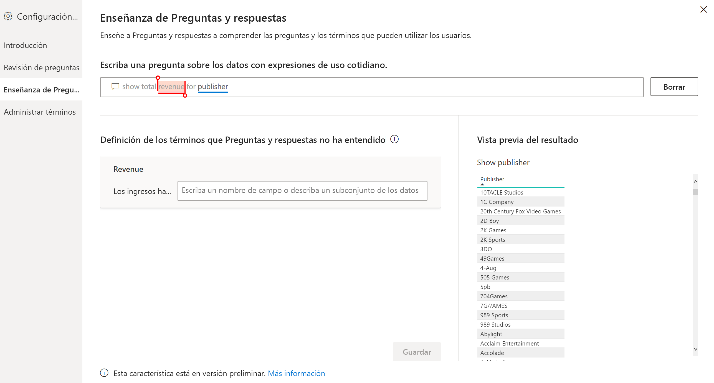
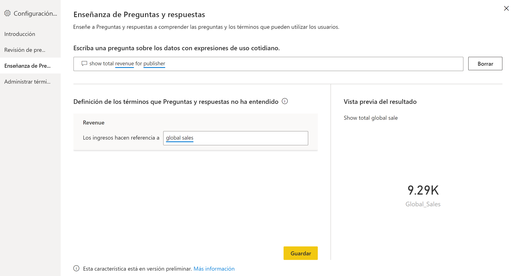
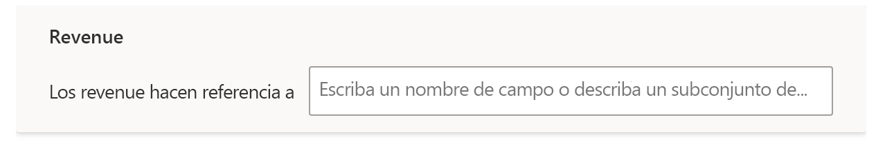
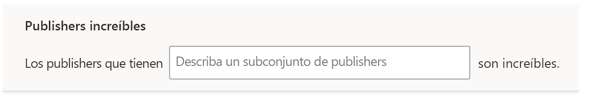
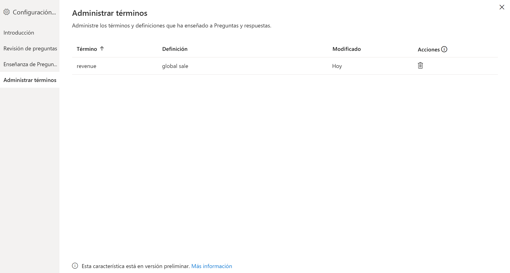

# Enseñanza de Preguntas y respuestas para comprender las preguntas y los términos de Preguntas y respuestas de Power BI

En la sección **Enseñanza de Preguntas y respuestas** de la configuración de Preguntas y respuestas, se entrena a Preguntas y respuestas para que comprenda las preguntas y los términos de lenguaje natural que no haya reconocido. Para empezar, envíe una pregunta que contenga una o varias palabras que Preguntas y respuestas no reconozca. Preguntas y respuestas le pide que defina ese término. Escriba un filtro o un nombre de campo que se corresponda con lo que representa la palabra. Preguntas y respuestas vuelve a interpretar la pregunta original. Si está satisfecho con los resultados, puede guardarlos.

> [!NOTE]
> La funcionalidad Enseñanza de Preguntas y respuestas solo admite el modo de importación. Tampoco admite la conexión a un origen de datos local o de Azure Analysis Services. Esta limitación se debe quitar en las versiones posteriores de Power BI.

## Empezar a enseñar a Preguntas y respuestas

1. En Power BI Desktop, en la cinta de opciones **Modelado**, seleccione **Configuración de Preguntas y respuestas** > **Enseñanza de Preguntas y respuestas**.

    

2. Escriba una frase con un término que Preguntas y respuestas no reconozca y seleccione **Enviar**.

3. Seleccione la palabra subrayada en color rojo. 

    Preguntas y respuestas ofrece sugerencias y le pide que proporcione la definición correcta del término. 
    
3. En **Definición de los términos que Preguntas y respuestas no ha entendido**, proporcione una definición.

    

4. Seleccione **Guardar** para obtener una vista previa actualizada.

5. Escriba la siguiente pregunta o seleccione la **X** para cerrar.

Los consumidores del informe no verán este cambio hasta que vuelva a publicar el informe en el servicio.

## Definición de sustantivos y adjetivos

Puede enseñar a Preguntas y respuestas dos tipos de términos:

- Sustantivos
- Adjetivos

### Definición de un sinónimo de sustantivo

Cuando trabaje con datos, tendrá nombres de campos a los que se puede hacer referencia con nombres alternativos. Un ejemplo podría ser "Ventas". Varias palabras o frases pueden hacer referencia a las ventas, como "ingresos". Si una columna se denomina "Ventas" y el tipo de los consumidores del informe es "Ingresos", es posible que Preguntas y respuestas no pueda seleccionar la columna correcta para responder a la pregunta de forma apropiada. En ese caso, puede ser conveniente indicar a Preguntas y respuestas que "Ventas" e "Ingresos" hacen referencia a lo mismo.

Preguntas y respuestas detecta automáticamente cuándo una palabra desconocida es un nombre que usa los conocimientos de Microsoft Office. Si Preguntas y respuestas detecta un nombre, se lo indica de la siguiente manera:

- <your term> **se refiere a** 

Rellene el cuadro con el término a partir de los datos.

Si proporciona un valor que no sea un campo del modelo de datos, puede obtener resultados no deseados.

### Definición de una condición de filtro de adjetivo

En ocasiones, es posible que desee definir términos que actúan como una condición en los datos subyacentes. Un ejemplo podría ser "Publicadores extraordinarios". "Extraordinarios" podría ser una condición que solo seleccione publicadores que hayan publicado un número de productos. Preguntas y respuestas intenta detectar adjetivos y muestra un mensaje diferente:

- <field name> **que tienen**  

Rellene el cuadro con la condición.

Algunas de las condiciones de ejemplo que se pueden definir son:

- "País" que sea "Francia"
- "País" que no sea "Francia"
- "Peso" > 2000
- "Peso" = 2000
- "Peso" < 2000

Solo se puede definir una condición en las herramientas. Para definir condiciones más complejas, use DAX para crear una columna calculada y, a continuación, use la sección de herramientas para crear una condición única para esa columna calculada. No se admiten medidas. Use columnas calculadas en su lugar.

## Administrar términos

Una vez que haya especificado las definiciones, puede volver a ver todas las correcciones que ha realizado y editarlas o eliminarlas. 

1. En **Configuración de Preguntas y respuestas**, vaya a la sección **Administrar términos**.

2. Elimine los términos que ya no desee. Actualmente no se pueden editar los términos. Para volver a definir un término, elimínelo y defínalo.

    

## Pasos siguientes

Hay una serie de procedimientos recomendados para mejorar el motor de lenguaje natural. Para obtener más información, consulte el artículo siguiente:

* [Procedimientos recomendados de Preguntas y respuestas](q-and-a-best-practices.md)
