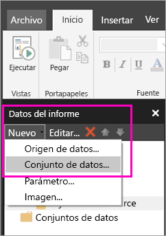
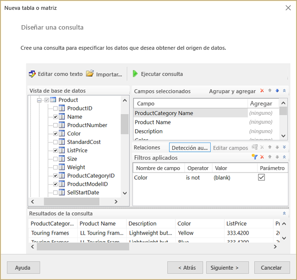
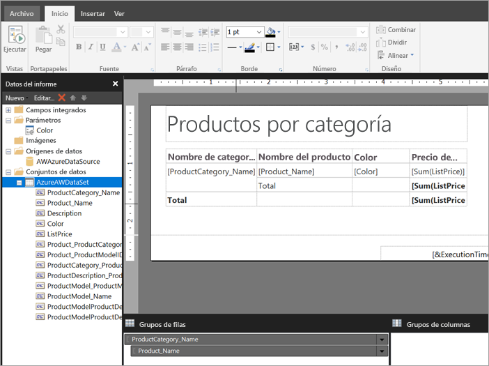

# Creación de un conjunto de datos insertado para un informe paginado en el servicio Power BI (versión preliminar)

En este artículo, aprenderá a crear un conjunto de datos insertado, basándose en un origen de datos insertado, para un informe paginado en el servicio Power BI. Los conjuntos de datos insertados están contenidos en un único informe paginado, para su uso en ese informe. Actualmente, los informes paginados que se publican en el servicio Power BI necesitan conjuntos de datos insertados y orígenes de datos insertados. Crear el origen de datos incrustado y un conjunto de datos en el generador de informes de Power BI, al crear el informe. 

Antes de crear el conjunto de datos, debe crear un origen de datos. Vea [Orígenes de datos insertados para informes paginados](paginated-reports-embedded-data-source.md) en el servicio Power BI para obtener información.
  
## Creación de un conjunto de datos insertados
  
1. En el panel datos de informe del generador de informes de Power BI, seleccione **New** > **Dataset**.

1. En la pestaña **Consulta** del cuadro de diálogo **Propiedades del conjunto de datos**, asigne un nombre al conjunto de datos. El origen de datos insertado ya está en el cuadro **Origen de datos**, o bien puede seleccionar **Nuevo** para crear un origen de datos insertado distinto.
 
     

3. En **Tipo de consulta**, seleccione el tipo de comando o consulta que desea usar para el conjunto de datos. 
    - El **texto** ejecuta una consulta para recuperar datos de la base de datos. Es el valor predeterminado y se usa para la mayoría de las consultas. Escriba una consulta o importe una consulta existente previamente seleccionando **Importar**. Para crear gráficamente la consulta, seleccione **Diseñador de consultas**. Si usa el diseñador de consultas para crear una consulta, el texto de la consulta aparecerá en este cuadro. Seleccione el botón **Expresiones** (**fx**) para usar una expresión a fin de generar la consulta de forma dinámica. 
    - **Tabla** selecciona todos los campos dentro de una tabla. Escriba el nombre de la tabla que desea utilizar como un conjunto de datos.
    - El **procedimiento almacenado** ejecuta un procedimiento almacenado por su nombre.

4. En el diseñador de consultas, puede ver las tablas y los campos en el conjunto de datos e interactuar con ellos, así como importar una consulta o editar como texto. También puede agregar filtros y parámetros aquí. 

    

5. En el Diseñador de consultas, seleccione **Ejecutar consulta** para probarla y después seleccione **Aceptar**.

1. De nuevo en el cuadro de diálogo Propiedades del conjunto de datos, en el cuadro **Tiempo de expiración (en segundos)** , escriba el número de segundos hasta que se agote el tiempo de expiración de la consulta. El valor predeterminado es 30 segundos. El valor de **Tiempo de expiración** debe ser mayor que cero o debe estar vacío. Si está vacío, el tiempo de expiración de la consulta no se agota.

7.  Puede configurar otras propiedades del conjunto de datos en las demás pestañas:
    - Cree campos calculados en la pestaña **Campos**.
    - Configure las opciones avanzadas en la pestaña **Opciones**.
    - Agregue o actualice **Filtros** y **Parámetros** en sus pestañas correspondientes.

8. Seleccione **Aceptar**.
 
   El informe se abre en la vista de diseño del informe. La colección de campos del conjunto de datos, el conjunto de datos y el origen de datos aparecen en el panel Datos de informe, y puede conjunto de datos con el diseño del informe paginado.  

     
 
## Pasos siguientes 

- [¿Qué son los informes paginados en Power BI Premium? (versión preliminar)](paginated-reports-report-builder-power-bi.md)  
- [Tutorial: Crear un informe paginado y cargarlo en el servicio Power BI](paginated-reports-quickstart-aw.md)
- [Publicación de un informe paginado en el servicio Power BI](paginated-reports-save-to-power-bi-service.md)

