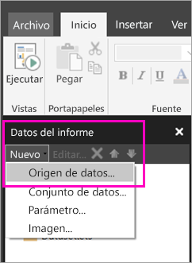

# Creación de un origen de datos insertado para informes paginados en el servicio Power BI

En este artículo, obtendrá información sobre cómo crear y modificar un origen de datos insertado en un informe paginado en el servicio Power BI. Defina un origen de datos insertado en un único informe y úselo solo en dicho informe. Actualmente, los informes paginados que se publican en el servicio Power BI necesitan conjuntos de datos insertados y orígenes de datos insertados, y se pueden conectar a estos orígenes de datos:

- Azure Analysis Services
- Azure SQL Database y 
- Azure SQL Data Warehouse
- SQL Server
- SQL Server Analysis Services
- Oracle 
- Teradata 

Para los siguientes orígenes de datos, use la opción [Conexión de SQL Server Analysis Services](service-premium-connect-tools.md):

- Conjuntos de datos de Power BI Premium

Los informes paginados se conectan a los orígenes de datos locales mediante una [puerta de enlace de Power BI](service-gateway-getting-started.md). Configure la puerta de enlace después de publicar el informe en el servicio Power BI.

Consulte [Datos del informe en el Generador de informes de Power BI](report-builder-data.md) para más información.

## Creación de un origen de datos insertados
  
1. Abra el Generador de informes de Power BI.

1. En la barra de herramientas del panel Datos de informe, seleccione **Nuevo** > **Orígenes de datos**. Se abre el cuadro de diálogo **Propiedades del origen de datos**.

    
  
2.  En el cuadro de texto **Nombre**, escriba un nombre para el origen de datos o acepte el valor predeterminado.  
  
3.  Seleccione **Usar una conexión incrustada en el informe**.  
  
1.  En la lista **Seleccionar el tipo de conexión**, seleccione un tipo de origen de datos. 

1.  Especifique una cadena de conexión con el uso de alguno de estos métodos:  
  
    -   Escriba la cadena de conexión directamente en el cuadro de texto **Cadena de conexión**. 
  
    -   Seleccione el botón de expresión (**fx)** para crear una expresión que se evalúa como una cadena de conexión. En el cuadro de diálogo **Expresión**, escriba la expresión en el panel Expresión. Seleccione **Aceptar**. 
  
    -   Seleccione **Compilar** para abrir el cuadro de diálogo **Propiedades de conexión** para el origen de datos elegido en el paso 2.  
  
        Rellene los campos del cuadro de diálogo **Propiedades de conexión** según corresponda para el tipo de origen de datos. Las propiedades de conexión incluyen el tipo de origen de datos, el nombre del origen de datos y las credenciales que se van a usar. Después de especificar los valores de este cuadro de diálogo, seleccione **Probar conexión** para comprobar que el origen de datos está disponible y que las credenciales que especificó son correctas.  
  
4.  Seleccione  **Credenciales**.  
  
     Especifique las credenciales que se usarán para este origen de datos. El propietario del origen de datos elige el tipo de credenciales que se admite. Para más información, vea [Especificar información de credenciales y conexión para los orígenes de datos de informes](https://docs.microsoft.com/sql/reporting-services/report-data/specify-credential-and-connection-information-for-report-data-sources).
  
5.  Seleccione **Aceptar**.  
  
     El origen de datos aparece en el panel Datos de informe.  
     
## Limitaciones y consideraciones

Los informes paginados que se conectan a los conjuntos de datos de Power BI siguen las reglas para los conjuntos de datos compartidos en Power BI con algunos cambios menores.  Para que los usuarios puedan ver correctamente los informes paginados con conjuntos de datos de Power BI, así como para garantizar que la seguridad en el nivel de fila (RLS) esté habilitada y que se aplique a los usuarios, asegúrese de que sigue estas reglas:

### Aplicaciones y áreas de trabajo de aplicación clásicos

- .rdl en la misma área de trabajo que el conjunto de datos (mismo propietario): Admitido
- .rdl en una área de trabajo distinta a la del conjunto de datos (mismo propietario): Admitido
- .rdl compartido: debe crear los permisos asignados a cada usuario que esté viendo el informe en el nivel de conjunto de datos.
- Aplicación compartida: debe crear los permisos asignados a cada usuario que esté viendo el informe en el nivel de conjunto de datos.
- .rdl en la misma área de trabajo que el conjunto de datos (usuario distinto): Admitido
- .rdl en una misma área de trabajo distinta a la del conjunto de datos (usuario distinto): debe crear los permisos asignados a cada usuario que esté viendo el informe en el nivel de conjunto de datos.
- Seguridad en el nivel de rol: para aplicarla, debe crear los permisos asignados a cada usuario que esté viendo el informe de nivel de conjunto de datos.

### Nueva experiencia de aplicaciones y áreas de trabajo de aplicación

- .rdl en la misma área de trabajo que el conjunto de datos: Admitido
- .rdl en una área de trabajo distinta a la del conjunto de datos (mismo propietario): Admitido
- .rdl compartido: debe crear los permisos asignados a cada usuario que esté viendo el informe en el nivel de conjunto de datos.
- Aplicación compartida: debe crear los permisos asignados a cada usuario que esté viendo el informe en el nivel de conjunto de datos.
- .rdl en la misma área de trabajo que el conjunto de datos (usuario distinto): se admite.
- .rdl en una área de trabajo distinta a la del conjunto de datos (usuario distinto): debe crear los permisos asignados a cada usuario que esté viendo el informe en el nivel de conjunto de datos.
- Seguridad en el nivel de rol: para aplicarla, debe crear los permisos asignados a cada usuario que esté viendo el informe en el nivel de conjunto de datos.

## Pasos siguientes

- [Creación de un conjunto de datos insertado para un informe paginado en el servicio Power BI](paginated-reports-create-embedded-dataset.md)
- [¿Qué son los informes paginados en Power BI Premium?](paginated-reports-report-builder-power-bi.md)
