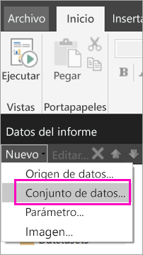
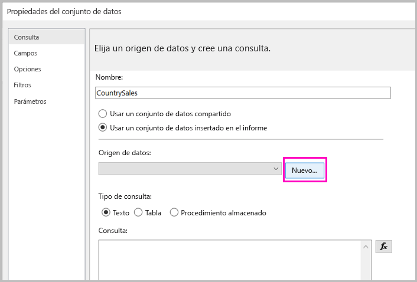
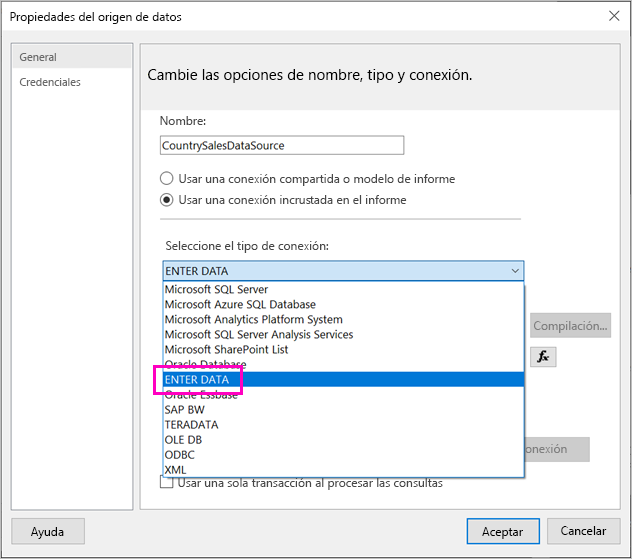
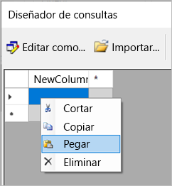
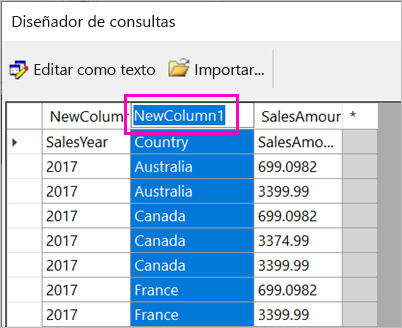
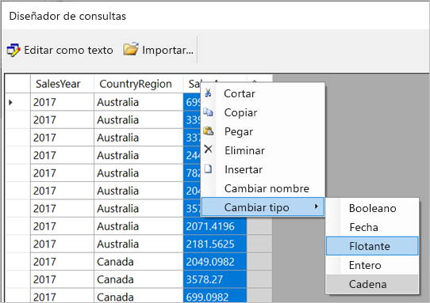
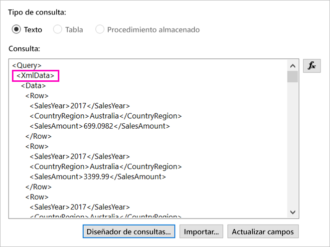
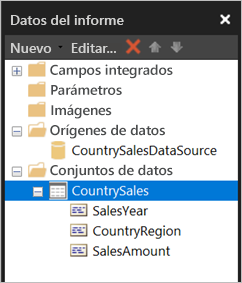

# <a name="enter-data-directly-in-a-paginated-report-in-report-builder---power-bi"></a>Escritura directa de datos en un informe paginado en el Generador de informes: Power BI

En este artículo, obtendrá información sobre una característica de la nueva versión del Generador de informes de SQL Server 2016 que le permite escribir datos directamente en un informe RDL como un conjunto de datos insertado.  Esta característica es similar a Power BI Desktop. Puede escribir los datos directamente en un conjunto de datos del informe o pegarlos desde otro programa como Microsoft Excel. Después de escribir los datos para crear un conjunto de datos, puede usarlo tal como lo haría con cualquier otro conjunto de datos insertado que haya creado. Además, puede agregar más de una tabla y usar una como un filtro de la otra. Esta característica es especialmente útil para conjuntos de datos pequeños y estáticos que puede que deba usar en el informe, como los parámetros de informe.
 
## <a name="prerequisites"></a>Requisitos previos

- Para escribir datos directamente en un informe paginado, instale la nueva versión del [Generador de informes desde el Centro de descarga de Microsoft](https://www.microsoft.com/download/details.aspx?id=53613). 
- Para guardar el informe paginado en el servicio Power BI, necesita una [cuenta de Power BI Pro](service-self-service-signup-for-power-bi.md) y acceso de escritura a un área de trabajo en una [capacidad Premium de Power BI](service-premium-what-is.md).
- Para guardar el informe paginado en un servidor de informes, necesita permisos para [editar el archivo RsReportServer.config](#upload-the-paginated-report-to-a-report-server).

## <a name="get-started"></a>Comenzar

Una vez que haya descargado e instalado el Generador de informes, siga el mismo flujo de trabajo que usa para agregar un origen de datos y un conjunto de datos insertados al informe. En el siguiente procedimiento, en **Orígenes de datos** verá una nueva opción: **Especificar datos**.  Solo tiene que configurar este origen de datos una vez en un informe. Después, puede crear varias tablas de datos especificados como conjuntos de datos independientes, todo ello con ese único origen de datos.

1. En el panel **Datos de informe**, haga clic en **Nuevo** > **Conjunto de datos**.

    

1. En el cuadro de diálogo **Propiedades del conjunto de datos**, seleccione **Usar un conjunto de datos insertado en el informe**.

1. Junto a **Origen de datos**, haga clic en **Nueva**.

    

1. En el cuadro de diálogo **Propiedades del origen de datos**, seleccione **Usar una conexión incrustada en el informe**.
2. En el cuadro **Seleccionar el tipo de conexión**, seleccione **ENTER DATA** > **Aceptar**.

    

1. En el cuadro de diálogo **Propiedades del conjunto de datos**, haga clic en **Diseñador de consultas**.
2. En el panel **Diseñador de consultas**, haga clic con el botón derecho y pegue los datos en la tabla.

    

1. Para establecer los nombres de las columnas, haga doble clic en el encabezado **NuevaColumna** de cada una de ellas y escriba el nombre de la columna.

    

1. Si la primera fila contiene los encabezados de columna de los datos originales, haga clic con el botón derecho y elimínela.
    
9. De forma predeterminada, el tipo de datos de cada columna es Cadena. Para cambiar el tipo de datos, haga clic con el botón derecho en el encabezado de columna > **Cambiar tipo** y establézcalo en otro tipo de datos, como Fecha o Flotante.

    

1. Cuando haya terminado de crear la tabla, haga clic en **Aceptar**.  

    La consulta que se genera es la misma que vería con un origen de datos XML. En segundo plano, usamos XML como el proveedor de datos.  Lo hemos adaptado para aceptar también este escenario.

    

12. En el cuadro de diálogo **Propiedades del conjunto de datos**, haga clic en **Aceptar**.

13. Verá el origen de datos y el conjunto de datos en el panel **Datos de informe**.

    

Puede usar el conjunto de datos como base para las visualizaciones de datos en el informe. También puede agregar otro conjunto de datos y usar el mismo origen de datos para él.

## <a name="upload-the-paginated-report-to-the-power-bi-service"></a>Carga del informe paginado en el servicio Power BI

Ahora que se admiten informes paginados en el servicio Power BI, puede cargar el informe paginado en una capacidad Premium. Vea [Carga de un informe paginado](paginated-reports-save-to-power-bi-service.md#upload-a-paginated-report) para obtener más información.

## <a name="upload-the-paginated-report-to-a-report-server"></a>Carga del informe paginado en un servidor de informes

También puede cargar el informe paginado en un servidor de informes de Power BI Report Server o SQL Server Reporting Services 2016 o 2017. Antes de hacerlo, deberá agregar el siguiente elemento al archivo RsReportServer.config como una extensión de datos adicional. Haga una copia de seguridad del archivo RsReportServer.config antes de realizar el cambio, en caso de que surja algún problema.

```xml
<Extension Name="ENTERDATA" Type="Microsoft.ReportingServices.DataExtensions.XmlDPConnection,Microsoft.ReportingServices.DataExtensions">
    <Configuration>
        <ConfigName>ENTERDATA</ConfigName>
    </Configuration>
</Extension>
```

Después de editarlo, la lista de proveedores de datos del archivo de configuración debería ser similar a esta:


Eso es todo, ya puede publicar informes que usen esta nueva funcionalidad en su servidor de informes.

## <a name="next-steps"></a>Pasos siguientes

- [¿Qué son los informes paginados en Power BI Premium?](paginated-reports-report-builder-power-bi.md)
- [¿Qué es Power BI Report Server?](report-server/get-started.md)
