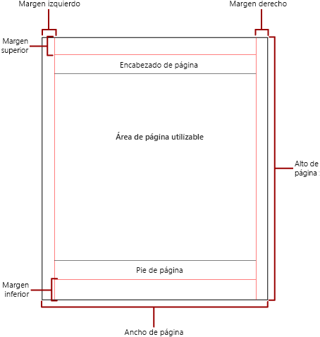
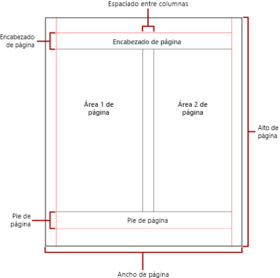

# Paginación en informes paginados de Power BI

 La paginación hace referencia al número de páginas de un informe y al modo en que se organizan los elementos del informe en estas páginas. La paginación de los informes paginados de Power BI varía en función de la extensión de representación que use para ver y entregar el informe. Al ejecutar un informe en el servidor de informes, el informe usa el representador de HTML. HTML sigue un conjunto concreto de reglas de paginación. Si exporta el mismo informe a PDF, por ejemplo, se usa el representador de PDF y se aplica un conjunto diferente de reglas. Por consiguiente, el informe se pagina de otro modo. Para diseñar correctamente un informe fácil de leer para los usuarios que esté optimizado para el representador que tiene previsto usar para entregar el informe, debe comprender las reglas que se usan para controlar la paginación en los informes paginados de Power BI.  
  
 En este tema se describe el impacto del tamaño de página físico y el diseño del informe sobre el modo en que los representadores de saltos de página manuales representan el informe. Puede establecer propiedades para modificar el tamaño de página físico y los márgenes, y dividir el informe en columnas mediante el panel **Propiedades del informe** , el panel **Propiedades** o el cuadro de diálogo **Configurar página**. Para acceder al panel **Propiedades del informe**, haga clic en el área azul fuera del cuerpo del informe. Para acceder al cuadro de diálogo **Configurar página**, haga clic en **Ejecutar** en la pestaña Inicio y, a continuación, haga clic en **Configurar página** en la pestaña Ejecutar.  
  
> [!NOTE]  
>  Si ha diseñado un informe para que tenga el ancho de una página, pero se representa en varias páginas, compruebe que el ancho del cuerpo del informe, incluidos los márgenes, no sea superior al ancho del tamaño de página físico. Para evitar que se agreguen páginas vacías al informe, puede reducir el tamaño del contenedor arrastrando la esquina del contenedor hacia la izquierda.  

## Cuerpo del informe  
 El cuerpo del informe es un contenedor rectangular que se muestra como un espacio en blanco en la superficie de diseño. Puede aumentar o reducir su tamaño para dar cabida a los elementos de informe que contiene. El cuerpo del informe no refleja el tamaño de página físico y, de hecho, puede crecer por encima de límites del tamaño de página físico para abarcar varias páginas del informe. Algunos representadores, como Microsoft Excel, Word, HTML y MHTML, representan informes que aumentan o reducen su tamaño en función del contenido de la página. Los informes representados en estos formatos se optimizan para la visualización basada en pantalla, como en un explorador web. Estos representadores agregan saltos de página verticales cuando es necesario.  
  
 Puede dar formato al cuerpo del informe con el color, el estilo y el ancho del borde. También puede agregar un color de fondo y una imagen de fondo.  
  
## Página física  
 El tamaño de página físico es el tamaño del papel. El tamaño de papel que especifica para el informe controla cómo se representa el informe. Los informes representados en formatos de salto de página manual insertan saltos de página horizontal y verticalmente según el tamaño de página físico para proporcionar una experiencia de lectura optimizada al imprimirse o visualizarse en un formato de archivo de salto de página manual. Los informes representados en formatos de salto de página automático insertan saltos de página horizontalmente según el tamaño físico para proporcionar una experiencia de lectura optimizada al visualizarse en un explorador web.  
  
 De forma predeterminada, el tamaño de página es de 8,5 x 11 pulgadas, pero puede cambiarlo desde el panel **Propiedades del informe** o el cuadro de diálogo **Configurar página** o bien cambiando las propiedades PageHeight y PageWidth en el panel **Propiedades**. El tamaño de página no aumenta ni se reduce para ajustarse al contenido del cuerpo del informe. Si quiere que el informe aparezca en una sola página, todo el contenido del cuerpo del informe debe caber en la página física. Si no cabe y usa el formato de salto de página manual, el informe requerirá páginas adicionales. Si el cuerpo del informe crece más allá del borde derecho de la página física, se inserta un salto de página horizontal. Si el cuerpo del informe crece más allá del borde inferior de la página física, se inserta un salto de página vertical.  
  
 Si quiere invalidar el tamaño de página físico definido en el informe, puede especificar el tamaño de página físico mediante la opción Información del dispositivo para el representador específico que está usando para exportar el informe. Para obtener una lista completa, consulte [Device Information Settings for Rendering Extensions](https://docs.microsoft.com/sql/reporting-services/device-information-settings-for-rendering-extensions-reporting-services?view=sql-server-2017) (Configuración de la información del dispositivo para las extensiones de representación) en la documentación de SQL Server Reporting Services.  
  
### Márgenes

 Los márgenes se dibujan desde el borde de las dimensiones de la página física hacia adentro hasta el valor de margen especificado. Si un elemento de informe se extiende hasta el área de margen, se recorta para que el área superpuesta no se represente. Si especifica tamaños de márgenes que provocan que el ancho horizontal o vertical de la página sea igual a cero, la configuración de margen predeterminada es cero. Los márgenes se especifican en el panel **Propiedades del informe** o el cuadro de diálogo**Configurar página**. También se pueden especificar modificando las propiedades TopMargin, BottomMargin, LeftMargin and RightMargin en el panel **Propiedades**. Si quiere invalidar el tamaño de margen definido en el informe, puede especificar el tamaño de margen mediante la opción Información del dispositivo para el representador específico que está usando para exportar el informe.  
  
 El área de la página física que queda después de asignar espacio para los márgenes, el espaciado de columnas y el encabezado y pie de página de la página se denomina *área de página utilizable*. Los márgenes solo se aplican cuando se representan e imprimen informes en formatos de representador de saltos de página manuales. La imagen siguiente indica el margen y el área de página utilizable de una página física.  
  
 
  
### Columnas de estilo boletín  

 El informe se puede dividir en columnas, como las columnas de un periódico. Las columnas se tratan como páginas *lógicas* representadas en la misma página *física*. Están organizadas de izquierda a derecha y de arriba abajo, y están separadas por espacios en blanco entre las columnas. Si el informe se divide en más de una columna, cada página física se divide verticalmente en columnas y cada columna se considera una página lógica. Por ejemplo, supongamos que tiene dos columnas en una página física. El contenido del informe rellena la primera columna y, a continuación, la segunda. Si el informe no cabe por completo en las dos primeras columnas, el informe rellenará la primera y la segunda columna de la página siguiente. Las columnas se continúan rellenando, de izquierda a derecha y de arriba abajo hasta que se representan todos los elementos del informe. Si especifica tamaños de columna que provocan que el ancho horizontal o vertical sea igual a cero, el espaciado entre columnas predeterminado es cero.  
  
 Las columnas se especifican en el panel **Propiedades del informe** o el cuadro de diálogo**Configurar página**. También se pueden especificar modificando las propiedades TopMargin, BottomMargin, LeftMargin y RightMargin del panel **Propiedades**. Si quiere usar un tamaño de margen que no está definido, puede especificar el tamaño de margen mediante la opción Información del dispositivo para el representador específico al que está exportando el informe. Las columnas solo se aplican cuando se representan e imprimen informes en PDF o formatos de imagen. La imagen siguiente indica el área de página utilizable de una página que contiene columnas.  
  

  
## Saltos de página y nombres de página

 Un informe puede ser más legible y sus datos más fáciles de auditar y exportar si el informe tiene nombres de página. Reporting Services proporciona propiedades para los informes, las regiones de datos de tabla, matriz y lista, los grupos y los rectángulos del informe para controlar la paginación, restablecer los números de página y proporcionar nuevos nombres de página de informe en los saltos de página. Estas características pueden mejorar los informes independientemente del formato en el que se representen, pero resultan especialmente útiles al exportar informes a libros de Excel.

> [!NOTE]
> Las regiones de datos de tabla, matriz y lista son, en realidad, el mismo tipo de región de datos en segundo plano: *tablix*. Por lo que es posible que aparezca este nombre. 

 La propiedad InitialPageName proporciona el nombre de página inicial del informe. Si el informe no incluye los nombres de página para los saltos de página, se usa el nombre de página inicial para todas las páginas nuevas que crean los saltos de página. No es necesario usar un nombre de página inicial.  
  
 Un informe representado puede proporcionar un nuevo nombre de página para la nueva página que crea un salto de página. Para proporcionar el nombre de la página, establezca la propiedad PageName de una tabla, matriz, lista, grupo o rectángulo. No es necesario especificar los nombres de página en los saltos. Si no lo hace, se usa el valor de InitialPageName en su lugar. Si InitialPageName también está en blanco, la nueva página no tiene nombre.  
  
 Las regiones de datos de tabla, matriz y lista, los grupos y los rectángulos admiten saltos de página.  
  
 El salto de página incluye las siguientes propiedades:  
  
- **BreakLocation** proporciona la ubicación del salto para el elemento de informe con saltos de página habilitados: al principio, al final, o al principio y al final. En los grupos, BreakLocation se puede situar entre grupos.  
  
- **Deshabilitado** indica si se aplica un salto de página al elemento de informe. Si esta propiedad se evalúa como true, se omite el salto de página. Esta propiedad se utiliza para deshabilitar dinámicamente los saltos de página basados en expresiones cuando se ejecuta el informe.  
  
- **ResetPageNumber** indica si el número de página se debe restablecer a 1 cuando se inserta un salto de página. Si esta propiedad se evalúa como true, se restablece el número de página.  
  
 Puede definir la propiedad BreakLocation en los cuadros de diálogo **Propiedades de Tablix**, **Propiedades del rectángulo** o **Propiedades del grupo**, pero debe definir las propiedades Disabled, ResetPageNumber y PageName en el panel Propiedades del Generador de informes. Si las propiedades del panel Propiedades están organizadas por categoría, las propiedades estarán disponibles en la categoría **PageBreak**. Para los grupos, la categoría **PageBreak** se encuentra dentro de la categoría **Grupo**.  
  
 Puede usar constantes y expresiones simples o complejas para establecer el valor de las propiedades Disabled y ResetPageNumber. Sin embargo, no puede utilizar la expresión con la propiedad BreakLocation. Para obtener más información sobre cómo escribir y usar expresiones, consulte [Expresiones en el Generador de informes de Power BI](report-builder-expressions.md).  
  
 En el informe, puede escribir expresiones que hagan referencia a los nombres o números de página actuales mediante la colección **Globales**. Para obtener más información, consulte [Built-in Globals and Users References](https://docs.microsoft.com/sql/reporting-services/report-design/built-in-collections-built-in-globals-and-users-references-report-builder?view=sql-server-2017) (Referencias de variables globales y de usuarios integradas) en la documentación del Generador de informes y Reporting Services.
  
### Asignar nombres a las pestañas de libros de Excel

 Estas propiedades son útiles a la hora de exportar informes a libros de Excel. Use la propiedad InitialPage para especificar un nombre predeterminado para el nombre de la pestaña de la hoja de cálculo cuando exporte el informe, y use saltos de página y la propiedad PageName para proporcionar nombres diferentes para cada hoja de cálculo. Cada nueva página del informe, definida por un salto de página, se exporta a una hoja de cálculo diferente designada por el valor de la propiedad PageName. Si PageName está en blanco, pero el informe tiene un nombre de página inicial, todas las hojas de cálculo del libro de Excel usan el mismo nombre: el nombre de página inicial.  
  
 Para obtener más información sobre cómo funcionan estas propiedades cuando se exportan informes a Excel, consulte [Exporting to Microsoft Excel](https://docs.microsoft.com/sql/reporting-services/report-builder/exporting-to-microsoft-excel-report-builder-and-ssrs?view=sql-server-2017) (Exportar a Microsoft Excel) en la documentación del Generador de informes y Reporting Services.  
  
## Pasos siguientes

[Visualización de un informe paginado en el servicio Power BI](paginated-reports-view-power-bi-service.md)

¿Tiene más preguntas? [Pruebe la comunidad de Power BI](http://community.powerbi.com/)
