# Tutorial: Crear un informe paginado y cargarlo en el servicio Power BI (versión preliminar)

En este tutorial, se conecta a una instancia de ejemplo de Azure SQL Database. Después, se usa un asistente del generador de informes para crear un informe paginado con una tabla que se ajusta a varias páginas. Luego se carga el informe paginado en un área de trabajo con una capacidad Premium en el servicio Power BI. Los informes paginados del servicio Power BI actualmente se encuentran en versión preliminar.

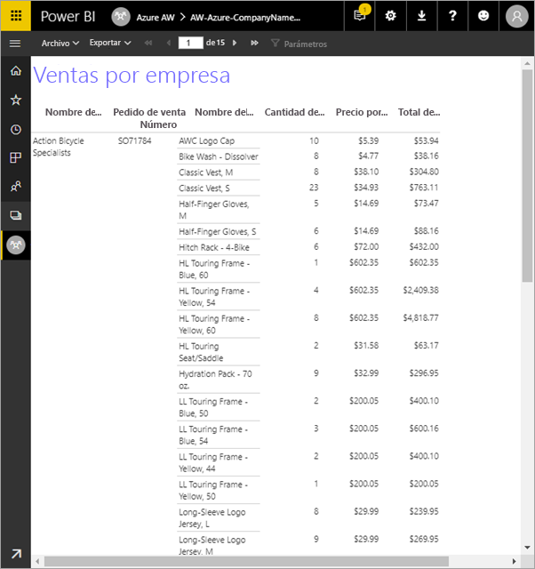

Estos son los pasos que se deben completar en este tutorial:

> [!div class="checklist"]
> * Cree una base de datos de ejemplo de Azure.
> * Cree una matriz en el generador de informes con la ayuda de un asistente.
> * Aplique formato al informe con títulos, números de página y encabezados de columna en cada página.
> * Aplique formato a la moneda.
> * Cargue el informe en el servicio Power BI.

Si no tiene ninguna suscripción a Azure, cree una [cuenta gratuita](https://azure.microsoft.com/free/?WT.mc_id=A261C142F) antes de empezar.
 
## Requisitos previos  

Estos son los requisitos previos para crear el informe paginado:

- Instale el [generador de informes desde el Centro de descarga de Microsoft](http://go.microsoft.com/fwlink/?LinkID=734968). 

- Siga la guía de inicio rápido [Creación de una instancia de ejemplo de Azure SQL Database en Azure Portal](https://docs.microsoft.com/azure/sql-database/sql-database-get-started-portal). Copie y guarde el valor en el cuadro **Nombre del servidor** en la pestaña **Introducción**. Recuerde el nombre de usuario y la contraseña que creó en Azure.

Estos son los requisitos previos para cargar el informe paginado en el servicio Power BI:

- Necesita una [licencia de Power BI Pro](service-admin-power-bi-pro-in-your-organization.md).
- Necesita un área de trabajo de la aplicación en el servicio con una [capacidad Premium de Power BI](service-premium.md). Tiene un icono de diamante  junto al nombre del área de trabajo.

## Creación de la matriz con un asistente
  
1.  Inicie el generador de informes desde el equipo.  
  
     Se abre el cuadro de diálogo **Introducción**.  
  
     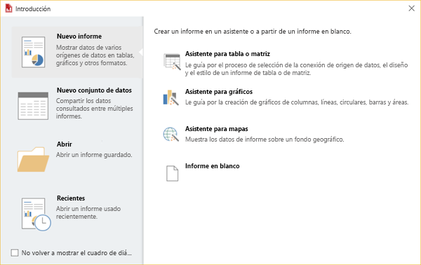
  
1.  En el panel izquierdo, compruebe que **Nuevo informe** está seleccionado y, en el panel derecho, seleccione **Asistente para tabla o matriz**.  
  
4.  En la página **Elegir un conjunto de datos**, seleccione **Crear un conjunto de datos** > **Siguiente**.  

    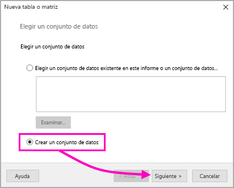
  
5.  En la página **Elegir una conexión a un origen de datos**, seleccione **Nuevo**. 

    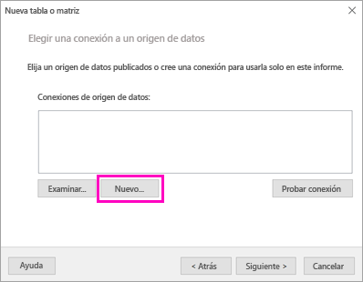
  
     Se abre el cuadro de diálogo **Propiedades del origen de datos**.  
  
6.  Puede asignar a un origen de datos el nombre que desee, con el uso de caracteres o guiones bajos. Para este tutorial, en el cuadro **Nombre**, escriba **MyAzureDataSource**.  
  
7.  En cuadro **Seleccionar tipo de conexión**, seleccione **Microsoft Azure SQL Database**.  
  
8.  Seleccione **Compilar** junto al cuadro **Cadena de conexión**. 

    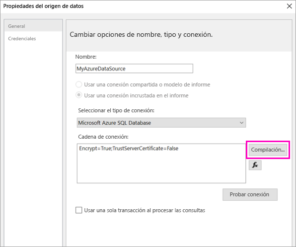

9. **En Azure:** vuelva a Azure Portal y seleccione **Bases de datos SQL**.

1. Seleccione la instancia de Azure SQL Database creada en la guía de inicio rápido "Creación de una instancia de ejemplo de Azure SQL Database en Azure Portal" en la sección **Requisitos previos** de este artículo.

1. En la pestaña **Introducción**, copie el valor en el cuadro **Nombre del servidor**.

2. **En el Generador de informes**: en el cuadro de diálogo **Propiedades de conexión**, en **Nombre del servidor**, pegue el nombre del servidor que copió. 

1. En **Iniciar sesión en el servidor**, asegúrese de que esté seleccionada la opción **Usar la autenticación de SQL Server** y luego escriba el nombre de usuario y la contraseña que creó en Azure para la base de datos de ejemplo.

1. En **Conexión a una base de datos**, seleccione la flecha desplegable y seleccione el nombre de la base de datos que creó en Azure.
 
    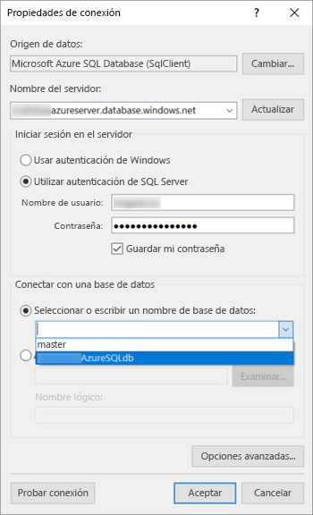

1. Seleccione **Probar conexión**. En los **Resultados de la prueba**, verá el mensaje **Conexión de prueba correcta**.

1. Seleccione **Aceptar** > **Aceptar**. 

   Ahora en el cuadro **Cadena de conexión**, el generador de informes muestra la cadena de conexión que acaba de crear. 

    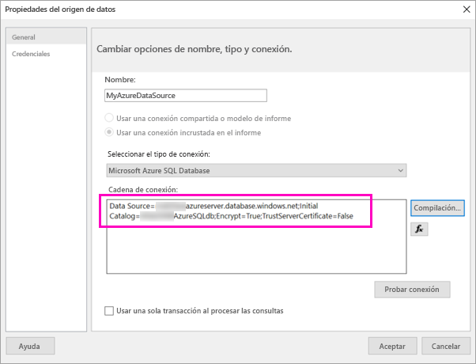

1. Seleccione **Aceptar**.
  
9. En la página **Elegir una conexión a un origen de datos**, verá "(en este informe)" debajo de la conexión al origen de datos que acaba de crear. Seleccione ese origen de datos > **Siguiente**.  

    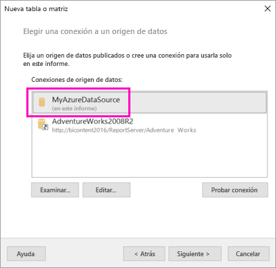

10. Escriba el mismo nombre de usuario y la contraseña en el cuadro. 
  
10. En la página **Diseñar una consulta**, expanda SalesLT, expanda las tablas y seleccione estas tablas:

    - Dirección
    - Cliente
    - Producto
    - ProductoCategoría
    - SalesOrderDetail
    - SalesOrderHeader

     Como **Relaciones** > **Detección automática** está seleccionado, el generador de informes detecta las relaciones entre estas tablas. 
    
    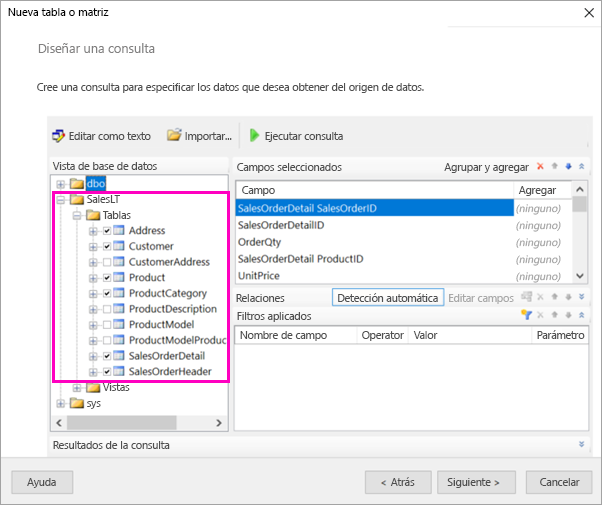
 
1.  Seleccione **Ejecutar consulta**. El generador de informes muestra los **resultados de la consulta**. 
 
     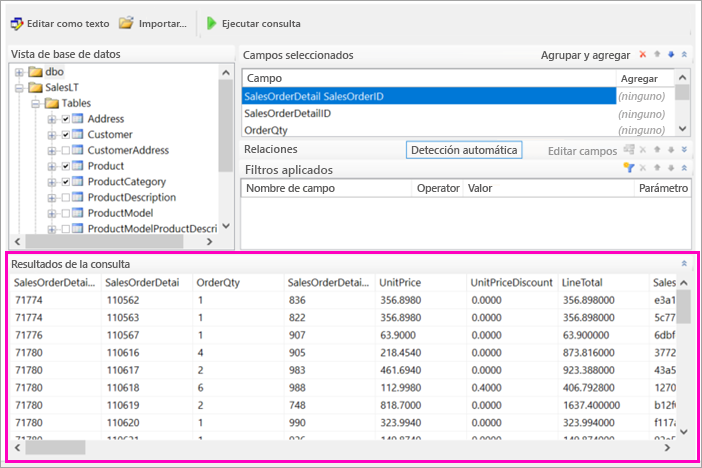

18. Seleccione **Siguiente**. 

19. En la página **Elegir un conjunto de datos**, seleccione el conjunto de datos que acaba de crear > **Siguiente**.

    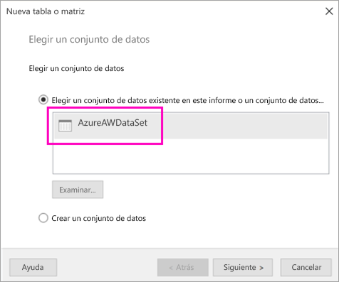

1. En la página **Organizar campos**, arrastre estos campos desde el cuadro **Campos disponibles** hasta el cuadro **Grupos de filas**:

    - CompanyName
    - SalesOrderNumber
    - Product_Name

1. Arrastre estos campos desde el cuadro **Campos disponibles** hasta el cuadro **Valores**:

    - OrderQty
    - Precio unidad
    - TotalLínea

    El generador de informes automáticamente suma los campos del cuadro **Valores**.

    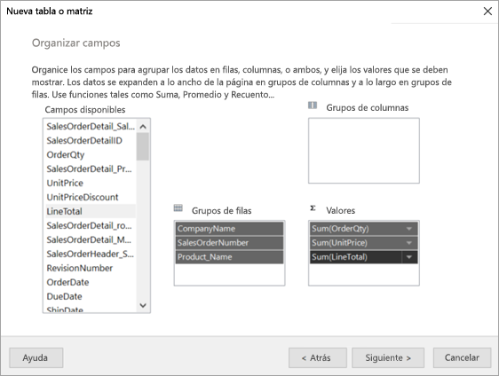

24. En la página **Elegir el diseño**, mantenga toda la configuración predeterminada, pero desactive **Expandir o contraer grupos**. En general, la característica Expandir o contraer grupos es magnífica, pero en esta ocasión desea que la tabla abarque varias páginas.

1. Seleccione **Siguiente** > **Finalizar**. La tabla se muestra en la superficie de diseño.
 
## Lo que ha creado

Vamos a hacer una pausa durante un momento para examinar los resultados del asistente.

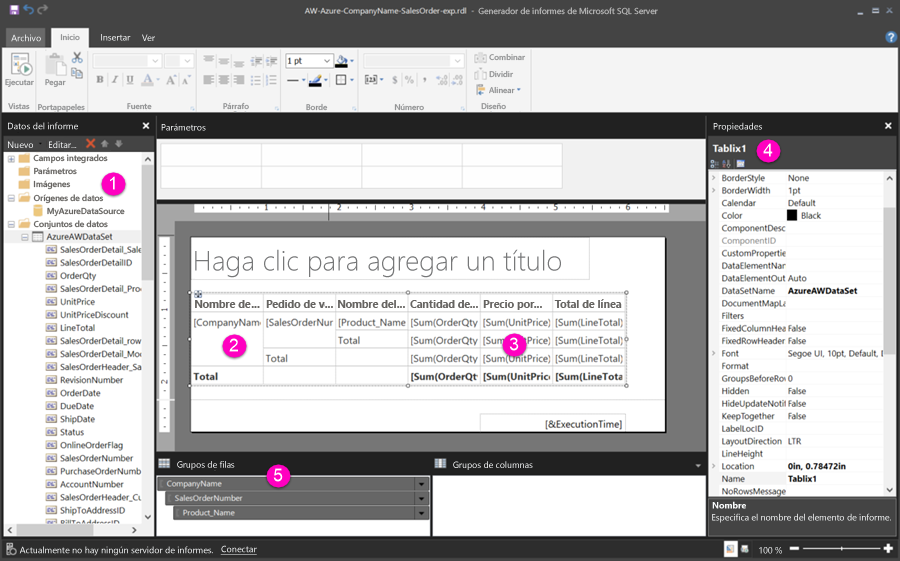

1. En el panel Datos de informe, verá el origen de datos de Azure insertado y el conjunto de datos insertado basado en él que usted mismo ha creado. 

2. La superficie de diseño tiene un ancho aproximado de 15 cm. En la superficie de diseño, verá la matriz, que muestra los valores de marcador de posición y los encabezados de columna. La matriz tiene seis columnas y parece tener una altura de solo cinco filas. 

3. En Order Qty, Unit Price y Line Total se muestran las sumas, y cada grupo de filas tiene un subtotal. 

    Aún no se ven los valores de datos reales. Deberá ejecutar el informe para verlos.

4. En el panel Propiedades, la matriz seleccionada se llama Tablix1. *Tablix* en el generador de informes es una región de datos que muestra los datos en filas y columnas. Puede ser una tabla o una matriz.

5. En el panel Agrupación, verá los tres grupos de filas creados en el asistente: 

    - CompanyName
    - Pedido de venta
    - Nombre del producto

    Esta matriz no tiene ningún grupo de columnas.

### Ejecución del informe

Para ver los valores reales, deberá ejecutar el informe.

1. Seleccione **Ejecutar** en la barra de herramientas **Inicio**.

   Ahora verá los valores. La matriz tiene muchas más filas que vio en la vista de diseño. Tenga en cuenta que en el generador de informes aparece la página **1** de **2?** El generador de informes carga el informe lo antes posible, por lo que solo recupera los datos suficientes para algunas páginas al mismo tiempo. El signo de interrogación indica que el generador de informes no ha cargado aún todos los datos.

   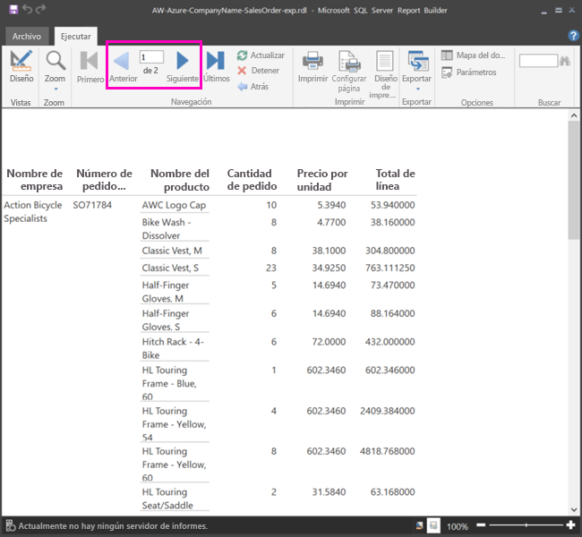

2. Seleccione **Diseño de impresión**. El informe tendrá este formato cuando lo imprima. El generador de informes ahora sabe que el informe tiene treinta y tres páginas y automáticamente ha agregado una marca de fecha y hora en el pie de página.

## Formato del informe

Ahora tiene un informe con una matriz que abarca treinta y tres páginas. Vamos a agregar algunas otras características y a mejorar su aspecto. Puede ejecutar el informe después de cada paso, si desea ver cómo está quedando.

- En la pestaña **Ejecutar** de la cinta de opciones, seleccione **Diseño**, de modo que pueda seguir modificándolo.  

### Configuración del ancho de página

Normalmente, un informe paginado tiene un formato de impresión, y una página normal tiene un tamaño de 8 1/2 X 11 pulgadas. 

1. Arrastre la regla para aplicar una anchura de 7 pulgadas a la superficie de diseño. Los márgenes predeterminados tienen 1 pulgada en cada lado, por lo que los márgenes laterales deben ser más estrechos.

1. Haga clic en el área gris que rodea la superficie de diseño para mostrar las propiedades del **informe**.

    Si no ve el panel Propiedades, haga clic en la pestaña **Vista** > **Propiedades**.

2. Expanda **Márgenes** y cambie **Izquierdo** y **Derecho** de 1 pulgada a 0,75 pulgadas. 

    
  
### Agregar un título al informe  

1. Seleccione el texto **Haga clic para agregar un título** en la parte superior de la página y después escriba **Ventas por empresa**.  

2. Seleccione el texto del título y, en el panel Propiedades, en **Fuente**, cambie el **Color** a **Azul**.
  
### Agregar un número de página

Puede observar que el informe tiene una marca de fecha y hora en el pie de página. También puede agregar un número de página en el pie de página.

1. En la parte inferior de la superficie de diseño, verá [& Hora de ejecución] a la derecha en el pie de página. 

2. En el panel Datos de informe, expanda la carpeta Campos integrados. Arrastre **Número de página** al lado izquierdo del pie de página, a la misma altura que [& Hora de ejecución].

3. Arrastre el lado derecho del cuadro [& Número de página] hasta que tenga un formato cuadrado.

4. En la pestaña **Insertar**, seleccione **Cuadro de texto**.

5. Haga clic a la derecha de [&Número de página], escriba "de" y luego ajuste el tamaño del cuadro de texto para que sea cuadrado.

6. Arrastre **Total general de páginas** al pie de página, a la derecha de "de" y luego arrastre su lado derecho hasta crear un cuadrado.

    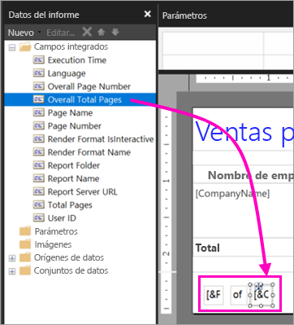

### Ampliar la anchura de la tabla  

Ahora puede ajustar la anchura de la matriz para que tenga un tamaño suficiente para llenar el ancho de la página y luego amplíe la anchura de las columnas de texto para que los nombres no se desplacen demasiado. 
 
1. Seleccione la matriz y luego seleccione la columna Nombre de empresa.

3. Mantenga el ratón sobre la barra gris en la parte superior de la matriz en el borde derecho de la columna Nombre de empresa. Arrastre hacia la derecha, hasta que la columna tenga 1 3/8 pulgadas. 

    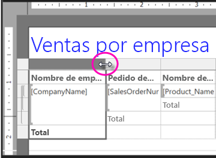

4. Arrastre el borde derecho del nombre de producto hasta que la columna tenga 3 3/4 pulgadas.   

Ahora la matriz es casi tan ancha como el área de impresión.

### Aplicar formato a la moneda

Si se dio cuenta cuando ejecutó el informe, los importes en dólares aún no tenían el formato de moneda.

1. Seleccione la celda superior izquierda [Sum(OrderQty)], mantenga presionada la tecla Mayús y seleccione la celda inferior derecha [Sum(LineTotal)].

    

2. En la pestaña **Inicio**, seleccione el símbolo de moneda del símbolo del dólar (**$**), luego seleccione la flecha situada junto a **Estilos de marcador de posición** > **Valores de ejemplo**.
 
    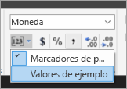

    Ahora puede observar que los valores tienen el formato de moneda.

    

### Agregar encabezados de columna en cada página

Una mejora más del formato antes de publicar el informe en el servicio Power BI: muestre los encabezados de columna en cada página del informe.

1. En el extremo derecho de la barra superior del panel Agrupación, seleccione la flecha desplegable > **Modo avanzado**.

    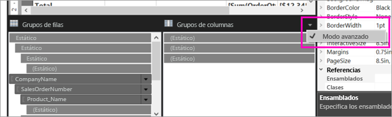

2. Seleccione la barra superior **Estático** en **Grupos de filas**. Verá que la celda Nombre de empresa de la matriz está seleccionada.

   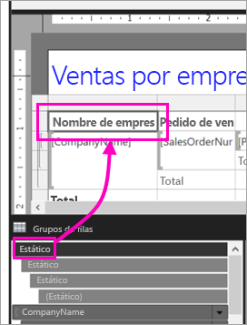

3. En el panel **Propiedades**, verá las propiedades de **Miembro de Tablix**. Establezca **KeepWithGroup** en **After** y **RepeatOnNewPage** en **True**.

    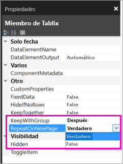

    Es el momento de ejecutar el informe y ver su aspecto ahora.

5. Seleccione **Ejecutar** en la pestaña **Inicio**.

6. Seleccione **Diseño de impresión**, si aún no está seleccionado. Ahora el informe tiene veintinueve páginas. Navegue por algunas páginas. Observará que el formato de moneda está aplicado, que las columnas tienen encabezados en cada página y que el informe tiene un pie de página con números de página y marcas de fecha y hora en cada página.
 
    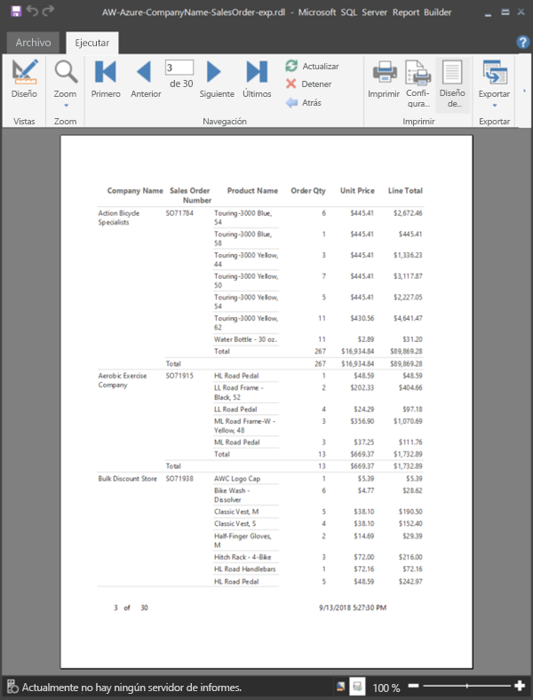

7. Guarde el informe en el equipo.
 
##  Cargar el informe en el servicio

Ahora que ha creado este informe paginado, es el momento de cargarlo en el servicio Power BI.

1. En el panel de navegación izquierdo (http://app.powerbi.com)) del servicio Power BI, seleccione **Áreas de trabajo** > **Crear área de trabajo de la aplicación**.

2. Asigne al área de trabajo el nombre **Azure AW** u otro nombre exclusivo. Es el único miembro por ahora. 

3. Seleccione la flecha situada junto a **Avanzado** y seleccione **Capacidad dedicada**. 

    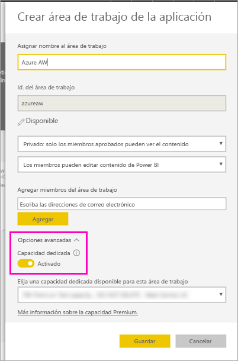

    Si no puede activar esta opción, debe pedir al administrador de Power BI que le conceda permisos para agregar el área de trabajo a la capacidad Premium dedicada.

4. Elija una **capacidad dedicada disponible para esta área de trabajo**, si es necesario > **Guardar**.
    
    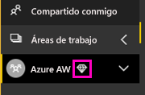

    Si el área de trabajo no tiene una capacidad Premium, al intentar cargar el informe, verá el mensaje "No se puede cargar el informe paginado". Póngase en contacto con el administrador de Power BI para mover el área de trabajo.

1. En el área de trabajo nueva, seleccione **Obtener datos**.

2. En el cuadro **Archivos**, seleccione **Obtener**.

3. Seleccione **Archivo local**, vaya a donde guardó el archivo > **Abrir**.

   Power BI importa el archivo, y puede verlo en **Informes** en la página de la lista de aplicaciones.

    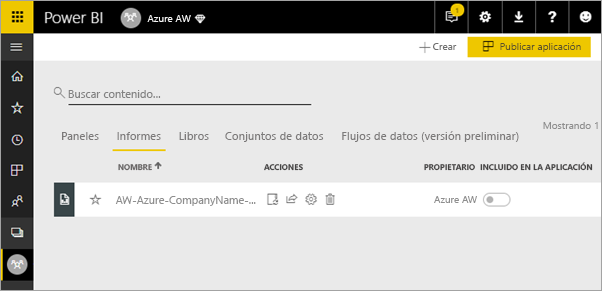

4. Seleccione el informe para verlo.

5. Si se produce un error, deberá volver a escribir sus credenciales. Seleccione el icono **Administrar**.

    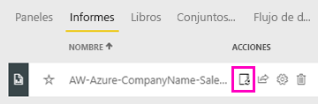

6. Seleccione **Editar credenciales** y escriba las credenciales que usó en Azure cuando creó la base de datos de Azure.

    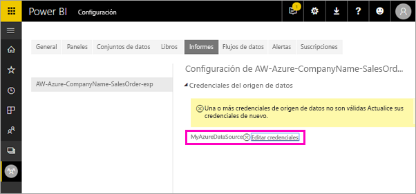

7. Ahora puede ver el informe paginado en el servicio Power BI.

    

## Pasos siguientes

[¿Qué son los informes paginados en Power BI Premium? (versión preliminar)](paginated-reports-report-builder-power-bi.md)

