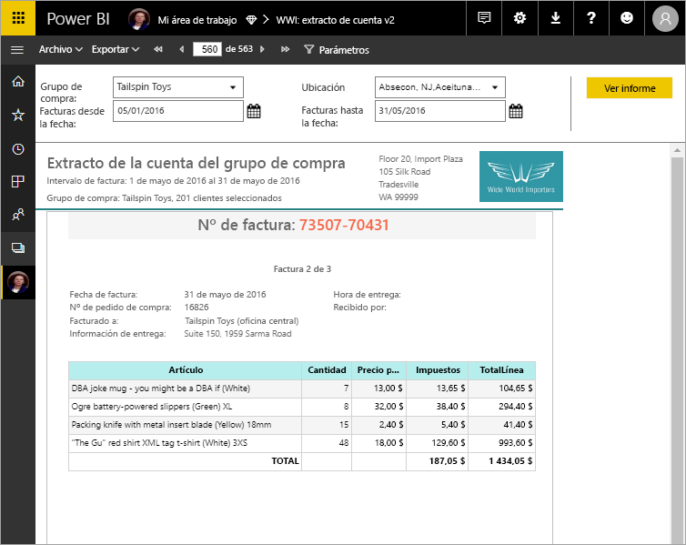

# ¿Qué son los informes paginados en Power BI Premium? (Versión preliminar)
Los informes paginados, con el formato de informe estándar de SQL Server Reporting Services, ya están disponibles en el servicio Power BI. Los informes paginados son informes diseñados para imprimirse o compartirse. Se denominan "paginados" porque se les aplica formato para ajustarse a una página, y muestran todos los datos en una tabla, por ejemplo, incluso si la tabla abarca varias páginas. A veces se denominan "píxel perfecto", porque se puede controlar exactamente el diseño de página del informe. Los informes paginados se basan en la tecnología de informe RDL de SQL Server Reporting Services. El generador de informes es la herramienta independiente para crear informes paginados. 

Los informes paginados pueden tener muchas páginas. El informe del siguiente ejemplo tiene 563 páginas, cada una diseñada exactamente con una página por factura y encabezados y pies de página repetidos.

Puede obtener una vista previa del informe en el generador de informes y luego publicarlo en el servicio Power BI, http://app.powerbi.com. Necesita una licencia de Power BI Pro para publicar un informe en el servicio. Puede publicar y compartir informes paginados en Mi área de trabajo o en las áreas de trabajo de la aplicación, siempre que el área de trabajo tenga una capacidad Premium de Power BI. Además, un administrador de Power BI debe habilitar los informes paginados en el portal de administración de Power BI. Obtenga más información sobre la [configuración de las cargas de trabajo](service-admin-premium-manage.md#configure-workloads). 

## Creación de informes en el generador de informes

Los informes paginados tienen su propia herramienta de diseño, el generador de informes. Si ha creado informes paginados para Power BI Report Server o SQL Server Reporting Services (SSRS), puede usar la misma herramienta y la misma versión. De hecho, los informes paginados que cree para SSRS 2016 y 2017 o para Power BI Report Server en el entorno local son compatibles con el servicio Power BI. El servicio Power BI mantiene la compatibilidad con versiones anteriores, para poder avanzar con los informes, y puede actualizar cualquier informe paginado de una versión anterior. No todas las características de informes están disponibles en el lanzamiento; consulte las [limitaciones y consideraciones](#limitations-and-considerations) en este artículo para obtener más información.
     
## Informes a partir de una variedad de orígenes de datos

Un único informe paginado puede tener un número de orígenes de datos distintos. No tiene un modelo de datos subyacente, a diferencia de los informes de Power BI. Para la versión inicial de los informes paginados del servicio Power BI, cree conjuntos de datos y orígenes de datos insertados en el propio informe, en lugar de conectarse a conjuntos de datos u orígenes de datos compartidos en un servidor. Cree informes en el generador de informes en el equipo local. Si un informe se conecta a datos locales, después de cargar el informe en el servicio Power BI, debe crear una puerta de enlace y redirigir la conexión de datos. Estos son los orígenes de datos a los que puede conectarse en la versión inicial:

- Azure SQL Database y Data Warehouse
- SQL Server a través de una puerta de enlace
- SQL Server Analysis Services a través de una puerta de enlace
 
Habrá más orígenes de datos durante el período de versión preliminar.

## Diseño del informe  

### Creación de informes paginados con diseños de forma libre, gráfico y matriz

Cree informes de tabla para datos basados en columnas, informes de matrices (como informes de tabla dinámica y de tabla cruzada) para datos resumidos, informes de gráficos para datos gráficos e informes de *lista* de forma libre para todo lo demás, como las facturas. 
  
Puede empezar con uno de los asistentes del generador de informes. Los asistentes de tabla, matriz y gráfico le ayudarán a crear el conjunto de datos insertado y la conexión del origen de datos insertada. Después, arrastre y coloque los campos para crear una consulta de conjunto de datos, seleccionar un diseño y estilo y personalizar el informe.  
  
Con el asistente para mapas, puede crear informes que muestren datos agregados con un fondo geométrico o geográfico. Los datos de mapas pueden ser datos espaciales de una consulta Transact-SQL o un archivo de forma de Environmental Systems Research Institute, Inc. (ESRI). También puede agregar un fondo de mosaico de mapa de Microsoft Bing.  

### Agregar más al informe

Modifique los datos mediante el filtrado, la agrupación y la ordenación de los datos o con la adición de fórmulas o expresiones. Agregue gráficos, medidores, minigráficos e indicadores para resumir los datos en un formato visual.  Use parámetros y filtros para filtrar datos en vistas personalizadas. Inserte imágenes y otros recursos o haga referencia a ellos, incluido contenido externo.  

Todo el contenido de un informe paginado, desde el propio informe hasta cada cuadro de texto, imagen, tabla y gráfico, tiene una matriz de propiedades que puede configurar para que el informe tenga exactamente el mismo aspecto que desea.

## Creación de una definición de informe

Al diseñar un informe paginado, realmente crea una *definición de informe*. No contiene los datos. Especifica de dónde se obtienen los datos, qué datos se obtienen y cómo mostrar los datos. Al ejecutar el informe, el procesador de informes toma la definición de informe que ha especificado, recupera los datos y los combina con el diseño del informe para generar el informe. Cargue la definición de informe en el servicio Power BI, http://app.powerbi.com, en Mi área de trabajo o en un área de trabajo compartida con sus compañeros. Si el origen de datos del informe es local, después de cargar el informe, redirija la conexión del origen de datos para que pase por una puerta de enlace. 

## Visualización del informe paginado
Puede ver el informe paginado en el servicio Power BI en un explorador y también en las aplicaciones móviles de Power BI. En el servicio Power BI, puede exportar el informe a un número formatos de aplicaciones de escritorio orientados a la Web y a páginas, como HTML, MHTML, PDF, XML, CSV, TIFF, Word y Excel. También puede compartirlo con otros usuarios.  
  
## Limitaciones y consideraciones

Estas son algunas otras características que no son compatibles con la versión inicial:

- Anclar páginas de informes u objetos visuales a los paneles de Power BI.
- Características interactivas como mapas del documento y botones para mostrar u ocultar.
- Subinformes e informes de obtención de detalles.
- Suscripciones.
- Orígenes de datos compartidos y conjuntos de datos compartidos.
- Conjuntos de datos de Power BI.
- Elementos visuales de informes de Power BI.
- Informes paginados de aplicaciones. Puede compartir un informe paginado de un área de trabajo de la aplicación, pero no puede incluirlo cuando se publica la aplicación desde esa área de trabajo.
 
## Pasos siguientes

- [Instalación del generador de informes desde el Centro de descarga de Microsoft](http://go.microsoft.com/fwlink/?LinkID=734968)

- [Tutorial: Crear un informe paginado](paginated-reports-quickstart-aw.md)
  

