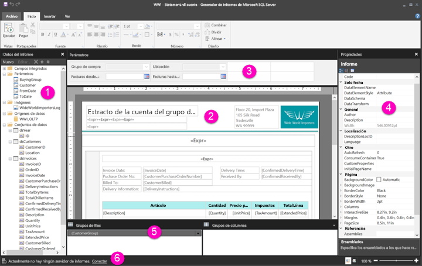

# Descripción de la vista de diseño de informe en los informes paginados

La vista de diseño de informe del generador de informes es el espacio de diseño para crear informes paginados que puede publicar en el servicio Power BI. La superficie de diseño está en el centro del generador de informes, con la cinta de opciones y los paneles a su alrededor. La superficie de diseño es donde se agregan y organizan los elementos de informe. En este artículo se explican los paneles que se usan para agregar, seleccionar y organizar los recursos de informe y cambiar las propiedades de los elementos del informe.  

1.  [Panel Datos de informe](#report-data-pane) 
2.  [Superficie de diseño del informe](#report-design-surface)  
3.  [Panel Parámetros](#parameters-pane) 
4.  [Panel Propiedades](#properties-pane) 
5.  [Panel de agrupación](#grouping-pane) 
6.  [Barra de estado del informe actual](#current-report-status-bar)  
  
## 1 Panel Datos de informe  
 En el panel Datos de informe, defina los datos y los recursos que necesita para un informe antes de crear el diseño del informe. Por ejemplo, puede agregar orígenes de datos, conjuntos de datos, campos calculados, parámetros de informe e imágenes al panel Datos de informe.  
  
 Una vez agregados los elementos al panel Datos de informe, arrastre los campos a los elementos de informe hasta la superficie de diseño para controlar dónde aparecen los datos en el informe.  
  
> [!TIP]  
>  Si arrastra un campo desde el panel Datos de informe directamente a la superficie de diseño del informe en lugar de colocarlo en una región de datos como una tabla o un gráfico, al ejecutar el informe, verá solo el primer valor de los datos de ese campo.  
  
 También puede arrastrar campos integrados desde el panel Datos de informe a la superficie de diseño del informe. Cuando se representan, estos campos proporcionan información acerca del informe, como el nombre del informe, el número total de páginas del informe y el número de página actual.  
  
 Algunos elementos se agregan automáticamente al panel Datos de informe al agregar algún elemento a la superficie de diseño del informe. Por ejemplo, si inserta una imagen en el informe, se agregará a la carpeta Imágenes en el panel Datos de informe.  
  
> [!NOTE]  
>  Puede usar el botón **Nuevo** para agregar un nuevo elemento al panel Datos de informe. Puede agregar varios conjuntos de datos desde el mismo origen de datos o desde otros orígenes de datos al informe. Para agregar un nuevo conjunto de datos desde el mismo origen de datos, haga clic con el botón derecho en un origen de datos > **Agregar conjunto de datos**.  
  
## 2 Superficie de diseño del informe  
 La superficie de diseño del informe del generador de informes es el área de trabajo principal para diseñar los informes. Para colocar elementos de informe como regiones de datos, subinformes, cuadros de texto, imágenes, rectángulos y líneas en el informe, agréguelos desde la galería de elementos de informe o desde la cinta de opciones a la superficie de diseño. Allí, puede agregar grupos, expresiones, parámetros, filtros, acciones, visibilidad y formato a los elementos de informe.  
  
 También puede modificar lo siguiente:  
  
-   Las propiedades del cuerpo del informe, como el color de borde y relleno, haciendo clic con el botón derecho en el área en blanco de la superficie de diseño, fuera de cualquier elemento de informe, y seleccionando **Propiedades de cuerpo de informe**.  
  
-   Las propiedades de encabezado y pie de página, como el color de borde y relleno, haciendo clic con el botón derecho en el área en blanco de la superficie de diseño en el área del encabezado o el pie de página, fuera de cualquier elemento de informe, y seleccionando **Propiedades del encabezado de página** o **Propiedades del pie de página**.  
  
-   Las propiedades del propio informe, como la configuración de página, haciendo clic con el botón derecho en el área gris que rodea la superficie de diseño y seleccionado **Propiedades del informe**.  
  
-   Las propiedades de los elementos de informe, haciendo clic con el botón derecho en ellos y seleccionando **Propiedades**.  
  
### Área de impresión y tamaño de la superficie de diseño  
El tamaño de la superficie de diseño podría ser diferente del área de impresión del tamaño de página que especifique para imprimir el informe. Cambiar el tamaño de la superficie de diseño no cambiará el área de impresión del informe. Con independencia del tamaño establecido para el área de impresión del informe, no cambia el tamaño total del área de diseño. Para más información, vea los comportamientos de representación. 
  
- Para mostrar la regla, en la pestaña **Vista**, seleccione la casilla **Regla**.  
  
## 3 Panel Parámetros  
 Con los parámetros de informe, puede controlar datos de informe, conectar informes relacionados y variar la presentación del informe. El panel de parámetros proporciona un diseño flexible para los parámetros del informe.  
  
 Más información sobre los parámetros de informe   
  
## 4 Panel Propiedades
 Todos los elementos de un informe, como las regiones de datos, las imágenes, los cuadros de texto y el cuerpo del informe, tienen propiedades asociadas con ellos. Por ejemplo, la propiedad BorderColor de un cuadro de texto muestra el valor de color del borde del cuadro de texto, y la propiedad PageSize del informe muestra el tamaño de página del informe.  
  
 Estas propiedades se muestran en el panel Propiedades. Las propiedades del panel cambian en función del elemento de informe que seleccione.  
  
- Para ver el panel Propiedades, haga clic en la pestaña **Vista** del grupo **Mostrar u ocultar** > **Propiedades**.  
  
### Cambiar valores de propiedad  
 En el generador de informes, puede cambiar las propiedades de los elementos de informe de varias maneras:  
  
-   Seleccionando los botones y las listas en la cinta de opciones.  
  
-   Cambiando la configuración de los cuadros de diálogo.  
  
-   Cambiando los valores de propiedad en el panel Propiedades.  
  
 Las propiedades más utilizadas están disponibles en los cuadros de diálogo y en la cinta de opciones.  
  
 Dependiendo de la propiedad, puede establecer un valor de propiedad desde una lista desplegable, escribir el valor o seleccionar `<Expression>` para crear una expresión.  
  
### Cambiar la vista del panel Propiedades  
 De forma predeterminada, las propiedades mostradas en el panel Propiedades se organizan en amplias categorías, como acción, borde, relleno, fuente y general. Cada categoría tiene un conjunto de propiedades asociadas con ella. Por ejemplo, las siguientes propiedades se muestran en la categoría de fuente: Color, FontFamily, FontSize, FontStyle, FontWeight, LineHeight y TextDecoration. Si lo prefiere, puede ordenar alfabéticamente todas las propiedades enumeradas en el panel. Esto elimina las categorías y enumera todas las propiedades en orden alfabético, independientemente de la categoría.  
  
 El panel Propiedades tiene tres botones en la parte superior del panel: **Categoría**, **Alfabetizar** y **Página de propiedades**. Seleccione los botones Categoría y Alfabetizar para cambiar entre las vistas del panel Propiedades. Seleccione el botón **Páginas de propiedades** para abrir el cuadro de diálogo de propiedades de un elemento de informe seleccionado.  
  
  
## 5 Panel de agrupación

 Los grupos se usan para organizar los datos del informe en una jerarquía visual y para calcular los totales. Puede ver los grupos de filas y columnas dentro de una región de datos en la superficie de diseño y en el panel de agrupación. El panel de agrupación tiene dos paneles: grupos de filas y grupos de columnas. Al seleccionar una región de datos, el panel Agrupación muestra todos los grupos dentro de dicha región de datos como una lista jerárquica: los grupos secundarios aparecen con sangría aplicada debajo de sus grupos principales.  
  
 Puede crear grupos arrastrando campos desde el panel Datos de informe y colocándolos en la superficie de diseño o en el panel de agrupación. En el panel de agrupación, puede agregar grupos principales, adyacentes y secundarios, cambiar las propiedades de grupo y eliminar grupos.  
  
 Se muestra el panel de agrupación de forma predeterminada, pero puede cerrarlo desactivando la casilla del panel de agrupación en la pestaña Vista. El panel de agrupación no está disponible para las regiones de datos de gráfico o medidor.  
  
 Para más información, vea el panel de agrupación y la descripción de los grupos.  
  
## 6 Barra de estado del informe actual

La barra de estado del informe actual muestra el nombre del servidor al que está conectado el informe, o bien muestra "Actualmente no hay ningún servidor de informes". Puede seleccionar **Conectar** para conectarse a un servidor.

## Pasos siguientes

[¿Qué son los informes paginados en Power BI Premium? (versión preliminar)](paginated-reports-report-builder-power-bi.md) 

  
  
