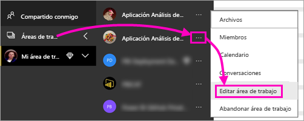
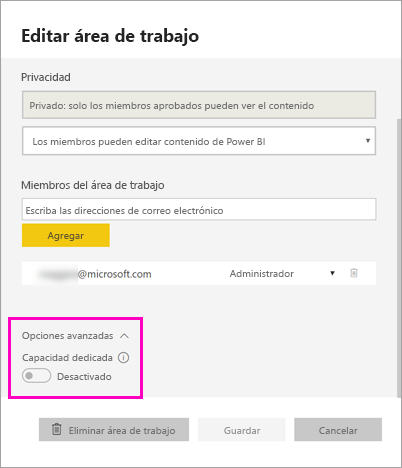
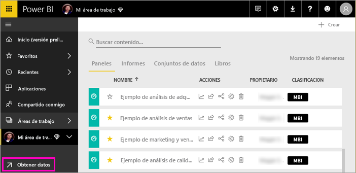
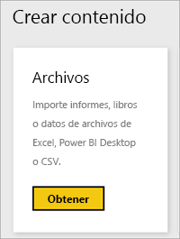
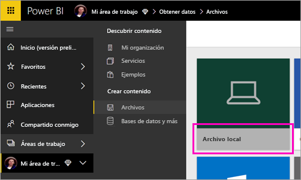
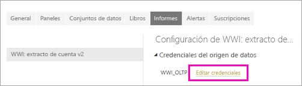
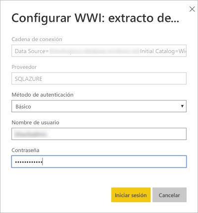
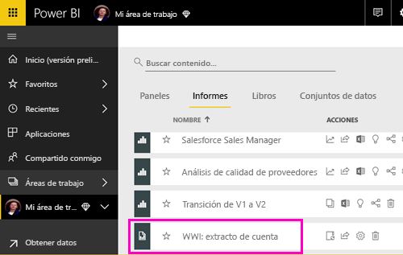
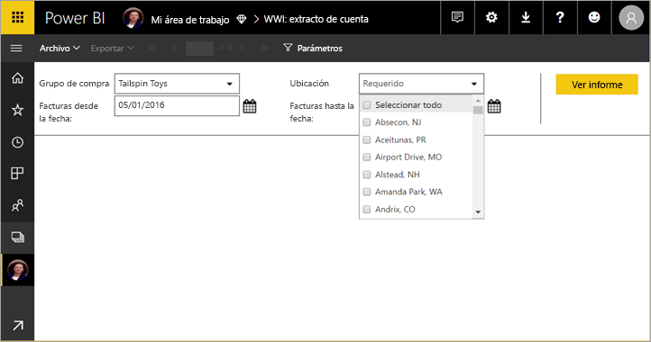

# Publicación de un informe paginado en el servicio Power BI (versión preliminar)

En este artículo, se ofrece información sobre cómo publicar un informe paginado en el servicio Power BI cargándolo desde el equipo local. Puede cargar informes paginados en Mi área de trabajo o en cualquier otra área de trabajo, siempre que tenga capacidad Premium. Busque el icono de diamante  junto al nombre del área de trabajo. 

Si el origen de datos del informe es local, entonces deberá [crear una puerta de enlace](#create-a-gateway-to-an-on-premises-data-source) después de cargar el informe.

## Adición de un área de trabajo a una capacidad Premium

Si el área de trabajo no tiene el icono de diamante  junto al nombre, deberá agregar el área de trabajo a una capacidad Premium. 

1. Seleccione **Áreas de trabajo**, seleccione el botón de puntos suspensivos (**...**) junto al nombre del área de trabajo y después seleccione **Editar área de trabajo**.

    

1. En el cuadro de diálogo **Editar área de trabajo**, expanda **Avanzado** y después establezca la opción **Capacidad dedicada** en **Activado**.

    

   Es posible que no pueda cambiar esta configuración. Si no puede, póngase en contacto con el administrador de capacidad Premium de Power BI para que le conceda derechos de asignación para agregar el área de trabajo a una capacidad Premium.

## Carga de un informe paginado

1. Cree el informe paginado en el generador de informes y guárdelo en el equipo local.

1. Abra el servicio Power BI en un explorador y vaya al área de trabajo Premium en el que desea publicar el informe. Observe el icono de diamante  junto al nombre. 

1. Seleccione **Obtener datos**.

    

1. En el cuadro **Archivos** , seleccione **Obtener**.

    

1. Seleccione **Archivo local** > busque el informe paginado > **Abrir**.

    

1. Seleccione **Continuar** > **Editar credenciales**.

    

1. Configure las credenciales > **Iniciar sesión**.

    

   El informe aparece en la lista de informes.

    

1. Selecciónelo para abrirlo en el servicio Power BI. Si tiene parámetros, debe seleccionarlos para poder ver el informe.
 
    

## Creación de una puerta de enlace

Al igual que cualquier otro informe de Power BI, si el origen de datos del informe es local, debe crear una puerta de enlace o conectarse a ella para acceder a los datos.

1. Junto al nombre del informe, seleccione **Administrar**.

   

1. Consulte el artículo del servicio Power BI [Instalación de una puerta de enlace](service-gateway-install.md) para obtener detalles y conocer los pasos siguientes.

### Limitaciones de la puerta de enlace

Actualmente, las puertas de enlace no admiten parámetros de varios valores.

## Pasos siguientes

- [Visualización de un informe paginado en el servicio Power BI](paginated-reports-view-power-bi-service.md)
- [¿Qué son los informes paginados en Power BI Premium? (versión preliminar)](paginated-reports-report-builder-power-bi.md)

