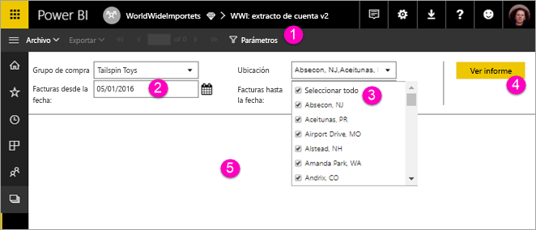

# Visualización de los parámetros de los informes paginados en el servicio Power BI

En este artículo, obtendrá información sobre cómo interactuar con los parámetros de los informes paginados en el servicio Power BI.  El parámetro de un informe ofrece una forma de filtrar los datos de los informes. Los parámetros ofrecen una lista de valores disponibles, y puede elegir uno o varios valores. A veces, los parámetros tienen un valor predeterminado y, en ocasiones, tendrá que elegir un valor para poder ver el informe.  

Al ver un informe que tiene parámetros, la barra de herramientas del visor de informes muestra cada parámetro para especificar valores de forma interactiva. La siguiente ilustración muestra el área de parámetros de un informe con parámetros para **Grupo de compra**, **Ubicación**, **Fecha inicial** y **Fecha final**.  

## Panel de parámetros en el servicio Power BI

  
1.  **Panel de parámetros** La barra de herramientas del visor de informes muestra un aviso, tipo "Obligatorio", o un valor predeterminado para cada parámetro.    
  
2.  **Parámetros de fecha inicial y fecha final de las facturas** Los dos parámetros de fecha tienen valores predeterminados. Para cambiar la fecha, escriba una fecha en el cuadro de texto o elija una en el calendario.  
  
3.  **Parámetro de ubicación** El parámetro de ubicación se configura para permitirle seleccionar un valor, muchos o todos. 
  
4.  **Ver informe** Después de escribir o cambiar los valores de parámetros, haga clic en **Ver informe** para ejecutar el informe. 

5. **Valores predeterminados** Si todos los parámetros tienen valores predeterminados, el informe se ejecuta automáticamente en la primera vista. Algunos parámetros de este informe no tienen valores predeterminados, por lo que no verá el informe hasta que haya seleccionado los valores.  

## Pasos siguientes

[Creación de parámetros de informes paginados en el servicio Power BI](paginated-reports-parameters.md)
