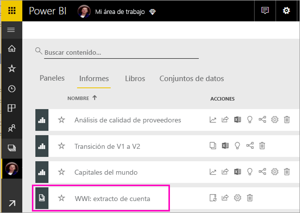
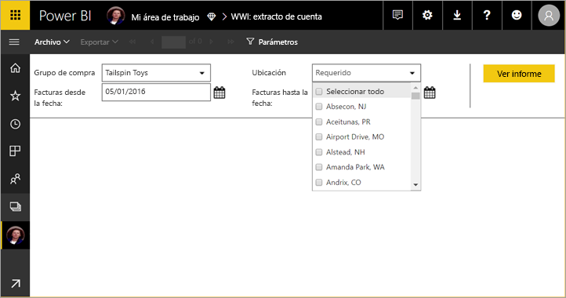
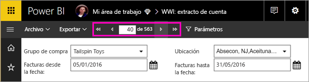
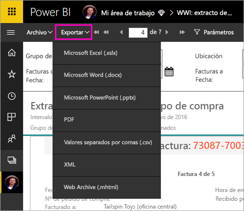

# Visualización de un informe paginado en el servicio Power BI

En este artículo obtendrá información sobre cómo ver un informe paginado en el servicio Power BI. Los informes paginados son informes creados en el generador de informes y cargados en cualquier área de trabajo con una capacidad Premium. Busque el icono de diamante  junto al nombre del área de trabajo. 

Los informes paginados tienen su propio icono. .

También puede exportar los informes paginados en una serie de formatos: 

- Microsoft Excel
- Microsoft Word
- Microsoft PowerPoint
- PDF
- Valores separados por comas
- XML
- Archivo web (.mhtml)

## Visualización de un informe paginado

1. Seleccione el informe paginado en el área de trabajo.

    

2. Si el informe tiene parámetros, como este, puede que no vea el informe la primera vez que lo abra. Seleccione los parámetros y luego seleccione **Ver informe**. 

     

    También puede cambiar los parámetros en cualquier momento.

1. Navegue por las páginas del informe seleccionando las flechas en la parte superior de la página o escribiendo el número de la página en el cuadro.
    
   

4. Seleccione **Exportar** para buscar un formato para exportar los informes paginados.

    

## Pasos siguientes

[¿Qué son los informes paginados en Power BI Premium?](paginated-reports-report-builder-power-bi.md)
