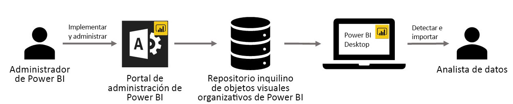

# Objetos visuales personalizados de la organización en Power BI

Puede usar objetos visuales personalizados en Power BI para crear un único tipo de objeto visual adaptado a sus necesidades. Son los desarrolladores quienes crean estos objetos visuales personalizados cuando la gran cantidad de objeto visuales incluidos en Power BI no satisface del todo sus necesidades.

En algunas organizaciones, los objetos visuales personalizados son incluso más importantes: pueden ser necesarios para transmitir datos o informaciones particulares que son exclusivos de la organización, pueden tener requisitos especiales de datos o pueden poner de relieve métodos empresariales privados. Estas organizaciones tienen que desarrollar objetos visuales personalizados, compartirlos en toda su organización y asegurarse de que reciben un mantenimiento adecuado. Los objetos visuales personalizados de Power BI permiten a las organizaciones hacer exactamente eso.

La siguiente imagen muestra el proceso por el cual los objetos visuales de la organización en Power BI van desde la administración, pasando por el desarrollo y el mantenimiento, hasta llegar al analista de datos.

Los objetos visuales de la organización se implementan y administran mediante el Administrador de Power BI del portal de administración. Una vez implementados en el repositorio de organización, los usuarios de la organización pueden detectarlos fácilmente e importarlos en sus informes directamente desde Power BI Desktop.

Para obtener más información sobre cómo utilizar los objetos visuales personalizados de la organización en los informes que ha creado, consulte el siguiente artículo: [Más información sobre cómo importar objetos visuales de la organización en los informes](power-bi-custom-visuals.md).

## Administración de objetos visuales personalizados de organización

Para obtener más información sobre cómo administrar, implementar y administrar objetos visuales personalizados en su organización, consulte el siguiente artículo: [Obtenga información sobre implementación y administración de objetos visuales personalizados de la organización](https://go.microsoft.com/fwlink/?linkid=866790).

> [!WARNING]
> Un objeto visual personalizado podría contener código que presente riesgos para la seguridad o la privacidad. Asegúrese de que confía en el autor y el origen de cualquier objeto visual personalizado antes de implementarlo en el repositorio de la organización.

## Consideraciones y limitaciones

Hay varias consideraciones y limitaciones que debe tener en cuenta.

Administrador:

* No se admiten objetos visuales personalizados heredados (por ejemplo, los que no se basan en las nuevas API con control de versiones).

* Si se elimina un objeto visual personalizado del repositorio, los informes existentes que usen el objeto visual eliminado dejarán de representarlo. La operación de eliminación del repositorio no es reversible. Para deshabilitar temporalmente un objeto visual personalizado, use la característica "Deshabilitar".

Usuario final:

* Los objetos visuales personalizados de la organización son objetos visuales privados importados del repositorio de la organización. Como cualquier otro objeto visual privado, no pueden [exportarse a PowerPoint](https://docs.microsoft.com/power-bi/consumer/end-user-powerpoint) ni mostrarse en los correos electrónicos recibidos cuando un usuario se [suscribe a las páginas del informe](https://docs.microsoft.com/power-bi/consumer/end-user-subscribe). Solo los [objetos visuales personalizados certificados](https://docs.microsoft.com/power-bi/power-bi-custom-visuals-certified) importados directamente del mercado admiten estas características.

* Los objetos visuales de Visio, PowerApps, Map y GlobeMap del Marketplace de AppSource no se representarán si se implementan a través del repositorio de la organización.

## Solucionar problemas

Para obtener información sobre cómo solucionar problemas, visite [Troubleshooting your Power BI custom visuals](power-bi-custom-visuals-troubleshoot.md) (Solución de problemas con objetos visuales personalizados de Power BI).

## PREGUNTAS MÁS FRECUENTES

Para obtener más información y respuestas a las preguntas, visite las [preguntas más frecuentes sobre objetos visuales personalizados de Power BI](power-bi-custom-visuals-faq.md#organizational-custom-visuals).

¿Tiene más preguntas? [Pruebe la comunidad de Power BI](http://community.powerbi.com/).
