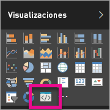

# Solución de problemas de los objetos visuales personalizados de Power BI

## Depurar

**No se ha encontrado el comando de pbiviz (o errores similares)**

Si ejecuta `pbiviz` en la línea de comandos del terminal, verá la pantalla de ayuda. De lo contrario, no está instalado correctamente. Asegúrese de que tiene instalada al menos la versión 4.0 de NodeJS.

**No se puede encontrar el objeto visual de depuración en la pestaña Visualizaciones**

El objeto visual de depuración es similar a un icono de símbolo del sistema en la pestaña **Visualizaciones**.

Si no lo ve, asegúrese de que lo ha habilitado en la configuración de Power BI.

> [!NOTE]
> Actualmente, el objeto visual de depuración solo está disponible en el servicio Power BI y no está en Power BI Desktop ni en la aplicación móvil. El objeto visual empaquetado seguirá funcionando en todas partes.

**No puede ponerse en contacto con el servidor del objeto visual**

Ejecute el servidor del objeto visual con el comando `pbiviz start` en línea de comandos del terminal desde la raíz del proyecto del objeto visual. Si el servidor no se está ejecutando, es probable que los certificados SSL no se hayan instalado correctamente.

Si tiene alguna pregunta, problema o quiere hacer un comentario, no dude en ponerse en contacto con el equipo de soporte técnico de los objetos visuales personalizados: *pbicvsupport@microsoft.com*  .

## Pasos siguientes

Para obtener más información, visite las [preguntas más frecuentes sobre objetos visuales personalizados de Power BI](power-bi-custom-visuals-faq.md#organizational-custom-visuals).
