# Elementos visuales personalizados en Power BI

Al crear o editar un informe de Power BI, puede usar muchos tipos diferentes de objetos visuales. Estos objetos visuales se muestran en el panel **Visualizaciones**. Al descargar Power BI Desktop o abrir el servicio Power BI (app.powerbi.com), este conjunto de objetos visuales ya está incluido.

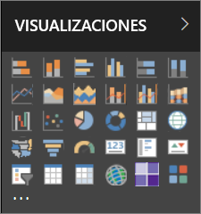

Pero no solo puede usar este conjunto de objetos visuales; seleccione el botón de puntos suspensivos y se abrirá otro origen de objetos visuales de informe, los *objetos visuales personalizados*.

Los desarrolladores son quienes crean los objetos visuales personalizados, por medio del SDK de los objetos visuales personalizados, para permitir a los usuarios de empresas ver sus datos de la manera que mejor se adapte a sus organizaciones. Los autores de informes pueden así importar los archivos de objetos visuales personalizados en sus informes y utilizarlos como cualquier otro objeto visual de Power BI. A los objetos visuales personalizados se les concede la máxima prioridad en Power BI y es posible filtrarlos, resaltarlos, editarlos, compartirlos, etc.

Los objetos visuales personalizados pueden tener el formato de tres canales de implementación:

* Archivos de objetos visuales personalizados
* Objetos visuales de la organización
* Objetos visuales de Marketplace

## Archivos de objetos visuales personalizados

Los objetos visuales personalizados son paquetes que contienen código para representar los datos que reciben. Cualquiera puede crear un objeto visual personalizado y empaquetarlo como un archivo `.pbiviz` único, que puede importarse en un informe de Power BI.

> [!WARNING]
> Un objeto visual personalizado podría contener código con riesgos para la seguridad o la privacidad; asegúrese de que confía en el autor y el origen del objeto visual personalizado antes de implementarlo en su informe.

## Objetos visuales de la organización

Los administradores de Power BI pueden implementar objetos visuales personalizados en su organización, de manera que los autores de informes pueden detectarlos fácilmente y usar objetos visuales personalizados que el administrador haya aprobado para su uso dentro de la organización. Esto confiere al administrador el control de elegir objetos visuales personalizados específicos para implementar en la organización, así como una manera fácil de administrar esos objetos visuales (por ejemplo, actualizar la versión, deshabilitar/habilitar). Para el autor del informe, es un método sencillo para detectar objetos visuales que son únicos para la organización, así como un medio fluido para actualizar esos objetos visuales.

Para obtener más información acerca de los objetos visuales de organización, [lea este artículo sobre los objetos visuales de organización](power-bi-custom-visuals-organization.md).

## Objetos visuales de Marketplace

Los miembros de la comunidad, así como Microsoft, han aportado sus objetos visuales personalizados para el beneficio del público y los han publicado en el Marketplace de [AppSource](https://appsource.microsoft.com/en-us/marketplace/apps?product=power-bi-visuals). Estos objetos visuales pueden descargarse y agregarse a los informes de Power BI. Todos estos objetos visuales personalizados se han probado y aprobado por Microsoft en términos de funcionalidad y calidad.

¿Qué es [AppSource](developer/office-store.md)? En pocas palabras, es el lugar donde podrá encontrar aplicaciones, complementos y extensiones para su software de Microsoft. [AppSource](https://appsource.microsoft.com/en-us/) conecta millones de usuarios de productos como Office 365, Azure, Dynamics 365, Cortana y Power BI con soluciones que les ayudan a realizar su trabajo de forma más eficaz, minuciosa o atractiva que antes.

### Objetos visuales certificados

Los objetos visuales certificados por Power BI son objetos visuales de Marketplace que han superado pruebas rigurosas adicionales para la calidad y se admiten en escenarios adicionales, como [suscripciones de correo electrónico](https://docs.microsoft.com/power-bi/service-report-subscribe) y [exportación a PowerPoint](https://docs.microsoft.com/power-bi/service-publish-to-powerpoint).
Para ver la lista de objetos visuales personalizados certificados o para enviar su propia lista, consulte [Certified custom visuals](https://docs.microsoft.com/power-bi/power-bi-custom-visuals-certified) (Objetos visuales personalizados certificados).

¿Es un desarrollador web interesado en crear sus propias visualizaciones y agregarlas a AppSource? Vea [Desarrollo de objetos visuales personalizados de Power BI](developer/custom-visual-develop-tutorial.md) y vea cómo [publicar objetos visuales personalizados en AppSource](https://appsource.microsoft.com/en-us/marketplace/apps?product=power-bi-visuals).

### Importar un objeto visual personalizado de un archivo

1. En la parte inferior del panel Visualizaciones, seleccione los puntos suspensivos.

    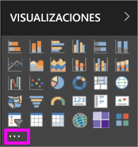

2. En la lista desplegable, seleccione **Importar desde archivo**.

    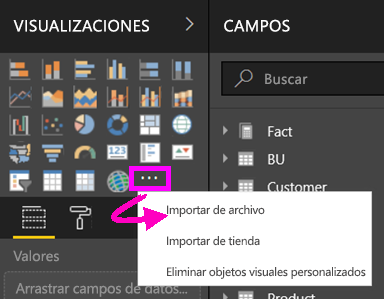

3. En el menú Abrir archivo, seleccione el archivo `.pbiviz` que quiere importar y luego Abrir. El icono del objeto visual personalizado se agrega a la parte inferior del panel de visualizaciones y ya se puede usar en el informe.

    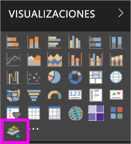

### Importación de objetos visuales de organización

1. En la parte inferior del panel Visualizaciones, seleccione los puntos suspensivos.

    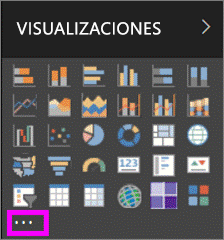

2. En el menú desplegable, seleccione Importar de Marketplace.

    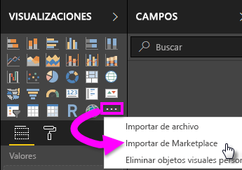

3. Seleccione **MI ORGANIZACIÓN** en el menú de la pestaña superior.

    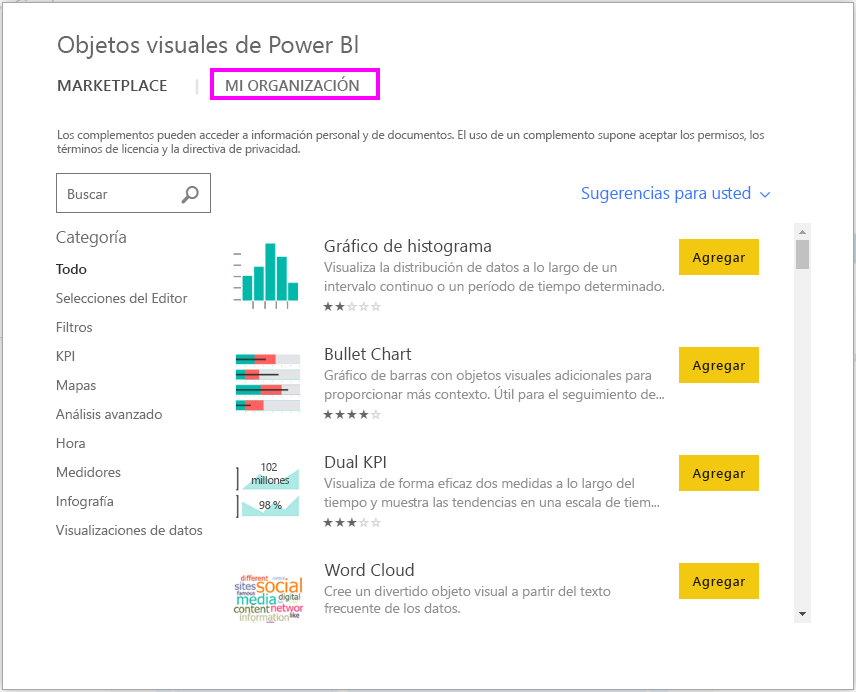

4. Desplácese por la lista hasta que encuentre el objeto visual que desea importar.

    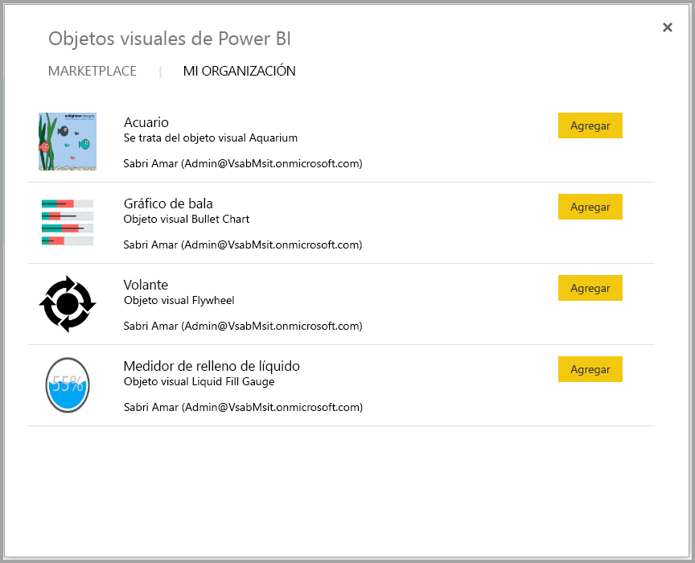

5. Para importar el objeto visual personalizado, seleccione **Agregar**. El icono del objeto visual personalizado se agrega a la parte inferior del panel de visualizaciones y ya se puede usar en el informe.

    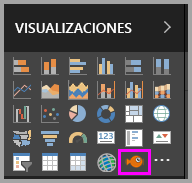

## Descargar o importar objetos visuales personalizados desde Microsoft AppSource

Tiene dos opciones para descargar e importar objetos visuales personalizados; desde Power BI y desde el sitio web de AppSource.

### Importar objetos visuales personalizados desde Power BI

1. En la parte inferior del panel Visualizaciones, seleccione los puntos suspensivos.

    

2. En el menú desplegable, seleccione **Importar de Marketplace**.

    

3. Desplácese por la lista hasta que encuentre el objeto visual que desea importar.

    

4. Para obtener más información sobre uno de los objetos visuales, resáltelo y selecciónelo.

    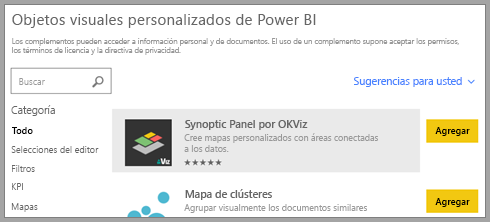

5. En dicha página puede ver capturas de pantalla, vídeos, descripción detallada, etc.

    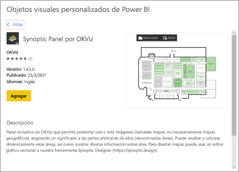

6. Desplácese hacia abajo para ver las opiniones.

    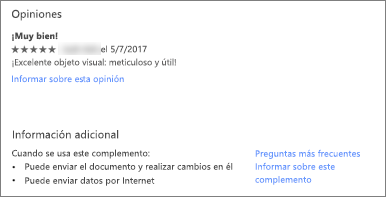

7. Importe el objeto visual personalizado mediante Agregar. El icono del objeto visual personalizado se agrega a la parte inferior del panel de visualizaciones y ya se puede usar en el informe.

    

### Descargar e importar objetos visuales personalizados desde Microsoft AppSource

1. Vaya a [Microsoft AppSource](https://appsource.microsoft.com) y seleccione la pestaña **Aplicaciones**. 

    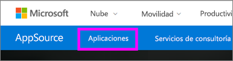

2. Vaya a la [página de resultados de aplicaciones](https://appsource.microsoft.com/en-us/marketplace/apps), donde puede ver las aplicaciones principales de cada categoría, entre ellas *Power BI apps* (Aplicaciones de Power BI). Pero estamos buscando objetos visuales personalizados, así que vamos a restringir los resultados. Seleccione **Power BI visuals** (Objetos visuales de Power BI) en la lista de navegación izquierda.

    

3. AppSource muestra un icono para cada objeto visual personalizado.  Cada mosaico tiene una instantánea del objeto visual personalizado y proporciona una breve descripción y un vínculo de descarga. Para ver información más detallada, seleccione el icono.

    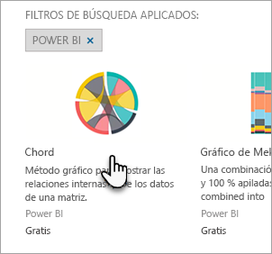

4. En dicha página puede ver capturas de pantalla, vídeos, descripción detallada, etc. Para descargar el objeto visual personalizado, seleccione **Obtener** y acepte los Términos de uso.

    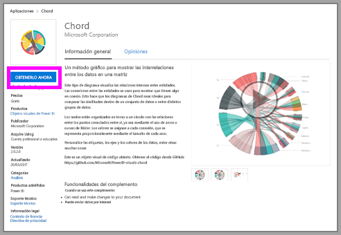

5. Seleccione el vínculo para descargar el objeto visual personalizado.

    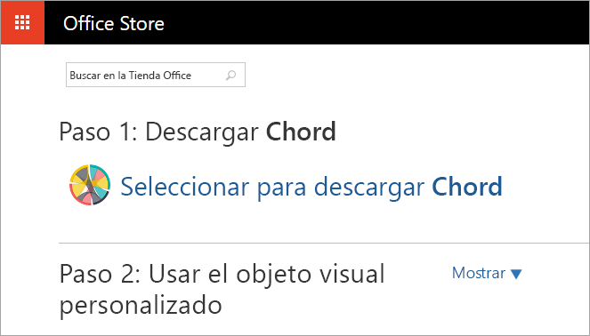

    La página de descarga también incluye instrucciones para importar el objeto visual personalizado en Power BI Desktop y el servicio Power BI.

    También puede descargar un informe de ejemplo que incluye el objeto visual personalizado y muestra sus funcionalidades.

    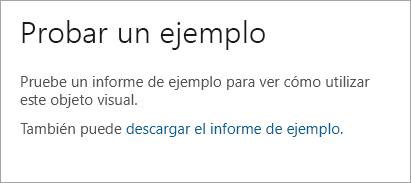

6. Guarde el archivo ".pbiviz" y luego abra Power BI.

7. Importar el archivo ".pbiviz" en el informe (vea la sección anterior [Importar un objeto visual personalizado de un archivo](#import-a-custom-visuals-from-a-file))

## Consideraciones y limitaciones

* Un objeto visual personalizado se agrega a un informe específico cuando se importa. Si desea usar el objeto visual en otro informe, debe importarlo también en dicho informe. Cuando se guarda un informe con un objeto visual personalizado mediante la opción **Guardar como** , se guarda una copia del objeto visual personalizado con el nuevo informe.

* Si no ve el panel **Visualizaciones**, significa que no tiene permisos de edición para el informe.  Solo se pueden agregar objetos visuales personalizados a los informes que puede editar, no a los informes que se han compartido con usted.

## Solucionar problemas

Para obtener información sobre cómo solucionar problemas, visite [Troubleshooting your Power BI custom visuals](power-bi-custom-visuals-troubleshoot.md) (Solución de problemas con objetos visuales personalizados de Power BI).

## PREGUNTAS MÁS FRECUENTES

Para obtener más información y respuestas a las preguntas, visite las [preguntas más frecuentes sobre objetos visuales personalizados de Power BI](power-bi-custom-visuals-faq.md#organizational-custom-visuals).

¿Tiene más preguntas? [Pruebe la comunidad de Power BI](http://community.powerbi.com/).
