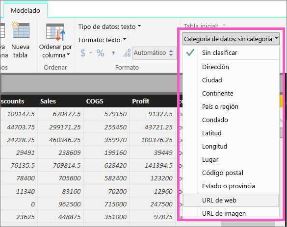
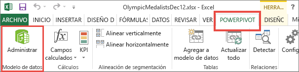
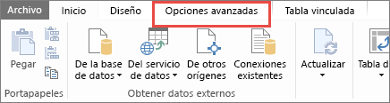
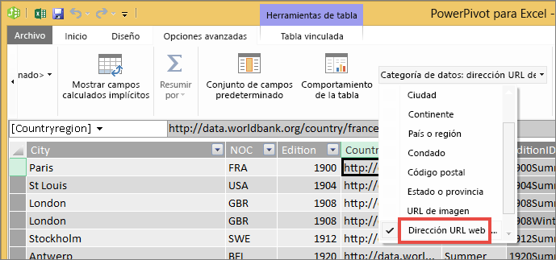

# Incorporación de hipervínculos (direcciones URL) a una tabla
En este tema se enseña cómo agregar hipervínculos (direcciones URL) a una tabla. Usará Power BI Desktop para agregar hipervínculos (direcciones URL) a una tabla o matriz. Luego, en Power BI Desktop o en el servicio Power BI, puede agregar esos hipervínculos a las tablas y matrices de informes. 

> [!NOTE]
> Puede crear hipervínculos de los [iconos de los paneles](service-dashboard-edit-tile.md) y de los [cuadros de texto de los paneles](service-dashboard-add-widget.md) sobre la marcha mediante el servicio Power BI. También, puede crear hipervínculos de los [cuadros de texto de los informes](service-add-hyperlink-to-text-box.md) sobre la marcha con el servicio Power BI y Power BI Desktop.
> 

## Crear un hipervínculo de una tabla o matriz con Power BI Desktop
Puede crear hipervínculos de tablas y matrices en Power BI Desktop, pero no en el servicio Power BI. También puede crear hipervínculos en Power Pivot para Excel antes de importar el libro en Power BI. Ambos métodos se describen a continuación.

## Crear un hipervínculo de tabla o matriz en Power BI Desktop
El procedimiento para agregar un hipervínculo depende de si ha importado los datos o los ha conectado mediante DirectQuery. Ambos escenarios se describen a continuación.

### Para los datos importados en Power BI
1. Si el hipervínculo aún no existe como campo en el conjunto de datos, use Power BI Desktop para agregarlo como una [columna personalizada](desktop-common-query-tasks.md).
2. En la vista de datos, seleccione la columna y, en la pestaña **Modelado**, elija la lista desplegable de **Categoría de datos**.
   
    
3. Seleccione **URL web**.
4. Cambie a la vista de informe y cree una tabla o matriz mediante el campo que se categoriza como una dirección URL web. Los hipervínculos aparecerán subrayados y de color azul.

    

    > [!NOTE]
    > Las direcciones URL deben comenzar por **http://, https://** o **www**.
    >
   
1. Si no quiere que aparezca una dirección URL larga en una tabla, puede mostrar un icono de hipervínculo   en su lugar. Tenga en cuenta que en las matrices no se muestran iconos.
   
    Seleccione el gráfico para activarlo.

    Seleccionar el icono de formato  para abrir la pestaña Formato.

    Expanda **Valores**, busque el **icono de la dirección URL** y **actívelo**.

    

1. (Opcional) [Publique el informe de Power BI Desktop en el servicio Power BI](guided-learning/publishingandsharing.yml?tutorial-step=2) y ábralo ahí. Los hipervínculos también funcionará en el servicio.

### Para los datos conectados con DirectQuery
No podrá crear una nueva columna en el modo DirectQuery.  Pero si los datos ya contienen direcciones URL, puede convertirlas en hipervínculos.

1. En la vista de informe, cree una tabla con un campo que contenga las direcciones URL.
2. Seleccione la columna y, en la pestaña **Modelado**, elija la lista desplegable de **Categoría de datos**.
3. Seleccione **URL web**. Los hipervínculos aparecerán subrayados y de color azul.
4. (Opcional) [Publique el informe de Power BI Desktop en el servicio Power BI](guided-learning/publishingandsharing.yml?tutorial-step=2) y ábralo ahí. Los hipervínculos también funcionará en el servicio.

## Crear un hipervínculo de tabla o matriz en Power Pivot para Excel
Otra manera de agregar hipervínculos a las tablas y matrices de Power BI es crear los hipervínculos en el conjunto de datos antes de importar o conectarse a ese conjunto de datos desde Power BI. Este ejemplo utiliza un libro de Excel.

1. Abra el libro en Excel.
2. Seleccione la pestaña **PowerPivot** y, a continuación, elija **Administrar**.
   
   
1. Cuando se abra PowerPivot, seleccione la pestaña **Opciones avanzadas**.
   
   
4. Coloque el cursor en la columna que contiene las direcciones URL que desea convertir en hipervínculos de tablas de Power BI.
   
   > [!NOTE]
   > Las direcciones URL deben comenzar por **http://, https://** o **www**.
   > 
5. En el grupo **Propiedades de informes** , seleccione la lista desplegable **Categoría de datos** y elija **Dirección URL web**. 
   
   

6. En el servicio Power BI o Power BI Desktop, conéctese a este libro o impórtelo.
7. Cree una visualización de la tabla que incluya el campo de dirección URL.
   
   

## Consideraciones y solución de problemas
P: ¿Puedo usar una dirección URL personalizada como hipervínculo en una tabla o matriz?    
R: No. Puede utilizar un icono de vínculo. Si necesita texto personalizado para los hipervínculos y la lista de direcciones URL es breve, considere la posibilidad de utilizar un cuadro de texto en su lugar.

## Pasos siguientes
[Visualizaciones en informes de Power BI](visuals/power-bi-report-visualizations.md)

[Conceptos básicos para los diseñadores en el servicio Power BI](service-basic-concepts.md)

¿Tiene más preguntas? [Pruebe la comunidad de Power BI](http://community.powerbi.com/)

