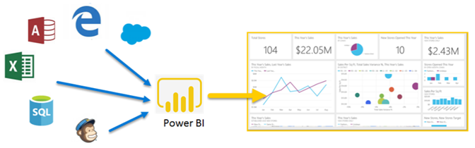

# ¿Qué es Power BI?
**Power BI** es una colección de servicios de software, aplicaciones y conectores que funcionan conjuntamente para convertir orígenes de datos sin relación entre sí en información coherente, interactiva y atractiva visualmente. Sus datos pueden ser una hoja de cálculo de Excel o una colección de almacenes de datos híbridos locales y basados en la nube. Power BI permite conectarse a los orígenes de datos, visualizar y descubrir lo que es importante y compartirlo con quien desee fácilmente.

Power BI puede ser sencilla y rápida, capaz de crear información rápida de una hoja de cálculo de Excel o una base de datos local. Pero Power BI también es estable y empresarial, listo para una amplia modelado y análisis en tiempo real, así como desarrollo personalizado. Puede ser el personal informe y la herramienta de visualización y actuar también como el motor de análisis y de decisión para proyectos de grupo, divisiones o empresas enteras.

## Las partes de Power BI
Power BI consta de: 
- Una aplicación de escritorio de Windows llamado **Power BI Desktop**
- Un SaaS en línea (*Software como servicio*) servicio denominado el **servicio Power BI** 
- Power BI **aplicaciones móviles** para dispositivos Android, iOS y Windows

Estos tres elementos&mdash;Power BI Desktop, el servicio y las aplicaciones móviles&mdash;están diseñados para permitir a los usuarios crear, compartir y consumir información empresarial de la manera en que les resulte su rol, la forma más eficaz.

Un cuarto elemento, **Power BI Report Server**, le permite publicar informes de Power BI en un servidor de informes local, tras crearlos en Power BI Desktop. Obtenga más información sobre el [servidor de informes de Power BI](#on-premises-reporting-with-power-bi-report-server).

## Adaptación de Power BI a su rol
Es posible que la forma en que utilice Power BI dependa de su rol en un proyecto o equipo. Otras personas, en otros roles, podrían usar Power BI forma diferente.

Por ejemplo, podría utilizar principalmente el **servicio Power BI**. Pero su compañero de trabajo, dedicado a procesar los números y crear informes empresariales, podría usar ampliamente **Power BI Desktop** para crear informes y, a continuación, publicarlos en el servicio Power BI, donde puede verlos. Otro compañero de trabajo, en las ventas, podría utilizar principalmente sus **aplicación de teléfono de Power BI** para supervisar el progreso de sus cuotas de ventas y profundizar en los detalles del nuevo cliente potencial.

Si es un desarrollador, puede usar las API de Power BI para insertar datos en conjuntos de datos o para insertar informes y paneles en sus propias aplicaciones personalizadas. ¿Tiene alguna idea de un nuevo objeto visual? Compílelo usted mismo y compártalo con los demás.  

También podría utilizar cada elemento de Power BI en momentos diferentes, dependiendo de lo que está intentando lograr o su rol para un proyecto determinado.

Su modo de usar Power BI puede basarse en la característica o servicio de Power BI que es la mejor herramienta para su situación. Por ejemplo, puede usar Power BI Desktop para crear informes para su propio equipo acerca de las estadísticas de afiliación de cliente y puede ver el inventario y fabricación progreso en un panel en tiempo real en el servicio Power BI. Cada una de las partes de Power BI está a su disposición, razón por la cual es tan flexible y atractivo.

Examine los documentos que pertenecen al rol:
- Power BI para [***diseñadores***](desktop-what-is-desktop.md)
- Power BI para [***consumidores***](consumer/end-user-consumer.md)
- Power BI para [***desarrolladores***](developer/what-can-you-do.md)
- Power BI para [***administradores***](service-admin-administering-power-bi-in-your-organization.md)

## El flujo de trabajo en Power BI
Un flujo de trabajo en Power BI habitual comienza con la conexión a orígenes de datos y generación de informes en Power BI Desktop. A continuación, publicar ese informe desde Power BI Desktop para el servicio Power BI y compartirlo por lo que los usuarios finales en el servicio Power BI y dispositivos móviles pueden ver e interactuar con el informe.
Este flujo de trabajo es habitual y muestra cómo los tres elementos principales de Power BI se complementan entre sí.

Esta es una [comparación de Power BI Desktop y el servicio Power BI](service-service-vs-desktop.md) detallada.

¿Pero qué ocurre si no está listo para pasarse a la nube y desea conservar los informes protegidos por un firewall corporativo?  Siga leyendo.

## En el entorno local de informes con Power BI Report Server
Crear, implementar y administrar informes paginados y móviles de Power BI en el entorno local con la gama de servicios que proporciona Power BI Report Server y herramientas listos para usar.

Power BI Report Server es una solución que se implemente detrás del firewall y luego entrega los informes a los usuarios deseados de maneras diferentes, ya sea para visualizarlos en un explorador web, en un dispositivo móvil o como correo electrónico. Además, como Power BI Report Server es compatible con Power BI en la nube, puede pasarse a la nube cuando esté listo. 

Obtenga más información sobre el [servidor de informes de Power BI](report-server/get-started.md).

## Pasos siguientes
- [Inicio rápido: Obtenga información sobre cómo usar el servicio Power BI](service-the-new-power-bi-experience.md)   
- [Tutorial: Empezar a trabajar con el servicio Power BI](service-get-started.md)
- [Inicio rápido: Conectarse a los datos en Power BI Desktop](desktop-quickstart-connect-to-data.md)
