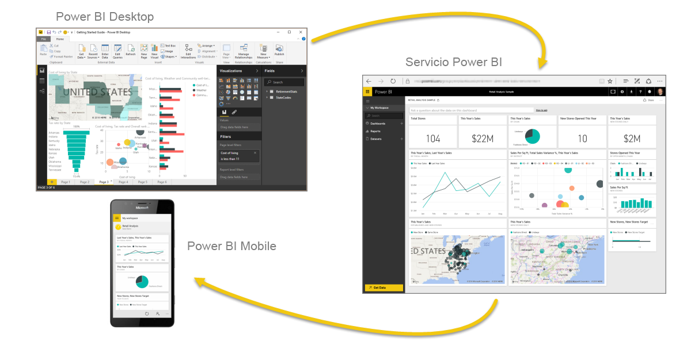
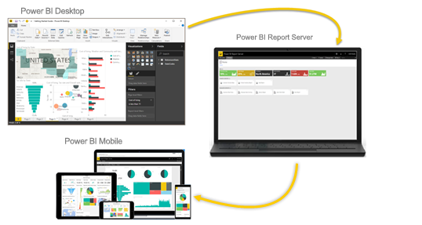

# ¿Qué es Power BI?
**Power BI** es una colección de servicios de software, aplicaciones y conectores que funcionan conjuntamente para convertir orígenes de datos sin relación entre sí en información coherente, interactiva y atractiva visualmente. Tanto si se trata de una sencilla hoja de cálculo de Excel como de una colección de almacenes de datos híbridos locales o basados en la nube, **Power BI** le permite conectar fácilmente los orígenes de datos, visualizar (o descubrir) lo más importante y compartirlo con quien quiera.

**Power BI** puede ser sencillo y rápido; capaz de crear información rápida a partir de una hoja de cálculo de Excel o una base de datos local. Sin embargo, **Power BI** también es estable y tiene una funcionalidad apta para empresas, listo para un modelado exhaustivo y un análisis en tiempo real, así como para un desarrollo personalizado. Por tanto, puede convertirse en su herramienta personal de creación de informes y visualización, así como actuar como el motor de análisis y de decisión que impulsa proyectos en grupo, divisiones o empresas enteras.

## Las partes de Power BI
Power BI consta de una aplicación de escritorio de Windows denominada **Power BI Desktop**, un servicio SaaS (*software como servicio*) en línea denominado **servicio Power BI**, y **aplicaciones** móviles de Power BI disponibles para teléfonos y tabletas Windows, así como para dispositivos iOS y Android.

Estos tres elementos, **Desktop**, el **servicio** y el destinado a **dispositivos móviles**, están diseñados para permitir a los usuarios crear, compartir y utilizar información empresarial de la forma que les resulte más eficaz para su rol.

## Adaptación de Power BI a su rol
Es posible que la forma en que utilice Power BI dependa de su rol en un proyecto o equipo. Por tanto, otras personas con otros roles podrían utilizar Power BI de un modo distinto, lo cual es normal.

Por ejemplo, podría darse el caso de que usted utilizara sobre todo el **servicio Power BI**, mientras que su compañero de trabajo, dedicado a procesar los números y crear informes empresariales, usara **Power BI Desktop** (y publicara informes de Desktop en el servicio Power PI, de forma que usted podría verlos). Por su parte, otra compañera que se dedica a las ventas podría utilizar principalmente la aplicación para móviles de Power BI para supervisar el progreso de sus cuotas de venta y profundizar en los detalles de los nuevos clientes potenciales.

Si es un desarrollador, puede usar las API de Power BI para insertar datos en conjuntos de datos o para insertar informes y paneles en sus propias aplicaciones personalizadas. ¿Tiene alguna idea de un nuevo objeto visual? Compílelo usted mismo y compártalo con los demás.  

También podría utilizar cada elemento de **Power BI** en distintos momentos, en función de su objetivo o su rol en un proyecto o trabajo determinados.

Quizás vea el progreso de inventario y fabricación en un panel en tiempo real en el servicio y también utilice **Power BI Desktop** a fin de crear informes para su equipo sobre las estadísticas de afiliación de los clientes. El modo en que utiliza Power BI puede depender de qué característica o servicio de Power BI sea el mejor para su caso. No obstante, tendrá Power BI al completo a su disposición, por eso es tan flexible y atractivo.

## El flujo de trabajo en Power BI
Un flujo de trabajo común en Power BI comienza con la conexión a orígenes de datos y la compilación de un informe en **Power BI Desktop**. Ese informe se publica entonces desde **Desktop** en el **servicio Power BI** y se comparte, para que los usuarios del **servicio** y el **dispositivo móvil** puedan *usarlo* (verlo e interactuar con él).
En ocasiones, puede que desee ofrecer a sus compañeros permisos similares a los suyos (permisos de *creador*), a fin de que puedan usar el **servicio** para editar informes, crear paneles y compartir su trabajo.

Pero este no es siempre el caso, aunque se trata de uno de los flujos de trabajo más comunes y muestra cómo los tres elementos principales de Power BI se complementan entre sí.

¿Pero qué ocurre si no está listo para pasarse a la nube y desea conservar los informes protegidos por un firewall corporativo?  Siga leyendo.

## Publicar informes en almacenamiento local con el servidor de informes de Power BI
Cree, implemente y administre Power BI, informes paginados y móviles de forma local con el intervalo de herramientas y servicios que proporciona el servidor de informes de Power BI.

Power BI Report Server es una solución que se implemente detrás del firewall y luego entrega los informes a los usuarios deseados de maneras diferentes, ya sea para visualizarlos en un explorador web, en un dispositivo móvil o como correo electrónico. Además, como Power BI Report Server es compatible con Power BI en la nube, puede pasarse a la nube cuando esté listo.

## Pasos siguientes
[Inicio de sesión, obtención de datos y más información sobre el servicio Power BI](service-the-new-power-bi-experience.md)   
[Tutorial: Introducción al servicio Power BI](service-get-started.md)
