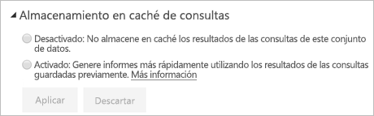

# Almacenamiento en caché de consultas en Power BI Premium/Embedded

Las organizaciones con Power BI Premium o Power BI Embedded pueden sacar partido del *almacenamiento en caché de consultas* para acelerar los informes asociados a un conjunto de datos. El almacenamiento en caché de consultas indica a la capacidad Premium/Embedded que use su servicio de almacenamiento en caché local para mantener los resultados de la consulta, lo que evita que el origen de datos subyacente tenga que calcular esos resultados.

> [!IMPORTANT]
> El almacenamiento en caché de consultas solo está disponible en Power BI Premium o Power BI Embedded. No es aplicable a los conjuntos de datos de LiveConnect que aprovechan Azure Analysis Services o SQL Server Analysis Services.

Los resultados de las consultas almacenadas en caché son específicos del usuario y el contexto del conjunto de datos, y siempre respetan las reglas de seguridad. En este momento, el servicio solo realiza el almacenamiento de consultas de la página inicial en la que se entra. En otras palabras, las consultas no se almacenan en caché cuando se interactúa con el informe. La caché de consultas respeta los [marcadores personales](consumer/end-user-bookmarks.md#personal-bookmarks) y los [filtros persistentes](https://powerbi.microsoft.com/blog/announcing-persistent-filters-in-the-service/), por lo que las consultas generadas por un informe personalizado se almacenarán en caché. Los [iconos de panel](service-dashboard-tiles.md) que funcionan con las mismas consultas también aprovechan las consultas una vez almacenadas en caché. El rendimiento mejora especialmente cuando se accede con frecuencia a un conjunto de datos que no es necesario actualizar a menudo. El almacenamiento en caché de consultas puede además reducir la carga sobre la capacidad Premium/Embedded al reducir el número total de consultas.

El comportamiento del almacenamiento en caché se controla en la página **Configuración** del conjunto de datos del servicio Power BI. Tiene dos valores de configuración posibles:

- **Desactivado**: No se usa el almacenamiento en caché de consultas para este conjunto de datos.

- **Activado**: Se usa el almacenamiento en caché de consultas para este conjunto de datos.

## Consideraciones y limitaciones

- Al cambiar la configuración de almacenamiento en caché de **Activado** a **Desactivado**, todos los resultados de la consulta del conjunto de datos guardados se quitan de la caché de capacidad. Puede desactivar el almacenamiento en caché ya sea explícitamente o revirtiendo a la configuración predeterminada de capacidad que un administrador haya establecido en **Desactivado**. La desactivación de esta opción puede introducir un pequeño retraso la próxima vez que un informe ejecute consultas en este conjunto de datos. El retraso se debe a que las consultas de informes se ejecutan a petición y no aprovechan los resultados guardados. Además, es posible que primero haya que cargar en memoria el conjunto de datos necesario para que pueda atender consultas.
- Cuando se actualiza la caché de consultas, Power BI tiene que ejecutar las consultas sobre los modelos de datos subyacentes para obtener los resultados más recientes. Si el almacenamiento en caché de consultas está habilitado en un gran número de conjuntos de datos y la capacidad Premium/Embedded está sobrecargada, se puede producir una degradación del rendimiento durante la actualización de la caché. La degradación es el resultado del aumento del volumen de las consultas que se ejecutan.

## Pasos siguientes

* [¿Qué es Power BI Premium?](service-premium-what-is.md)
* [¿Qué es Power BI Embedded de Azure?](developer/azure-pbie-what-is-power-bi-embedded.md)