# Incorporación de un filtro a un informe en Power BI

[!INCLUDE [power-bi-service-new-look-include](includes/power-bi-service-new-look-include.md)]

En este artículo se explica cómo agregar un filtro de página, un filtro de visualización, un filtro de informe o un filtro de obtención de detalles a un informe en Power BI. Para los ejemplos de este artículo se usa el servicio Power BI. Los pasos son casi idénticos en Power BI Desktop.

**¿Sabía qué?** Power BI tiene una nueva experiencia de filtro. Aprenda más sobre la [nueva experiencia de filtro en los informes de Power BI](power-bi-report-filter.md).

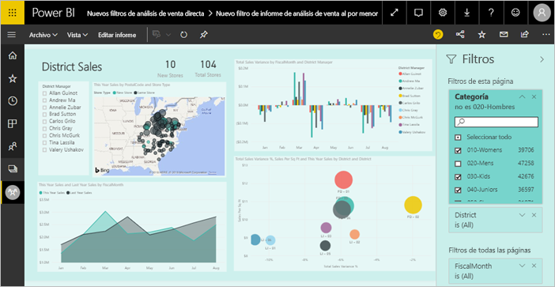

Power BI ofrece una serie de diferentes tipos de filtros, desde los manuales y automáticos hasta los de obtención de detalles y paso a través. Obtenga información sobre los [diferentes tipos de filtros](power-bi-report-filter-types.md).

## Filtros en la vista de edición o en la vista de lectura
Puede interactuar con informes en dos vistas diferentes: la vista de lectura y la vista de edición. Las funcionalidades de filtrado disponibles dependen de la vista en la que se encuentre. Lea toda la [información sobre filtros y resaltado en informes de Power BI](power-bi-reports-filters-and-highlighting.md) para obtener detalles.

En este artículo se describe cómo crear filtros en la **Vista de edición** del informe.  Para más información sobre los filtros en la vista de lectura, vea [Interacción con un informe en la vista de lectura en Power BI](consumer/end-user-report-filter.md).

Dado que los filtros se *conservan*, cuando sale del informe, Power BI conserva el filtro, la segmentación y otros cambios de la vista de datos que ha realizado. De esta forma, puede retomar el informe por donde lo dejó cuando vuelva a él. Si no quiere conservar los cambios de filtro, seleccione **Restablecer valores predeterminados** en la barra de menús superior.

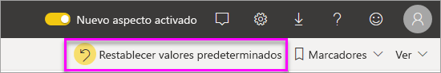

## Niveles de filtros en el panel Filtros
Tanto si usa Desktop como el servicio de Power BI, el panel Filtros se muestra en el lado derecho del lienzo del informe. Si no se muestra el panel Filtros, seleccione el icono ">" en la esquina superior derecha para expandirlo.

Puede establecer los filtros en tres niveles distintos para el informe: filtros de nivel visual, de página y de informe. También puede establecer filtros de obtención de detalles. En este artículo se explican los distintos niveles.

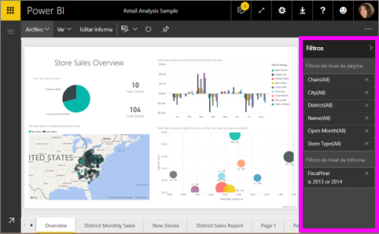

## Agregar un filtro a un objeto visual
Puede agregar un filtro de nivel de objeto visual a un objeto visual específico de dos formas diferentes. 

* Filtre un campo que ya se use en la visualización.
* Identifique un campo que ya no se utiliza en la visualización y agregue ese campo directamente al cubo **Filtros de nivel de objeto visual**.

Además, este procedimiento usa el ejemplo de Análisis de venta al por menor, por si quiere descargarlo y seguirlo como referencia. Descargue el paquete de contenido de [ejemplo de Análisis de venta al por menor](sample-retail-analysis.md#get-the-content-pack-for-this-sample).

### Filtrar los campos en el objeto visual

1. Seleccione **Más opciones (...)**  > **Editar informe** para abrir el informe en la Vista de edición.
   
   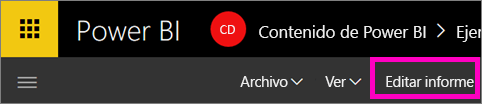

2. Abra el panel Visualizaciones y filtros y el panel Campos (si no están ya abiertos).
   
   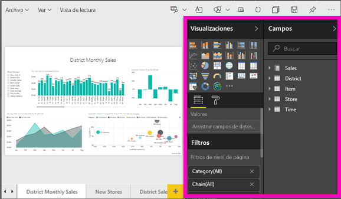
3. Seleccione un objeto visual para activarlo. Todos los campos que se usan en el objeto visual se encuentran en el panel **Campos** y también se enumeran en el panel **Filtros**, en el encabezado **Filtros de nivel de objeto visual**.
   
   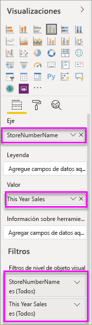
4. En este punto, vamos a agregar un filtro a un campo que ya se está usando en la visualización. 
   
    Desplácese hacia abajo hasta el área **Filtros de nivel visual** y seleccione la flecha para expandir el campo que quiere filtrar. En este ejemplo, vamos a filtrar **StoreNumberName**.
     
    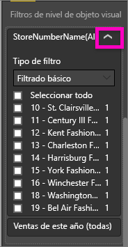 
    
    Establezca controles de filtrado **básico**, **avanzado** o **N principales**. En este ejemplo, se busca **cha** con el filtrado básico y se seleccionan los cinco almacenes.
     
    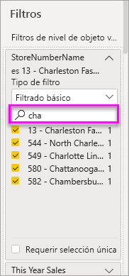 
   
    El objeto visual cambia para reflejar el nuevo filtro. Si guarda el informe con el filtro, los lectores de informes verán el objeto visual filtrado para empezar a trabajar con él y podrán interactuar con el filtro en la vista de lectura y activar o desactivar valores.
     
    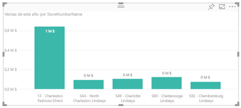
    
    Al aplicar el filtro en un campo usado en el objeto visual donde se agrega el campo (por ejemplo, una suma, una media o un recuento), se filtra el valor *agregado* en cada punto de datos. Por lo tanto, al pedir que se filtre el objeto visual anterior donde las **ventas de este año > 500 000**, solo se mostrará el punto de datos **13: Charleston Fashion Direct** en el resultado. Los filtros de las [medidas del modelo](desktop-measures.md) siempre se aplican en el valor agregado del punto de datos.

### Filtrar con un campo que no está en el objeto visual

Ahora vamos a agregar un campo nuevo a la visualización como un filtro de nivel de objeto visual.
   
1. En el panel Campos, seleccione el campo que quiere agregar como nuevo filtro de nivel visual y arrástrelo al área **Filtros de nivel de objeto visual**.  En este ejemplo se arrastra **District Manager** al cubo **Filtros de nivel de objeto visual**, se busca **an** y se seleccionan esos tres administradores.
     
    

    Tenga en cuenta que **District Manager** *no* se agrega a la misma visualización. La visualización se todavía se compone de **StoreNumberName** como el eje y **This Year Sales** como el valor.  
     
    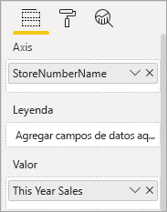

    Además, la misma visualización ahora se filtra para mostrar solo las ventas de los administradores de este año en los almacenes especificados.
     
    

    Si guarda el informe con este filtro, los lectores de informes pueden interactuar con el filtro **District Manager** en la vista de lectura y activar o desactivar valores.
    
    Si arrastra una *columna numérica* al panel del filtro para crear un filtro de nivel visual, el filtro se aplicará en las *filas de datos subyacentes*. Por ejemplo, al agregar un filtro al campo **Costo unitario** y establecerlo donde **Costo unitario** > 20, solo se mostrarán los datos de las filas de productos donde el costo unitario sea mayor que 20, independientemente del costo unitario total de los puntos de datos mostrados en el objeto visual.

## Agregar un filtro a una página completa

También puede agregar un filtro de nivel de página para filtrar una página completa.

1. En el servicio Power BI, abra el informe Retail Analysis (Análisis de venta al por menor) y vaya a la página **District Monthly Sales** (Ventas mensuales por distrito). 

2. Seleccione **...**  > **Editar informe** para abrir el informe en la Vista de edición.
   
   
2. Abra el panel Visualizaciones y filtros y el panel Campos (si no están ya abiertos).
3. En el panel Campos, seleccione el campo que quiere agregar como nuevo filtro de nivel de página y arrástrelo al área **Filtros de nivel de página**.  
4. Seleccione los valores que quiera filtrar y establecer mediante los controles de filtrado **básico** o **avanzado**.
   
   Todas las visualizaciones de la página se vuelven a trazar para reflejar el cambio.
   
   

    Si guarda el informe con el filtro, los lectores de informes pueden interactuar con el filtro en la vista de lectura y activar o desactivar valores.

## Adición de un filtro de obtención de detalles
Con la obtención de detalles en el servicio Power BI y Power BI Desktop, puede crear una página en el informe de *destino* que se centra en una entidad específica, como un proveedor, un cliente o un fabricante. Ahora, desde las otras páginas del informe, los usuarios hacer clic con el botón derecho en un punto de datos de esa entidad y obtener detalles en la página específica.

### Creación de un filtro de obtención de detalles
Para poder continuar, descargue el [ejemplo de Rentabilidad de clientes](sample-customer-profitability.md#get-the-content-pack-for-this-sample). Supongamos que desea una página que se centra en áreas de negocio ejecutivas.

1. En el servicio Power BI, abra el informe Retail Analysis (Análisis de venta al por menor) y vaya a la página **District Monthly Sales** (Ventas mensuales por distrito).

2. Seleccione **Más opciones (...)**  > **Editar informe** para abrir el informe en la Vista de edición.
   
   

1. Agregue una nueva página al informe y asígnele el nombre **Equipo ejecutivo**. Esta será la página de *destino* de la obtención de detalles.
2. Agregue visualizaciones que realicen el seguimiento de las métricas clave de las áreas de negocios de los equipos ejecutivos.    
3. En la tabla **Executives** (Ejecutivos), arrastre **Executive** (Ejecutivo) al área de filtros de obtención de detalles.    
   
    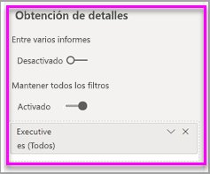
   
    Observe que Power BI agrega una flecha hacia atrás a la página del informe.  Al seleccionar la flecha atrás se devuelve a los usuarios la página del informe *original*, la página en la que estaban cuando seleccionaron la obtención de detalles. En la Vista de edición, mantenga presionada la tecla Ctrl para seleccionar la flecha atrás.
   
     

### Uso del filtro de obtención de detalles
Veamos cómo funciona el filtro de obtención de detalles.

1. Comience en la página del informe **Cuadro de mandos de equipo**.    
2. Supongamos que es Andrew Ma y desea ver la página del informe del equipo ejecutivo filtrada por sus datos únicamente.  En el gráfico del área superior izquierda, haga clic con el botón derecho en cualquier punto de datos de color verde para abrir la opción de menú Obtención de detalles.
   
    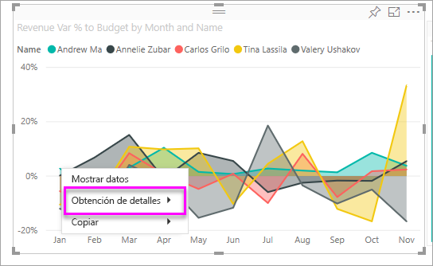
3. Seleccione **Obtención de detalles > Equipo ejecutivo** para la obtención de detalles en la página del informe llamada **Equipo ejecutivo**. La página se filtra para mostrar información acerca del punto de datos desde el que se hizo clic con el botón derecho, en este caso, Andrew Ma. Los filtros de la página de origen se aplican a la página del informe de obtención de detalles.  
   
    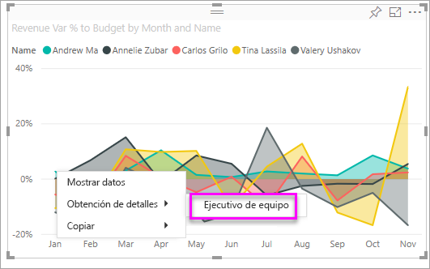

## Agregar un filtro de nivel de informe para filtrar un informe completo

1. Seleccione **Editar informe** para abrir el informe en la vista de edición.
   
   

2. Abra el panel Visualizaciones y Filtros y el panel Campos, si no están ya abiertos.
3. En el panel Campos, seleccione el campo que quiere agregar como nuevo filtro de nivel de informe y arrástrelo al área **Filtros de nivel de informe**.  
4. Seleccione los valores que desea filtrar.

    Los objetos visuales de la página activa, y de todas las páginas del informe, cambian para reflejar el nuevo filtro. Si guarda el informe con el filtro, los lectores de informes pueden interactuar con el filtro en la vista de lectura y activar o desactivar valores.

1. Seleccione la flecha Atrás para volver a la página anterior del informe.

## Consideraciones y solución de problemas

- Si no ve el panel Campos, asegúrese de que se encuentra en la [vista de edición](service-interact-with-a-report-in-editing-view.md) del informe.    
- Si ha realizado muchos cambios en los filtros y quiere volver a la configuración predeterminada del autor del informe, seleccione **Restablecer valores predeterminados** en la barra de menús superior.

## Pasos siguientes
[Ver el panel Filtros del informe](consumer/end-user-report-filter.md)

[Filtrado y resaltado en informes](power-bi-reports-filters-and-highlighting.md)

[Different kinds of filters in Power BI](power-bi-report-filter-types.md) (Diferentes tipos de filtros en Power BI)

¿Tiene más preguntas? [Pruebe la comunidad de Power BI](https://community.powerbi.com/)

