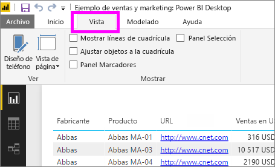
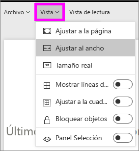
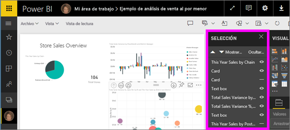
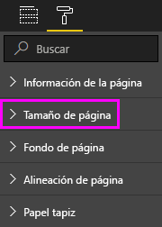

# Configuración de presentación de página en un informe de Power BI
Somos conscientes de que es fundamental mantener el píxel del diseño de informe perfecto. En ocasiones, puede resultar complicado, ya que usted y sus compañeros pueden ver esos informes en pantallas con relaciones de aspecto diferentes y tamaños. 

La vista de pantalla predeterminada es **Ajustar a la página** y el tamaño de pantalla predeterminado es **16:9**. Si desea fijar otra relación de aspecto o ajustar su informe de forma diferente, hay dos herramientas que le ayudarán: ***Vista de página*** configuración y ***tamaño de página*** configuración.

<iframe width="560" height="315" src="https://www.youtube.com/embed/5tg-OXzxe2g" frameborder="0" allowfullscreen></iframe>

## Dónde encontrar la configuración de la vista de página en el servicio Power BI y Power BI Desktop
Configuración de la vista de página está disponible en el servicio Power BI y Power BI Desktop, pero la interfaz es ligeramente diferente. Las secciones siguientes explican dónde puede encontrar ver la configuración en cada herramienta de Power BI.

### En Power BI Desktop
En la vista de informe, seleccione la pestaña **Vista** para abrir la configuración de la vista de página, así como la configuración del diseño de teléfono.

  

### En el servicio Power BI (app.powerbi.com)
En el servicio Power BI, abra un informe y seleccione **vista** desde la barra de menús superior izquierdo.

Configuración de la vista de página está disponible tanto en [la vista de lectura y vista de edición](consumer/end-user-reading-view.md). En la vista de edición, el propietario de un informe puede asignar la configuración de la vista de página a páginas individuales del informe y esa configuración se guarda con el informe. Cuando los compañeros abren ese informe en la vista de lectura, ven las páginas del informe con la configuración del propietario. En la vista de lectura, los compañeros pueden cambiar *algunos* de la **vista de página** configuración, pero los cambios no se guardarán cuando cierre el informe.

## Configuración de la vista de página
El primer conjunto de configuración de la vista de página controla la presentación de la página del informe en relación con la ventana del explorador. Puede elegir entre:

* **Ajustar a la página** (valor predeterminado): Contenido se escala para ajustarse mejor a la página
* **Ajustar al ancho**: Contenido se escala para ajustarse al ancho de la página
* **Tamaño real**: Se muestra el contenido en tamaño completo

El segundo conjunto de controles de configuración de vista de página, la posición de los objetos en el lienzo del informe. Puede elegir entre:

* **Mostrar líneas de cuadrícula**: Activar las líneas de cuadrícula para colocar los objetos en el lienzo del informe.
* **Ajustar a la cuadrícula**: Usar con **mostrar líneas de cuadrícula** para colocar y alinear objetos en el lienzo del informe con precisión. 
* **Bloquear objetos**: Bloquear todos los objetos en el lienzo para que no se puede mover o cambiar de tamaño.
* **Panel selección**: El **selección** panel enumera todos los objetos en el lienzo. Puede decidir que se va a mostrar y que se va a ocultar.

    

## Configuración de tamaño de página

**Tamaño de página** opciones solo están disponibles para los propietarios de informes. En el servicio Power BI (app.powerbi.com), esto significa que puede abrir el informe en [la vista de edición](consumer/end-user-reading-view.md). **Tamaño de página** configuración se encuentra en la **visualizaciones** panel y la proporción de presentación del control y el tamaño real (en píxeles) del lienzo del informe:   

* Relación 4:3
* Relación 16:9 (valor predeterminado)
* Cortana
* Carta
* Personalizado (alto y ancho en píxeles)

## Pasos siguientes
[Vista de informe en Power BI Desktop](desktop-report-view.md)

[Cambiar vista de página y la configuración de tamaño de página en sus propios informes de Power BI](consumer/end-user-report-view.md)

Más información sobre [informes de Power BI](consumer/end-user-reports.md)

[Conceptos básicos de los consumidores del servicio Power BI](consumer/end-user-basic-concepts.md)

¿Tiene más preguntas? [Pruebe la comunidad de Power BI](http://community.powerbi.com/)

