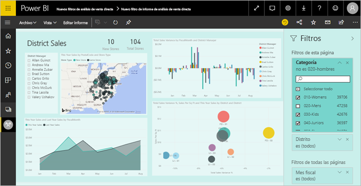
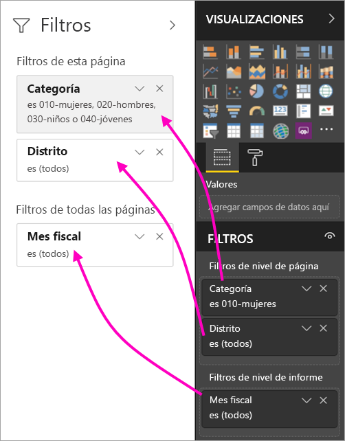
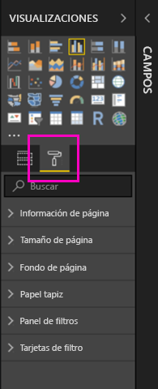
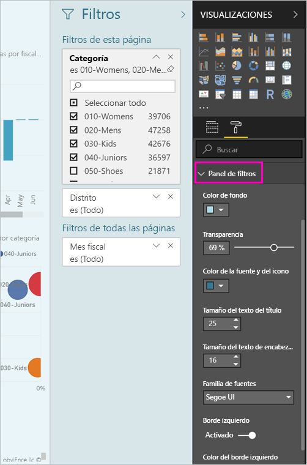
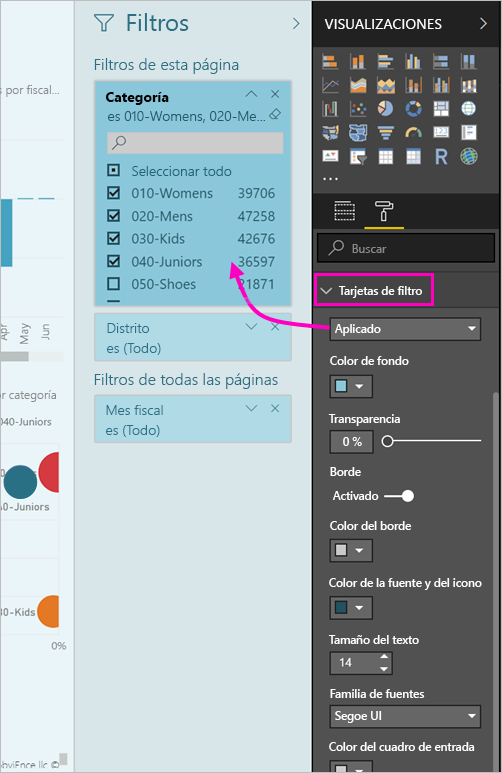
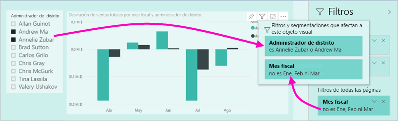

# La nueva experiencia de filtro en los informes de Power BI (versión preliminar)

En este artículo se detalla la nueva experiencia de filtro: Los filtros de Power BI van a tener una nueva funcionalidad y un nuevo diseño. Al diseñar informes en Power BI Desktop o en el servicio Power BI, puede hacer que el panel de filtros se parezca a un informe entero y funcione con él. En la nueva experiencia, el panel de filtros antiguo funciona como un panel de edición de filtros y el nuevo panel de filtros es el único que ven los consumidores de informes. 
 

> [!NOTE]
> La nueva experiencia de filtro está en versión preliminar. Las compilaciones nuevas pueden invalidar el formato que ya haya configurado.

Como diseñador de informes, esto es lo que puede hacer con los nuevos filtros:

- Mostrar una vista de solo lectura de los filtros en el encabezado de objeto visual, para que los consumidores sepan exactamente qué filtros o segmentaciones afectan a un objeto visual determinado.
- Aplicar formato al panel de filtros y personalizarlo para que parezca parte del informe.
- Definir si el panel de filtros está abierto o contraído de forma predeterminada cuando un consumidor abre el informe.
- Ocultar el panel de filtros entero o filtros específicos que no desea que vean los consumidores del informe.
- Controlar, e incluso guardar como marcador, los estados de visibilidad, abierto y contraído del nuevo panel de filtros.
- Bloquear los filtros que no desea que editen los consumidores.

## Activar la nueva experiencia de filtro 

La nueva experiencia de filtro se habilita en Power BI Desktop. Luego, puede modificar ahí los filtros o en el servicio Power BI (https://app.powerbi.com). Dado que esta nueva experiencia de filtro se encuentra en versión preliminar, primero debe habilitarla en Power BI Desktop. Si empieza por crear un informe en el servicio Power BI, no puede tener nuevos filtros.

### Activar los nuevos filtros para todos los nuevos informes

1. En Power BI Desktop, seleccione **Archivo** > **Opciones y configuración** > **Opciones** > **Características de versión preliminar** y, luego, active la casilla **Nueva experiencia de filtro**. 
2. Reinicie Power BI Desktop para ver la nueva experiencia de filtro en todos los nuevos informes.

Después de reiniciar Power BI Desktop, está habilitada de forma predeterminada para todos los nuevos informes que se creen.  

### Activar nuevos filtros para un informe existente

También puede habilitar los nuevos filtros para informes existentes.

1. En Power BI Desktop, en un informe existente, seleccione **Archivo** > **Opciones y configuración** > **Opciones**.
2. En **Configuración de informes**, seleccione **Habilitar el panel de filtros actualizado y mostrar los filtros en el encabezado del objeto visual de este informe**.

## Compilar el nuevo panel de filtros

Después de habilitar el nuevo panel de filtros, lo verá a la derecha de la página del informe, con el formato predeterminado basado en la configuración de informes actual. El panel de filtros anterior ahora funciona como el panel de edición de filtros. El nuevo panel de filtros muestra lo que los consumidores de informes verán al publicar el informe. Puede actualizar los filtros existentes en el nuevo panel, pero usará el panel de filtros anterior para configurar los filtros que se deben incluir.

1. En primer lugar, decida si desea que los consumidores de informes vean el panel de filtros. Si desea que lo vean, seleccione el icono de ojo.  junto a los filtros.

2. Para empezar a compilar el nuevo panel de filtros, arrastre los campos de interés al panel de edición de filtros como filtros de nivel de objeto visual, página o informe. Los verá en el nuevo panel de filtros.

    

Cuando se agrega un objeto visual a un lienzo de informe, Power BI agrega automáticamente un filtro para cada campo del objeto visual. Power BI no agrega esos filtros automáticos al panel de filtros de solo lectura. Debe seleccionar el icono de ojo para agregarlos explícitamente.

 
## Bloquear u ocultar filtros

Puede bloquear u ocultar tarjetas de filtro individuales. Si bloquea un filtro, los consumidores de informes pueden verlo pero no modificarlo. Si lo oculta, no podrán ni siquiera verlo. Ocultar tarjetas de filtro es normalmente útil si necesita ocultar filtros de limpieza de datos que excluyen los valores nulos o inesperados. 

- En el panel de edición de filtros, active o desactive los iconos **Bloquear filtro** u **Ocultar filtro** de una tarjeta de filtro.

   

A medida que active o desactive esta configuración en el panel de edición de filtros, verá los cambios reflejados en el nuevo panel de filtros. Los filtros ocultos no se muestran en la ventana emergente de filtros de un objeto visual.

También puede configurar el estado del panel de filtros para que fluya con los marcadores de informe. Los estados abierto, cerrado y de visibilidad del panel se pueden todos guardar como marcador.
 
## Aplicar formato el nuevo panel de filtros

Una parte importante de esta nueva experiencia es que ahora puede aplicar formato el panel de filtros para que coincida con la apariencia del informe. Puede aplicar formato al panel filtros de forma diferente para cada página del informe. Estos son los elementos a los que puede aplicar formato: 

- Color de fondo
- Transparencia del fondo
- Borde del panel de filtros activado o desactivado
- Color de borde del panel de filtros
- Título del panel de filtros y tamaño de texto, color y fuente del encabezado

También puede aplicar formato a estos elementos en las tarjetas de filtro, según si se han aplicado (establecido en algún valor) o están disponibles (desactivados): 

- Color de fondo
- Transparencia del fondo
- Borde: activar o desactivar
- Color del borde
- Tamaño de texto, color y fuente
- Color del cuadro de entrada

### Establecer el formato del panel de filtros y las tarjetas

1. En el informe, haga clic en el informe propiamente dicho o en el fondo (*papel tapiz*) y, en el panel **Visualizaciones**, seleccione **Formato**. 
    Verá las opciones de formato de la página del informe, el papel tapiz y también el panel de filtros y las tarjetas de filtro.

        

1. Expanda **Panel de filtros** para establecer el color del fondo, el icono y el borde izquierdo, a fin de complementar la página del informe.

    

1. Expanda **Tarjetas de filtro** para establecer el color y el borde **Disponible** y **Aplicado**. Si crea las tarjetas disponibles y aplicadas con diferentes colores, es obvio qué filtros se aplican. 
  
    

## Ver los filtros de un objeto visual en modo de lectura

En el modo de lectura, puede mantener el mouse sobre un icono de filtro de un objeto visual y ver una ventana emergente con todos los filtros, segmentaciones, etc., que afectan a ese objeto visual. El formato de la ventana emergente es el mismo que el del panel de filtros. 

Estos son los tipos de filtros que se muestran en esta vista: 
- Filtros básicos
- Segmentaciones
- Resaltado cruzado 
- Filtrado cruzado
- Filtros avanzados
- N filtros principales
- Filtros de fecha relativa
- Segmentaciones de sincronización
- Filtros de inclusión o exclusión
- Filtros que se pasan mediante una dirección URL

## Próximamente

En los próximos meses, está previsto incorporar las siguientes mejoras:
- Posibilidad de cambiar el orden de las tarjetas de filtro
- Experiencia de panel de filtros único para creadores de informes 
- Más opciones de formato

Pruebe la nueva experiencia de filtro. Proporciónenos sus comentarios sobre esta característica y cómo podemos mejorar esta experiencia. 

## Pasos siguientes
[Uso de filtros de informe](consumer/end-user-report-filter.md)

[Filtrado y resaltado en informes](power-bi-reports-filters-and-highlighting.md)

[Interacción con filtros y resaltado en la Vista de lectura del informe](consumer/end-user-reading-view.md)

[Cambiar el filtro cruzado y el resaltado cruzado entre los objetos visuales de los informes](consumer/end-user-interactions.md)

¿Tiene más preguntas? [Pruebe la comunidad de Power BI](http://community.powerbi.com/)

