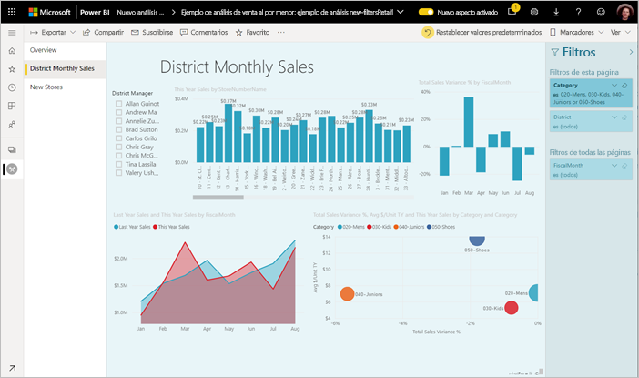
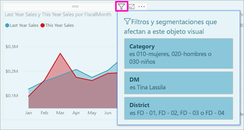
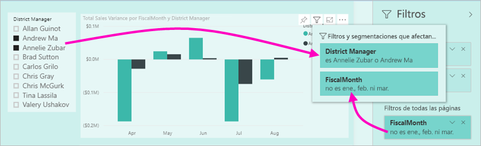
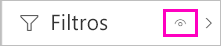
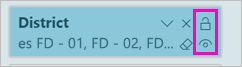
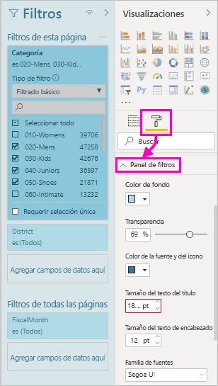
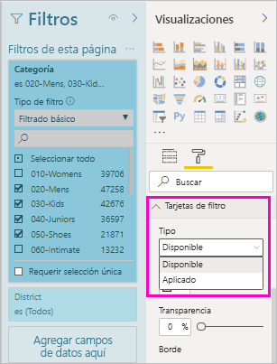
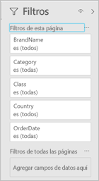
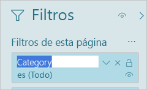
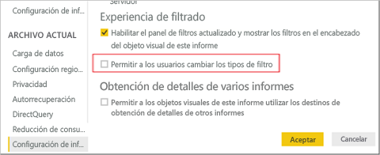

# <a name="the-new-filter-experience-in-power-bi-reports"></a>La nueva experiencia de filtro en los informes de Power BI

Los filtros de Power BI van a tener una nueva funcionalidad y un nuevo diseño. Al participar en la nueva experiencia de filtro, puede aplicar formato al panel Filtros para que su aspecto sea similar al del resto del informe. Puede bloquear e incluso ocultar filtros. Al diseñar su informe, ya no verá en absoluto el panel Filtros antiguo en el panel Visualizaciones. La edición y el formato de filtros se llevan a cabo en un solo panel Filtros. 



Como diseñador de informes, estas son algunas de las tareas que puede realizar en el nuevo panel Filtros:

- Agregar y quitar campos en los que filtrar. 
- Cambiar el estado del filtro.
- Aplicar formato al panel Filtros y personalizarlo para que parezca parte del informe.
- Definir si el panel de filtros está abierto o contraído de forma predeterminada cuando un consumidor abre el informe.
- Ocultar el panel Filtros entero o filtros específicos que no desea que vean los consumidores del informe.
- Controlar, e incluso guardar como marcador, los estados de visibilidad, abierto y contraído del nuevo panel Filtros.
- Bloquear los filtros que no desea que editen los consumidores.

Con la nueva experiencia de filtro, los consumidores del informe también pueden mantener el mouse sobre cualquier objeto visual para ver una lista de solo lectura de todos los filtros o segmentaciones que afectan a dicho objeto.



## <a name="turn-on-the-new-filter-experience"></a>Activar la nueva experiencia de filtro 

La nueva experiencia de filtro está activada de forma predeterminada para los informes nuevos. Puede habilitar la nueva experiencia para los informes existentes en Power BI Desktop o en el servicio Power BI.

### <a name="turn-on-new-filters-for-an-existing-report-in-power-bi-desktop"></a>Activación de nuevos filtros para un informe existente en Power BI Desktop

1. En Power BI Desktop, en un informe existente, seleccione **Archivo** > **Opciones y configuración** > **Opciones**.
2. En el panel de navegación, en **Archivo actual**, seleccione **Configuración de informes**.
3. En **Experiencia de filtrado**, seleccione **Habilitar el panel de filtros actualizado y mostrar los filtros en el encabezado del objeto visual de este informe**.

### <a name="turn-on-new-filters-for-an-existing-report-in-the-service"></a>Activación de nuevos filtros para un informe existente en el servicio

Si ha activado la opción **Nuevo aspecto** del servicio Power BI, en , la nueva experiencia de filtro se activa automáticamente. Obtenga más información sobre el [nuevo aspecto del servicio Power BI](service-new-look.md).

Si no ha activado el nuevo aspecto, puede seguir estos pasos para ver la nueva experiencia de filtro.

1. En el servicio Power BI, seleccione la pestaña **Informes** en la lista de contenido de un área de trabajo.
2. Busque el informe que quiera habilitar y seleccione el icono **Configuración**  de ese informe.
3. En **Experiencia de filtrado**, seleccione **Habilitar el panel de filtros actualizado y mostrar los filtros en el encabezado del objeto visual de este informe**.

    

## <a name="view-filters-for-a-visual-in-reading-mode"></a>Ver los filtros de un objeto visual en modo de lectura

En el modo de lectura, mantenga el mouse sobre un icono de filtro de un objeto visual para ver una lista emergente con todos los filtros, segmentaciones, etc., que afectan a ese objeto visual. El formato de la lista de filtros emergente es el mismo que el del panel Filtros. 



Estos son los tipos de filtros que se muestran en esta vista: 
- Filtros básicos
- Segmentaciones
- Resaltado cruzado 
- Filtrado cruzado
- Filtros avanzados
- N filtros principales
- Filtros de fecha relativa
- Segmentaciones de sincronización
- Filtros de inclusión o exclusión
- Filtros que se pasan mediante una dirección URL

## <a name="build-the-new-filters-pane"></a>Compilar el nuevo panel Filtros

Después de habilitar el nuevo panel Filtros, lo verá a la derecha de la página del informe, con el formato predeterminado basado en la configuración de informes actual. Usará el nuevo panel Filtros para configurar los filtros que se deben incluir y actualizar los existentes en el nuevo panel. El nuevo panel Filtros muestra lo que los consumidores de informes verán al publicar el informe. 

1. Los consumidores de informes podrán ver el panel Filtros de forma predeterminada. Si desea que lo vean, seleccione el icono de ojo situado junto a **Filtros**.

    

2. Para empezar a compilar el nuevo panel Filtros, arrastre los campos de interés a este como filtros de nivel de objeto visual, página o informe.

Cuando se agrega un objeto visual a un lienzo de informe, Power BI agrega de forma automática un filtro al panel Filtros de cada campo del objeto visual. 

## <a name="lock-or-hide-filters"></a>Bloquear u ocultar filtros

Puede bloquear u ocultar tarjetas de filtro individuales. Si bloquea un filtro, los consumidores de informes pueden verlo pero no modificarlo. Si lo oculta, no podrán ni siquiera verlo. Ocultar tarjetas de filtro es normalmente útil si necesita ocultar filtros de limpieza de datos que excluyen los valores nulos o inesperados. 

- En el nuevo panel Filtros, active o desactive los iconos **Bloquear filtro** u **Ocultar filtro** de una tarjeta de filtro.

   

A medida que active o desactive esta configuración en el nuevo panel Filtros, verá los cambios reflejados en el informe. Los filtros ocultos no se muestran en la lista emergente de filtros de un objeto visual.

También puede configurar el estado del nuevo panel Filtros para que fluya con los marcadores de informe. Los estados abierto, cerrado y de visibilidad del panel se pueden todos guardar como marcador.
 
## <a name="format-the-new-filters-pane"></a>Aplicar formato el nuevo panel de filtros

Una parte importante de esta nueva experiencia es que puede aplicar formato al panel Filtros para que coincida con la apariencia del informe. Puede aplicar formato al panel Filtros de forma diferente para cada página del informe. Estos son los elementos a los que puede aplicar formato: 

- Color de fondo
- Transparencia del fondo
- Borde activado o desactivado
- Color del borde
- Título y tamaño de texto, color y fuente del encabezado

También puede aplicar formato a estos elementos en las tarjetas de filtro, según si se han aplicado (establecido en algún valor) o están disponibles (desactivados): 

- Color de fondo
- Transparencia del fondo
- Borde: activar o desactivar
- Color del borde
- Tamaño de texto, color y fuente
- Color del cuadro de entrada

### <a name="format-the-filters-pane-and-cards"></a>Aplicar formato al panel Filtros y las tarjetas

1. En el informe, haga clic en el informe propiamente dicho o en el fondo (*papel tapiz*) y, en el panel **Visualizaciones**, seleccione **Formato**. 
    Verá las opciones de formato de la página del informe, el papel tapiz y también el panel Filtros y las tarjetas de filtro.

1. Expanda **Panel de filtros** para establecer el color del fondo, el icono y el borde izquierdo, a fin de complementar la página del informe.

    

1. Expanda **Tarjetas de filtro** para establecer el color y el borde **Disponible** y **Aplicado**. Si crea las tarjetas disponibles y aplicadas con diferentes colores, es obvio qué filtros se aplican. 
  
    

## <a name="theming-for-filter-pane"></a>Temas del panel de filtros
Ya puede modificar la configuración predeterminada del panel de filtros con el archivo de tema. Este es un fragmento del tema de ejemplo que puede ayudarlo a comenzar:

 
```
"outspacePane": [{ 

"backgroundColor": {"solid": {"color": "#0000ff"}}, 

"foregroundColor": {"solid": {"color": "#00ff00"}}, 

"transparency": 50, 

"titleSize": 35, 

"headerSize": 8, 

"fontFamily": "Georgia", 

"border": true, 

"borderColor": {"solid": {"color": "#ff0000"}} 

}], 

"filterCard": [ 

{ 

"$id": "Applied", 

"transparency": 0, 

"backgroundColor": {"solid": {"color": "#ff0000"}}, 

"foregroundColor": {"solid": {"color": "#45f442"}}, 

"textSize": 30, 

"fontFamily": "Arial", 

"border": true, 

"borderColor": {"solid": {"color": "#ffffff"}}, 

"inputBoxColor": {"solid": {"color": "#C8C8C8"}} 

}, 

{ 

"$id": "Available", 

"transparency": 40, 

"backgroundColor": {"solid": {"color": "#00ff00"}}, 

"foregroundColor": {"solid": {"color": "#ffffff"}}, 

"textSize": 10, 

"fontFamily": "Times New Roman", 

"border": true, 

"borderColor": {"solid": {"color": "#123456"}}, 

"inputBoxColor": {"solid": {"color": "#777777"}} 

}] 
```

## <a name="sort-the-filter-pane"></a>Ordenar el panel de filtros

La funcionalidad de ordenación personalizada forma parte de la nueva experiencia de panel de filtros. Los creadores de informes pueden arrastrar y colocar filtros para reorganizarlos en cualquier orden.


El criterio de ordenación predeterminado es alfabético para los filtros. Para iniciar el modo de ordenación personalizada, solo tiene que arrastrar cualquier filtro a una nueva posición. Solo puede ordenar filtros en el nivel al que se aplican, como, por ejemplo, un filtro de nivel de objeto visual, nivel de página o nivel de informe.

## <a name="improved-filters-pane-accessibility"></a>Accesibilidad al panel Filtros mejorada

Hemos mejorado la navegación mediante el teclado para el nuevo panel Filtros. Puede tabular a través de todas las partes del panel Filtros y usar la clave de contexto en su teclado o Mayús+F10 para abrir el menú contextual.



## <a name="rename-filters"></a>Cambiar el nombre de los filtros
Al editar el panel Filtros, puede hacer doble clic en el título para editarlo. El cambio del nombre resulta útil si desea actualizar la tarjeta de filtro para facilitar la comprensión de los usuarios finales. Tenga en cuenta que al cambiarse el nombre de la tarjeta de filtro *no* se cambia el nombre para mostrar del campo en la lista de campos. Solo cambia el nombre para mostrar usado en la tarjeta de filtro.



## <a name="restrict-changes-to-filter-type"></a>Restringir los cambios al tipo de filtro

En la sección de la experiencia de filtrado de la configuración de informes actual, tiene la opción de controlar si los usuarios pueden cambiar el tipo de filtro.



## <a name="next-steps"></a>Pasos siguientes

Pruebe la nueva experiencia de filtro. Proporciónenos sus comentarios sobre esta característica y cómo podemos seguir mejorándola en el [sitio Ideas sobre Power BI](https://ideas.powerbi.com/forums/265200-power-bi). 

- [Uso de filtros de informe](consumer/end-user-report-filter.md)
- [Filtrado y resaltado en informes](power-bi-reports-filters-and-highlighting.md)
- [Different kinds of filters in Power BI](power-bi-report-filter-types.md) (Diferentes tipos de filtros en Power BI)

¿Tiene más preguntas? [Pruebe la comunidad de Power BI](https://community.powerbi.com/)

