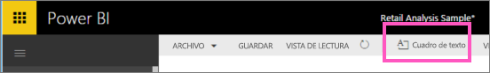
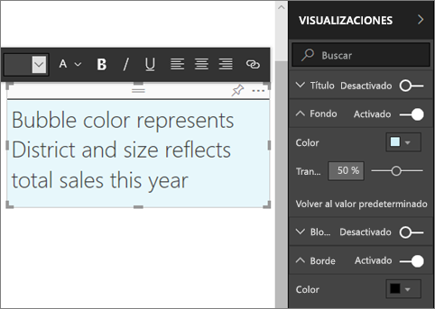
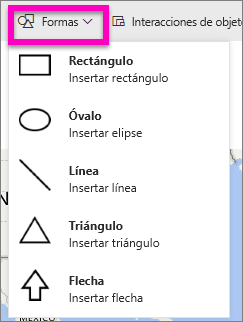
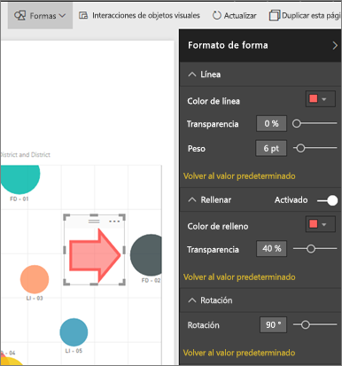

# Adición de cuadros de texto y formas en informes de Power BI
Con el servicio Power BI y Power BI Desktop puede agregar cuadros de texto y formas a los informes. En ambos casos, debe tener permisos de edición para el informe. Si un informe se ha compartido con usted en el servicio Power BI, no tendrá permisos de edición. 

Use en su lugar Power BI Desktop para [agregar imágenes estáticas a un informe](/learn/modules/visuals-in-power-bi/12-formatting) y, después, siga estos pasos para probarlas mediante el servicio Power BI.
> 
> <iframe width="560" height="315" src="https://www.youtube.com/embed/_3q6VEBhGew" frameborder="0" allowfullscreen></iframe>
> 

## Agregar un cuadro de texto a un informe
1. Abra un informe en Vista de edición.

2. Coloque el cursor en cualquier zona en blanco del lienzo del informe y seleccione **Cuadro de texto** en el menú superior.
   
   
3. Escriba el texto en el cuadro de texto y, opcionalmente, establezca el formato de fuente, el color y la alineación del texto. 
   
   
4. Para colocar el cuadro de texto, seleccione el área gris de la parte superior y arrastre. Para cambiar el tamaño del cuadro de texto, seleccione y arrastre cualquiera de los controladores del contorno. 
   
   

5. Con el cuadro de texto seleccionado, agregue formato adicional en el panel **Visualizaciones**. En este ejemplo, se ha aplicado formato al fondo y al borde. También puede crear una posición y un tamaño exactos para un cuadro de texto.  

   

6. Para cerrar el cuadro de texto, seleccione cualquier espacio en blanco del lienzo del informe. 

7. Seleccione el icono de anclaje   para anclar el cuadro de texto a un panel. 

## Agregar una forma a un informe
1. Coloque el cursor en cualquier lugar del lienzo del informe y seleccione **Formas**.
   
   
2. En la lista desplegable, seleccione una forma para agregarla al lienzo del informe. En este ejemplo, se agregará una flecha para dirigir la atención a la burbuja con la varianza total de ventas más alta. 
   
   En el panel **Formato de forma**, personalice la forma. En este ejemplo, hemos creado una flecha roja con un borde rojo oscuro, girada 90 grados.
   
   
3. Para colocar la forma, seleccione el área gris en la parte superior y arrastre. Para cambiar el tamaño de la forma, seleccione y arrastre cualquiera de los controladores del contorno. Al igual que con el cuadro de texto, también puede crear una posición y un tamaño exactos para una forma.

   > [!NOTE]
   > Las formas no se pueden anclar al panel, excepto como uno de los objetos visuales cuando se [ancla una página activa](service-dashboard-pin-live-tile-from-report.md). 
   > 
   > 

## Pasos siguientes
[Agregar un hipervínculo a un cuadro de texto](service-add-hyperlink-to-text-box.md)

[Conceptos básicos para los diseñadores en el servicio Power BI](service-basic-concepts.md)

¿Tiene más preguntas? [Pruebe la comunidad de Power BI](https://community.powerbi.com/)
