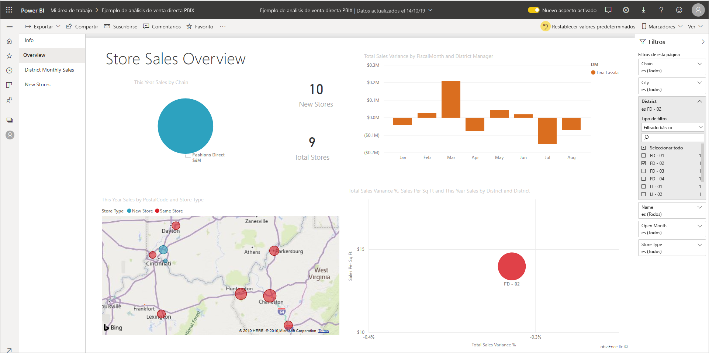
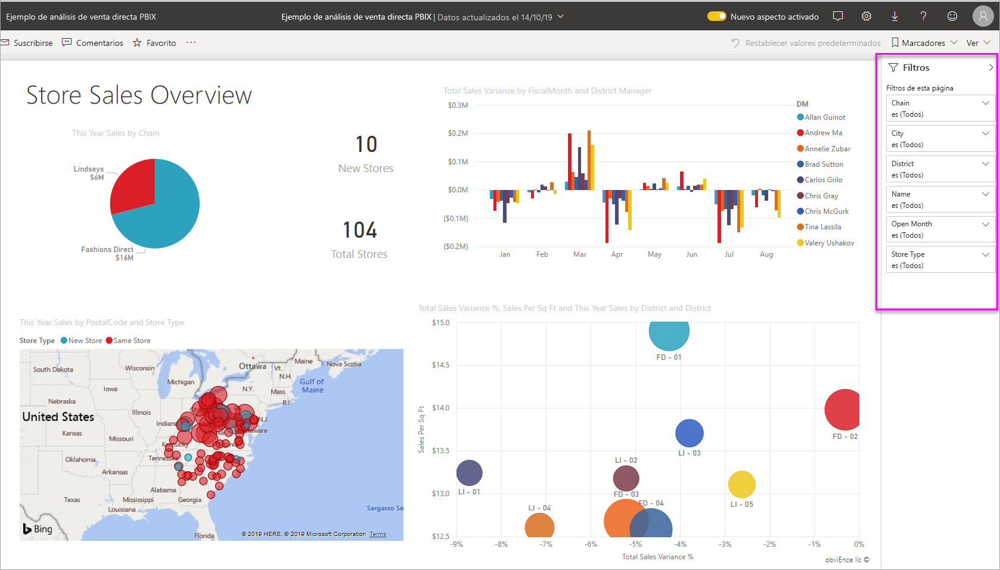
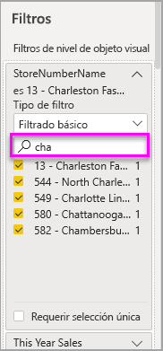
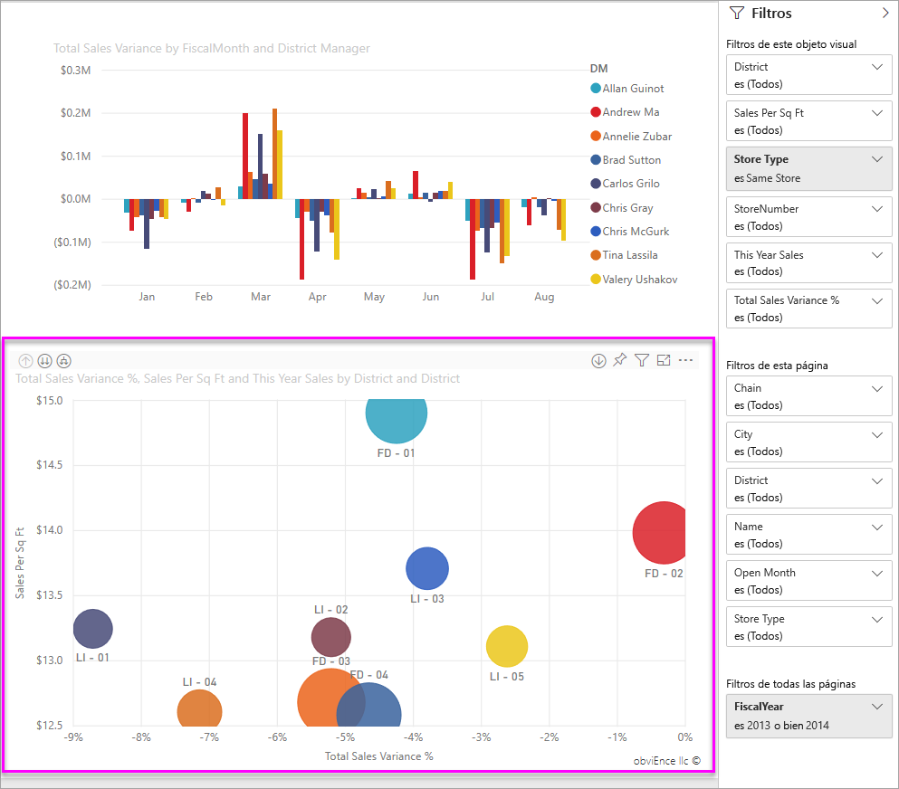
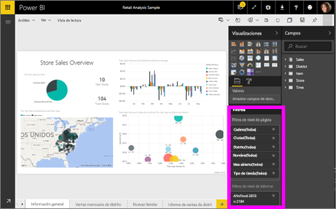

# Filtros y resaltado en informes de Power BI
 Este artículo presenta en el filtrado y resaltado en el servicio Power BI. aunque la experiencia es casi exactamente la misma que en Power BI Desktop. Los *filtros* eliminan todos los datos excepto aquellos en los que desea centrarse. *Resaltado* no está filtrado. No elimina los datos, pero en su lugar, resalta un subconjunto de los datos visibles; los datos que no están resaltados permanecen visibles pero atenuados.

Hay muchas formas distintas de filtrar y resaltar informes en Power BI. Colocar toda la información en un artículo podría ser confuso, por lo que se han realizado las siguientes divisiones:

* Introducción a los filtros y resaltado, el artículo que está leyendo ahora.
* Cómo [crear y usar filtros en la vista de edición](power-bi-report-add-filter.md) en los informes de Power BI Desktop y el servicio Power BI. Si dispone de permisos de edición en un informe, puede crear, modificar y eliminar filtros en él.
* Cómo los objetos visuales [filtrar y resaltar en un informe compartido con usted](consumer/end-user-interactions.md), en la vista de lectura en el servicio Power BI de informes. Sus posibilidades son más limitadas, pero dispone de un amplio abanico de opciones de filtrado y resaltado.  
* Un repaso detallado de la [de filtrado y resaltado de controles disponibles en la vista de edición](power-bi-report-add-filter.md) en Power BI Desktop y el servicio Power BI. El artículo tiene una visión detallada de los tipos de filtros de fecha y hora, numérico y el texto. También cubre las diferencias entre las opciones básicas y avanzadas.
* Una vez que haya aprendido el funcionamiento predeterminado de los filtros y resaltados, [obtenga más información sobre cómo cambiar el modo en el que las visualizaciones de una página se filtran y resaltan entre ellas](service-reports-visual-interactions.md).

**¿Sabía qué?** Power BI tiene una nueva experiencia de filtro, actualmente en versión preliminar. Aprenda más sobre la [nueva experiencia de filtro en los informes de Power BI](power-bi-report-filter-preview.md).

## Introducción al panel Filtros

Puede aplicar filtros en el panel **Filtros** o [realizando selecciones en las segmentaciones](visuals/power-bi-visualization-slicers.md) directamente en el propio informe. En el panel Filtros se muestran las tablas y los campos que se usan en el informe, así como los filtros que se han aplicado, si hay alguno. 

Hay cuatro tipos de filtros.

- Los **filtros de página** se aplican a todos los objetos visuales de la página del informe.     
- Los **filtros visuales** se aplican a un solo objeto visual de una página del informe. Solo verá los filtros de nivel visual en caso de haber seleccionado un objeto visual en el lienzo del informe.    
- Los **filtros de informe** se aplican a todas las páginas del informe.    
- Los **filtros de obtención de detalles** se aplican a una sola entidad en un informe.    

Puede realizar búsquedas en los filtros de página, objeto visual e informe en la vista de lectura o edición, para identificar y seleccionar el valor que quiera. 

Si el filtro contiene las palabras **Todos o Todas** junto a él significa que todos los valores del campo se incluyen en el filtro.  Por ejemplo, **Cadena(Todas)** , como se puede ver en la captura de pantalla siguiente, indica que esta página del informe incluye datos sobre todas las cadenas del almacén.  Por otro lado, el filtro de nivel de informe **AñoFiscal es 2013 o 2014** nos indica que el informe solo incluye los datos de los años fiscales de 2013 y 2014.

## Filtros en las vistas de lectura y edición
Existen dos modos de interactuar con los informes: [la vista de lectura](consumer/end-user-reading-view.md) y la vista de edición. Las funcionalidades de filtrado disponibles dependen del modo en el que se encuentre.

* En la vista de edición, puede agregar filtros de informes, de páginas, de obtención de detalles y de objetos visuales. Al guardar el informe, los filtros se guardan con él, aunque se abra en una aplicación móvil. Las personas que consulten el informe en la vista de lectura pueden interactuar con los filtros que haya agregado, pero no pueden agregar nuevos filtros.
* En la vista de lectura, puede interactuar con los filtros que ya existen en el informe y guardar las selecciones que haya hecho, pero no podrá agregar nuevos filtros.

### Filtros en la vista de lectura
Si solo tiene acceso a un informe en la vista de lectura, el panel Filtros se mostrará de una forma similar a la siguiente:

Así pues, esta página del informe tiene seis filtros de nivel de página y un filtro de nivel de informe.

Cada objeto visual puede tener filtros para todos los campos en el objeto visual, y un autor de informes puede agregar más. En la siguiente imagen, el gráfico de burbujas tiene seis filtros.

En la vista de lectura puede modificar los filtros existentes para explorar los datos. Los cambios que realice se guardan con el informe, aunque se abra en una aplicación móvil. Vea cómo se hace con [un paseo por el panel Filtros del informe](consumer/end-user-report-filter.md).

Cuando se cierra el informe, se guardan los filtros. Para deshacer el filtrado y volver a los valores predeterminados de filtrado, segmentación, obtención de detalles y ordenación establecidos por el autor del informe, seleccione **Restablecer valores predeterminados** en la barra de menús superior.

### Filtros en la vista de edición
Si dispone de permisos de propietario sobre un informe y lo abre en la vista de edición, verá que **Filtros** solo es uno de los varios paneles de edición disponibles.

Como en el caso de la vista de lectura, esta página del informe tiene seis filtros de nivel de página y un filtro de nivel de informe. Al seleccionar el gráfico se burbujas, veremos que tiene seis filtros de nivel de objeto visual aplicados.

Se puede hacer más con los filtros y el resaltado en la vista de edición. Principalmente, se pueden agregar nuevos filtros. Obtenga información sobre cómo [agregar un filtro a un informe](power-bi-report-add-filter.md) y mucho más.

## Resaltado de ad hoc
Seleccione una etiqueta de eje o de valor en un objeto visual para resaltar los demás objetos visuales en la página. Para quitar el resaltado, seleccione el valor nuevo o seleccione cualquier espacio vacío del mismo objeto Visual. Resaltado es un divertido para explorar rápidamente los impactos de datos. Para profundizar en el funcionamiento de este tipo de resaltado cruzado, vea [Interacciones de objetos visuales](service-reports-visual-interactions.md).

## Pasos siguientes

[La nueva experiencia de filtro en los informes de Power BI](power-bi-report-filter-preview.md)

[Incorporación de un filtro a un informe (en la vista de edición)](power-bi-report-add-filter.md)

[Ver los filtros de informes](consumer/end-user-report-filter.md)

[Cambiar el filtro cruzado y el resaltado cruzado entre los objetos visuales de los informes](consumer/end-user-interactions.md)

¿Tiene más preguntas? [Pruebe la comunidad de Power BI](http://community.powerbi.com/)

