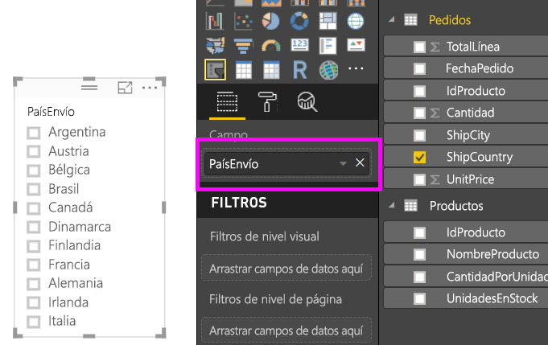
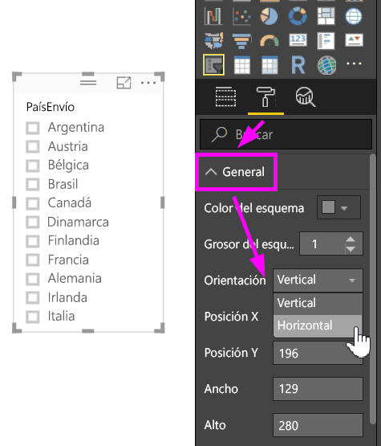
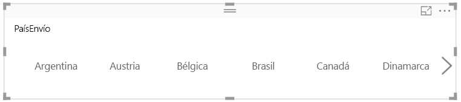
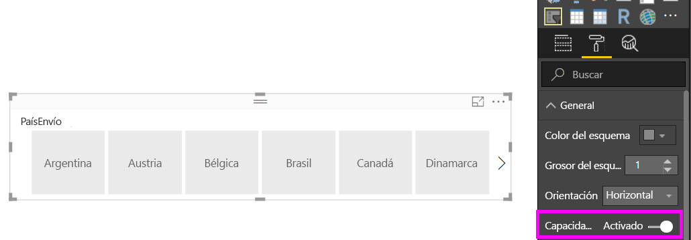
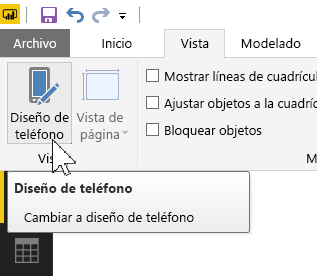
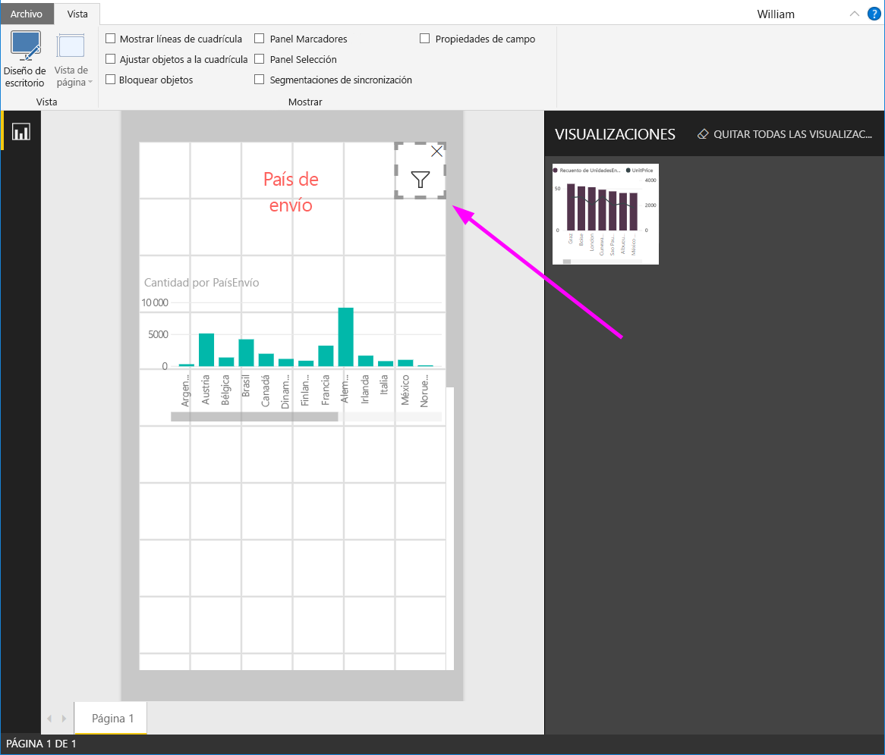

# Crear una segmentación con capacidad de respuesta que se puede cambiar de tamaño en Power BI

Las segmentaciones con capacidad de respuesta se pueden cambiar de tamaño para ajustarse a cualquier espacio en el informe. Con las segmentaciones con capacidad de respuesta, puede cambiar a diferentes tamaños y formas, desde horizontal a cuadrado o vertical y los valores de la segmentación se reorganizan por sí mismos cuando lo hace. En Power BI Desktop y en el servicio Power BI, puede realizar segmentaciones horizontales y segmentaciones de fecha y rango con capacidad de respuesta. Las segmentaciones de fecha y rango también disponen de áreas táctiles mejoradas para que sea más fácil cambiarlas con el dedo. Puede hacer segmentaciones con capacidad de respuesta tan pequeñas o tan grandes como desee; también cambian de tamaño automáticamente para ajustarse a los informes en el servicio Power BI y en las aplicaciones móviles de Power BI. 

## Crear una segmentación

El primer paso para crear una segmentación dinámica es crear una segmentación básica. 

1. Seleccione el icono **Segmentación**  en el panel **Visualizaciones**.
2. Arrastre el campo que desea filtrar a **Campo**.

    

## Convertir en una segmentación horizontal

1. Con la segmentación seleccionada, en el panel **Visualizaciones**, seleccione la pestaña **Formato**.
2. Expanda la sección **General** y, a continuación, en **Orientación** seleccione **Horizontal**.

     

1.  Probablemente deseará para que sea más ancha para mostrar más valores.

     

## Haga que tenga capacidad de respuesta y experimente con ella

Este paso es fácil. 

1. Inmediatamente debajo de **Orientación** en la sección **General** de la pestaña **Formato**, deslice **Con capacidad de respuesta** a **Activar**.  

    

1. Ya puede trabajar con ella. Arrastre las esquinas para que sea corta, alta, ancha o estrecha. Si la hace lo suficientemente pequeña, se convierte en un icono de filtro.

    

## Agréguela a un diseño de informe de teléfono

En Power BI Desktop, puede crear un diseño de teléfono para cada página de un informe. Si una página tiene un diseño de teléfono, se muestra en vertical en un teléfono móvil. En caso contrario, debe verla en la vista horizontal. 

1. En el menú **Vista**, seleccione **Diseño de teléfono**.

     
    
1. Arrastre todos los objetos visuales que desee en el informe de teléfono a la cuadrícula. Cuando arrastre la segmentación con capacidad de respuesta, hágala del tamaño que desee, en este caso, como un icono de filtro.

    

Obtenga más información sobre la creación de [informes optimizados para aplicaciones móviles de Power BI](desktop-create-phone-report.md).

## Hacer que una segmentación de fecha e intervalo tenga capacidad de respuesta

Puede seguir los mismos pasos para convertir una segmentación de fecha e intervalo en una segmentación con capacidad de respuesta. Después de establecer **Con capacidad de respuesta** en **Activar**, se aprecian algunas cosas:

- Los objetos visuales optimizan el orden de los cuadros de entrada según el tamaño permitido en el lienzo. 
- La visualización del elemento de datos está optimizada para hacer que la segmentación sea tan utilizable como sea posible, en función del tamaño que se permite en el lienzo. 
- Los nuevos manipuladores de los controles deslizantes optimizan las interacciones táctiles. 
- Cuando un objeto visual se vuelve demasiado pequeño para ser útil, se convierte en un icono que representa el tipo de objeto visual en su lugar. Para interactuar con él, simplemente pulse dos veces para abrirlo en modo de enfoque. Esto ahorra un espacio valioso en la página del informe sin perder la funcionalidad.

## Pasos siguientes

- [Segmentaciones en el servicio Power BI](power-bi-visualization-slicers.md)
- ¿Tiene más preguntas? [Pruebe a preguntar a la comunidad de Power BI](http://community.powerbi.com/)