# Uso de Preguntas y respuestas de Power BI para explorar los datos y crear objetos visuales

A veces, la manera más rápida de obtener una respuesta de sus datos es formular una pregunta con un lenguaje natural. La característica Preguntas y respuestas de Power BI le permite explorar los datos con sus propias palabras.  En la primera parte de este artículo se muestra cómo se usa Preguntas y respuestas en los paneles del servicio Power BI. En la segunda parte se muestra qué se puede hacer con Preguntas y respuestas al crear informes en el servicio Power BI o en Power BI Desktop. Para más información, consulte el artículo [Preguntas y respuestas para consumidores](consumer/end-user-q-and-a.md). 

[Preguntas y respuestas de las aplicaciones de Power BI Mobile](consumer/mobile/mobile-apps-ios-qna.md) y [Preguntas y respuestas de Power BI Embedded](developer/qanda.md) se tratan en artículos independientes. 

Preguntas y respuestas es una característica interactiva, incluso divertida. A menudo, una pregunta conduce a otras a medida que las visualizaciones revelan rutas interesantes. Observe cómo Amanda muestra el uso de Preguntas y respuestas para crear visualizaciones, indagar en los objetos visuales y anclarlos en paneles.

<iframe width="560" height="315" src="https://www.youtube.com/embed/qMf7OLJfCz8?list=PL1N57mwBHtN0JFoKSR0n-tBkUJHeMP2cP" frameborder="0" allowfullscreen></iframe>

## Parte 1: Uso de las Preguntas y respuestas en un panel del servicio Power BI

En el servicio Power BI (app.powerbi.com), un panel contiene iconos anclados desde uno o varios conjuntos de datos, por lo que puede formular preguntas sobre cualquiera de los datos contenidos en cualquiera de estos conjuntos de datos. Para ver los informes y conjuntos de datos que se usaron para crear el panel, seleccione **Ver relacionado** desde la barra de menús.

El cuadro de pregunta de Preguntas y respuestas se encuentra en la esquina superior izquierda del panel y es donde se escribe la pregunta con lenguaje natural. ¿No ve el cuadro de Preguntas y respuestas? Consulte la sección [Consideraciones y solución de problemas](consumer/end-user-q-and-a.md#considerations-and-troubleshooting) en el artículo **Preguntas y respuestas para consumidores**.  Preguntas y respuestas reconoce las palabras que escribe y determina dónde (en qué conjunto de datos) encontrar la respuesta. Preguntas y respuestas también le ayuda a formar la pregunta con autocompletar, redefinición y otras ayudas textuales y visuales.

La respuesta a su pregunta se muestra como una visualización interactiva y se actualiza cuando modifica la pregunta.

1. Abra un panel y coloque el cursor en el cuadro de pregunta. En la esquina superior derecha, seleccione **Nueva experiencia de Preguntas y respuestas**.

    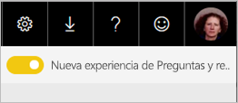

1. Incluso antes de comenzar a escribir, Preguntas y respuestas muestra una nueva pantalla con sugerencias que le ayudarán a realizar la pregunta. Verá frases y preguntas completas con los nombres de las tablas de los conjuntos de datos subyacentes, y podrá ver incluso una lista de preguntas ya planteadas si el propietario del conjunto de datos creó [preguntas destacadas](service-q-and-a-create-featured-questions.md):

   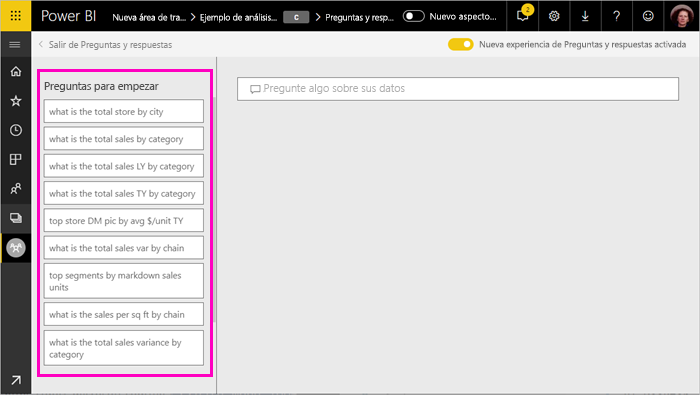

   Puede elegir una de estas preguntas como punto de partida y continuar ajustándola para encontrar una respuesta concreta. O bien, puede usar un nombre de tabla para ayudarle a plantear una pregunta nueva.

2. Seleccione entre la lista de preguntas o comience a escribir su propia pregunta y seleccione entre las sugerencias de la lista desplegable.

   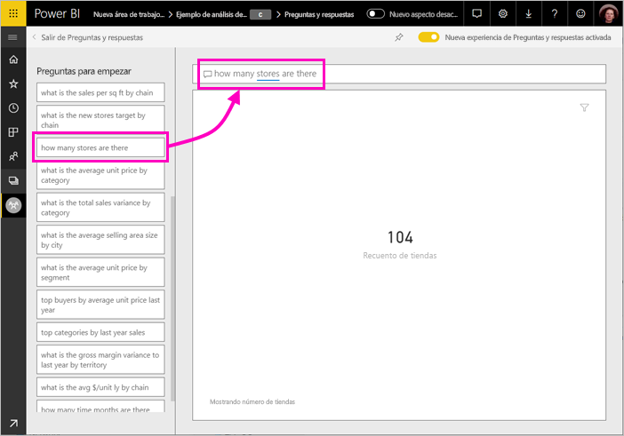

3. A medida que escribe una pregunta, Preguntas y respuestas elige la mejor visualización para mostrar la respuesta.

   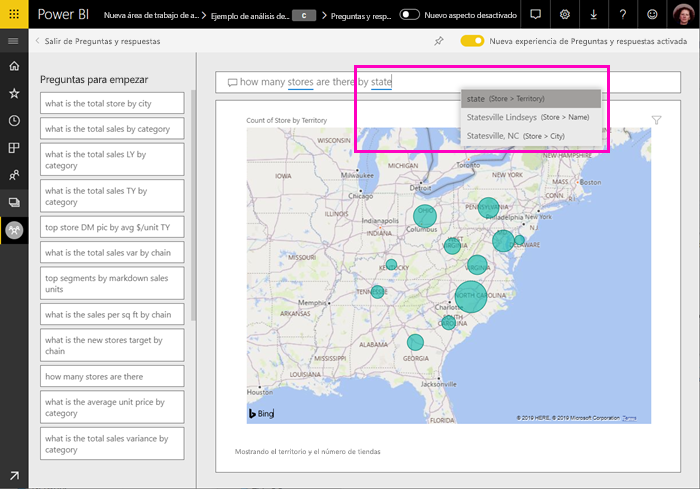

4. La visualización cambia dinámicamente a medida que se modifica la pregunta.

   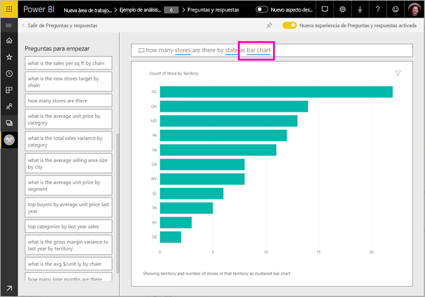

1. Al escribir una pregunta, Power BI busca la mejor respuesta en cualquier conjunto de datos que tenga un icono en ese panel.  Si todos los iconos son del *conjunto de datos A*, entonces su respuesta procederá del *conjunto de datos A*.  Si hay iconos del *conjunto de datos A* y del *conjunto de datos B*, Preguntas y respuestas buscará la mejor respuesta en ambos.

   > [!TIP]
   > Tenga cuidado si solo tiene un icono del *conjunto de datos A* y lo quita de su panel; si hace esto, Preguntas y respuestas dejará de tener acceso al *conjunto de datos A*.
   >

5. Cuando esté satisfecho con el resultado, ancle la visualización a un panel seleccionando el icono de anclaje en la esquina superior derecha. Si el panel se compartió con usted o forma parte de una aplicación, no podrá anclarlo.

   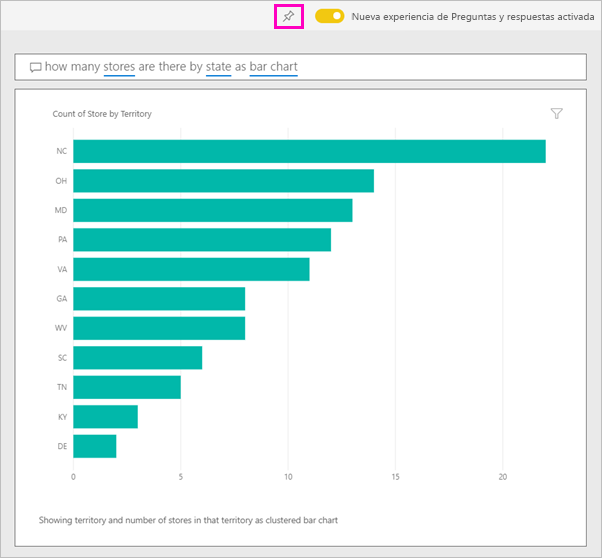

## Parte 2: Uso de Preguntas y respuestas en un informe en el servicio Power BI o en Power BI Desktop

Use Preguntas y respuestas para explorar el conjunto de datos y agregar visualizaciones al informe y los paneles. Un informe se basa en un único conjunto de datos y podría estar completamente en blanco o contener páginas enteras de visualizaciones. Que un informe esté en blanco no significa que no haya ningún dato para explorar; el conjunto de datos está vinculado al informe y está esperando para que lo explore y cree visualizaciones.  Para ver qué conjunto de datos se ha utilizado para crear un informe, abra el informe en la vista de lectura del servicio Power BI y seleccione **Ver relacionado** desde la barra de menús.

Para usar Preguntas y respuestas en los informes, debe tener permisos de edición para el informe y el conjunto de datos subyacente. En el artículo [Preguntas y respuestas para consumidores](consumer/end-user-q-and-a.md) se hace referencia a esta situación como el escenario del *creador*. Si en lugar de esto está *consumiendo* un informe que se ha compartido con usted, Preguntas y respuestas no está disponible.

1. Abra un informe en la vista de edición (servicio Power BI) o en la vista de informe (Power BI Desktop) y seleccione **Hacer una pregunta** en la barra de menús.

    **Power BI Desktop**    
    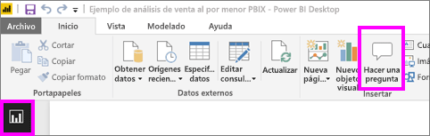

    **Servicio**    
    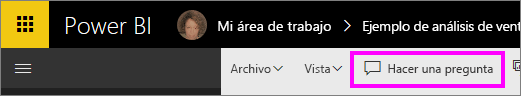

2. Se muestra un cuadro de pregunta de Preguntas y respuestas en el lienzo del informe. En el ejemplo siguiente, el cuadro de pregunta se muestra en la parte superior de otra visualización. Esto es correcto, pero podría ser mejor agregar una página en blanco al informe antes de formular una pregunta.

    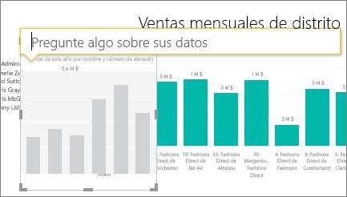

3. Coloque el cursor en el cuadro de pregunta. A medida que escribe, Preguntas y respuestas muestra sugerencias para ayudarle a construir la pregunta.

   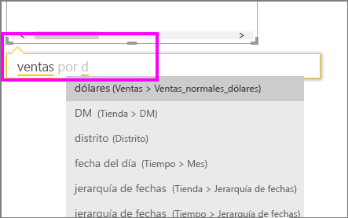

4. A medida que escriba la pregunta, Preguntas y respuestas selecciona la mejor [visualización](visuals/power-bi-visualization-types-for-reports-and-q-and-a.md) para mostrar la respuesta; la visualización cambia de forma dinámica a medida que se modifica la pregunta.

   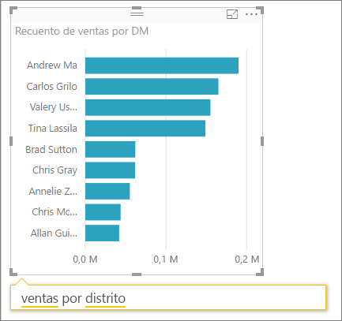

5. Cuando tenga la visualización que desea, presione ENTRAR. Para guardar la visualización con el informe, seleccione **Archivo > Guardar**.

6. Interactúe con la nueva visualización. No importa cómo se creó la visualización, están disponibles la misma interactividad, formato y características.

   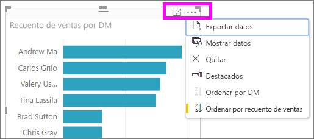

   Si ha creado la visualización en el servicio Power BI, puede incluso [anclarla a un panel](service-dashboard-pin-tile-from-q-and-a.md).

## Indica a Preguntas y respuestas qué visualización usar
Con Preguntas y respuestas, no solo puede pedir a sus datos que sean suficientemente aclaratorios, también puede indicar a Power BI cómo mostrar la respuesta. Solo tiene que agregar "como un <visualization type>" al final de la pregunta.  Por ejemplo, "mostrar volumen de inventario por planta como un mapa" y "mostrar total del inventario como una tarjeta".  Pruébelo usted mismo.

## Consideraciones y solución de problemas
- Si se ha conectado a un conjunto de datos mediante una conexión dinámica o una puerta de enlace, Preguntas y respuestas deben ser [habilitado para ese conjunto de datos](service-q-and-a-direct-query.md).

- Ha abierto un informe y no ve la opción de Preguntas y respuestas. Si está utilizando el servicio Power BI, asegúrese de que abre el informe en la vista de edición. Si no puede abrir la vista de edición significa que no tiene permisos de edición para el informe y no puede usar Preguntas y respuestas con ese informe específico.

## Pasos siguientes

- [Preguntas y respuestas para consumidores](consumer/end-user-q-and-a.md)   
- [Sugerencias para hacer preguntas en Preguntas y respuestas](consumer/end-user-q-and-a-tips.md)   
- [Preparación de un libro para Preguntas y respuestas](service-prepare-data-for-q-and-a.md)  
- [Preparar un conjunto de datos local para Preguntas y respuestas](service-q-and-a-direct-query.md)   
- [Anclar un icono al panel desde Preguntas y respuestas](service-dashboard-pin-tile-from-q-and-a.md)
