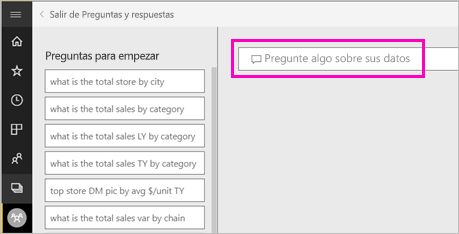
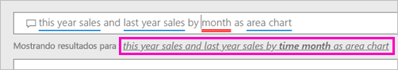
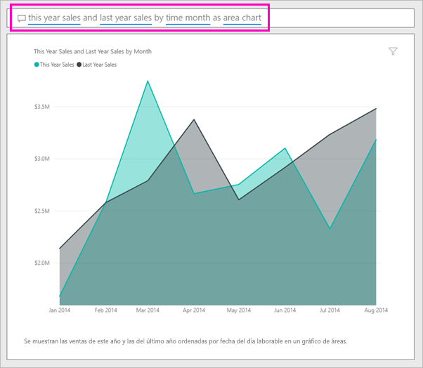
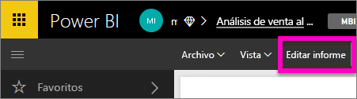
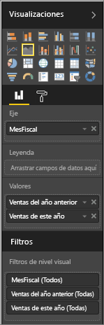

# Crear un objeto visual con Power BI Q & A

A veces, la manera más rápida de obtener una respuesta de sus datos es formular una pregunta con un lenguaje natural.  En este artículo, veremos dos formas distintas de crear la misma visualización: en primer lugar, preguntando con preguntas y respuestas y en segundo lugar, la creación de un informe. Usamos el servicio Power BI para crear el objeto visual en el informe, pero el proceso es casi idéntico con Power BI Desktop.

Para poder continuar, debe utilizar un informe que pueda editar, por lo que vamos a usar uno de los ejemplos disponibles con Power BI.

## Crear un objeto visual con preguntas y respuestas

¿Cómo se dirigiría acerca de cómo crear este gráfico de líneas mediante preguntas y respuestas?

1. En el área de trabajo de Power BI, seleccione **Obtener datos** \> **Ejemplos** \> **Ejemplo de análisis de minoristas** > **Conectar**.

1. Abra el panel de ejemplo de análisis de venta directa y coloque el cursor en el cuadro de preguntas, **formular una pregunta acerca de los datos**.

    

2. En el cuadro de preguntas, escriba algo parecido a esta pregunta:
   
    **ventas de este año y ventas del último año por mes como gráfico de áreas**
   
    A medida que escriba la pregunta, Preguntas y respuestas seleccionará la mejor visualización para mostrar la respuesta; la visualización cambia de forma dinámica a medida que se modifica la pregunta. Además, Preguntas y respuestas le ayuda a dar formato a la pregunta con sugerencias, Autocomplete y correcciones ortográficas. Preguntas y respuestas recomienda un cambio pequeño redacción: "ventas de este año y ventas del último año por *mes tiempo* como gráfico de áreas".  

    

4. Seleccione la frase para aceptar la sugerencia. 
   
   Cuando termine de escribir la pregunta, el resultado es el mismo gráfico que se ve en el panel.
   
   

4. Para anclar el gráfico a su panel, seleccione el icono de anclaje.  en la esquina superior derecha.

## Creación de un objeto visual en el editor de informes

1. Vuelva al panel del ejemplo de análisis de venta directa.
   
2. El panel contiene el mismo icono de gráfico de área para "Ventas del último año y ventas de este año".  Seleccione este icono. No seleccione el icono que se creó con preguntas y respuestas. Si selecciona, abrirá preguntas y respuestas. El icono de gráfico de área original se creó en un informe, por lo que el informe se abre en la página que contiene esta visualización.

    

1. Seleccione **Editar informe**para abrir el informe en la Vista de edición.  Si no es el propietario de un informe, no tiene la opción de abrirlo en la vista de edición.
   
    
4. Seleccione el gráfico de área y revise la configuración en el panel **Campos** .  El creador del informe genera este gráfico seleccionando estos tres valores (**ventas del último año** y **ventas de este año > valor** desde el **ventas** tabla, y  **Mes fiscal** desde el **tiempo** tabla) y los organiza en el **eje** y **valores** wells.
   
    

    Verá que terminé con el mismo objeto visual. Creación de esta manera no era demasiado complicado. Pero crearlo con preguntas y respuestas era más fácil!

## Pasos siguientes

- [Uso de preguntas y respuestas en paneles e informes](power-bi-tutorial-q-and-a.md)  
- [Preguntas y respuestas para los consumidores](consumer/end-user-q-and-a.md)
- [Funcionamiento correcto de los datos con Preguntas y respuestas en Power BI](service-prepare-data-for-q-and-a.md)

¿Tiene más preguntas? [Pruebe la comunidad de Power BI](http://community.powerbi.com/)

