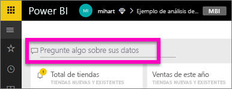
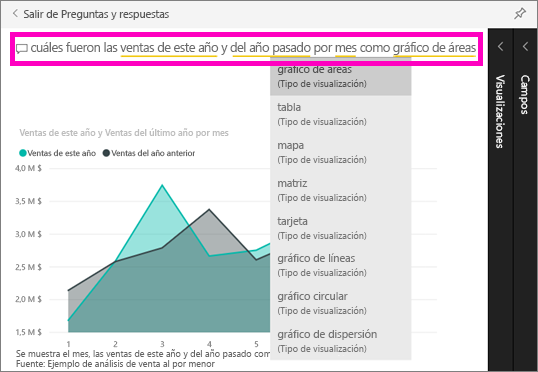

# Introducción a Preguntas y respuestas de Power BI

A veces, la manera más rápida de obtener una respuesta de sus datos es formular una pregunta con un lenguaje natural.  En esta guía de inicio rápido veremos dos formas distintas de crear la misma visualización: en primer lugar, la crearemos en un informe y, en segundo lugar, haremos una pregunta con Preguntas y respuestas. Vamos a usar el servicio Power BI, pero el proceso es casi idéntico con Power BI Desktop.

Para poder continuar, debe utilizar un informe que pueda editar, por lo que vamos a usar uno de los ejemplos disponibles con Power BI.

## Creación de un objeto visual en el editor de informes

1. En el área de trabajo de Power BI, seleccione **Obtener datos** \> **Ejemplos** \> **Ejemplo de análisis de minoristas** > **Conectar**.
   
2. El panel contiene un icono de gráfico de área para "Ventas del último año y ventas de este año".  Seleccione este icono. Si el icono se creó con Preguntas y respuestas, al seleccionar el icono se abrirá Preguntas y respuestas. Pero este icono se creó en un informe, por lo que se abre el informe en la página que contiene esta visualización.

    

1. Seleccione **Editar informe**para abrir el informe en la Vista de edición.  Si no es el propietario de un informe, no tiene la opción de abrirlo en la vista de edición.
   
    
4. Seleccione el gráfico de área y revise la configuración en el panel **Campos** .  Para crear este gráfico, el creador del informe ha seleccionado estos tres valores (**Tiempo > MesFiscal**, **Ventas > Ventas de este año**, **Ventas > Ventas del año anterior > Valor**) y los ha organizado en los campos **Eje** y **Valores**.
   
    

## Creación del mismo objeto visual con Preguntas y respuestas

¿Cómo podría crear este mismo gráfico de líneas mediante Preguntas y respuestas?

1. Vuelva al panel del ejemplo de análisis de venta directa.
2. Con un lenguaje natural, escriba una pregunta similar a esta en el cuadro de pregunta:
   
   **cuáles fueron las ventas de este año y del año pasado por mes como gráfico de áreas**
   
   A medida que escriba la pregunta, Preguntas y respuestas seleccionará la mejor visualización para mostrar la respuesta; la visualización cambia de forma dinámica a medida que se modifica la pregunta. Además, Preguntas y respuestas le ayuda a dar formato a la pregunta con sugerencias, Autocomplete y correcciones ortográficas.
   
   Cuando termine de escribir la pregunta, el resultado será exactamente el mismo gráfico que vimos en el informe.  Pero crearlo así es mucho más rápido.
   
   
3. De forma similar a cómo trabaja con informes, en Preguntas y respuestas tiene acceso a los paneles Visualizaciones, Filtros y Campos.  Abra estos paneles para explorar y modificar aún más el objeto visual.
4. Para anclar el gráfico a su panel, seleccione el icono de anclaje. .

## Pasos siguientes
[Preguntas y respuestas en Power BI](consumer/end-user-q-and-a.md)

[Funcionamiento correcto de los datos con Preguntas y respuestas en Power BI](service-prepare-data-for-q-and-a.md)

¿Tiene más preguntas? [Pruebe la comunidad de Power BI](http://community.powerbi.com/)

