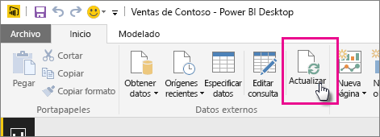

# Actualización de un conjunto de datos creado a partir de un archivo de Power BI Desktop en una unidad local

## ¿Qué es compatible?

En Power BI, se admite la actualización inmediata y la programación de actualización para los conjuntos de datos creados a partir de archivos de Power BI Desktop importados desde una unidad local, y se usa Obtener datos o el Editor de consultas para conectarse a cualquiera de los siguientes orígenes de datos y cargar datos de ellos:

### Power BI Gateway - Personal

- Todos los orígenes de datos en línea que se muestran en Obtener datos y en el Editor de consultas de Power BI Desktop.
- Todos los orígenes de datos locales que se muestran en Obtener datos y en el Editor de consultas de Power BI Desktop, excepto el archivo Hadoop (HDFS) y Microsoft Exchange.

<!-- Refresh Data sources-->
[!INCLUDE [refresh-datasources](./includes/refresh-datasources.md)]

> [!NOTE]
> Es necesario tener una puerta de enlace instalada y en ejecución para que Power BI se pueda conectar a orígenes de datos locales y actualizar el conjunto de datos.
>
>

Para realizar una actualización manual única en Power BI Desktop, seleccione **Actualizar** en la cinta de opciones Inicio. Cuando se selecciona **Actualizar** aquí, los datos del modelo del *archivo* se actualizan con los datos actualizados del origen de datos original. Este tipo de actualización, que se realiza completamente desde la aplicación Power BI Desktop, es diferente de una actualización manual o programada en Power BI y es importante comprender la diferencia.

Al importar el archivo de Power BI Desktop desde una unidad local, los datos y otra información acerca del modelo se cargan en un conjunto de datos en el servicio Power BI. En el servicio Power BI (no en Power BI Desktop), los datos se actualizan en el conjunto de datos porque en él se basan los informes del servicio Power BI. Dado que los orígenes de datos son externos, puede actualizar manualmente el conjunto de datos mediante **Actualizar ahora** o bien puede configurar una programación de actualización mediante **Programar actualización**.

Al actualizar el conjunto de datos, Power BI no se conecta al archivo en la unidad local para consultar los datos actualizados. Usa la información del conjunto de datos para conectarse directamente a los orígenes de datos para consultar los datos actualizados que luego carga en el conjunto de datos.

> [!NOTE]
> Estos datos actualizados del conjunto de datos no se vuelven a sincronizar con el archivo en la unidad local.
>
>

## ¿Cómo se programa una actualización?

Si configura una programación de actualización, Power BI se conectará directamente a los orígenes de datos con la información de conexión y las credenciales del conjunto de datos para consultar los datos actualizados y, luego, cargar los datos actualizados en el conjunto de datos. También se actualizan las visualizaciones de informes y paneles basadas en ese conjunto de datos en el servicio Power BI.

Para más información sobre cómo configurar la actualización programada, consulte [Configuración de la actualización programada](refresh-scheduled-refresh.md).

## Si se produce algún problema

Si las cosas no van bien, suele ser porque Power BI no puede iniciar sesión en los orígenes de datos o, si el conjunto de datos se conecta a un origen de datos local, la puerta de enlace está sin conexión. Asegúrese de que Power BI puede iniciar sesión en los orígenes de datos. Si cambia una contraseña que usa para iniciar sesión en un origen de datos o se le cierra la sesión a Power BI de un origen de datos, asegúrese de intentar iniciar sesión en los orígenes de datos en Credenciales del origen de datos.

Asegúrese de dejar seleccionada la opción **Enviar un correo con los errores de actualización** . Si no se puede realizar una actualización programada, deseará saberlo inmediatamente.

## Solución de problemas

A veces, la actualización de datos no funciona según lo previsto. Normalmente se trata de una incidencia relacionada con una puerta de enlace. Consulte en los artículos de solución de problemas relacionados con la puerta de enlace las herramientas y los problemas conocidos.

- [Solución de problemas con la puerta de enlace de datos local](service-gateway-onprem-tshoot.md)
- [Solución de problemas de Power BI Gateway - Personal](service-admin-troubleshooting-power-bi-personal-gateway.md)

¿Tiene más preguntas? [Pruebe a preguntar a la comunidad de Power BI](https://community.powerbi.com/)

