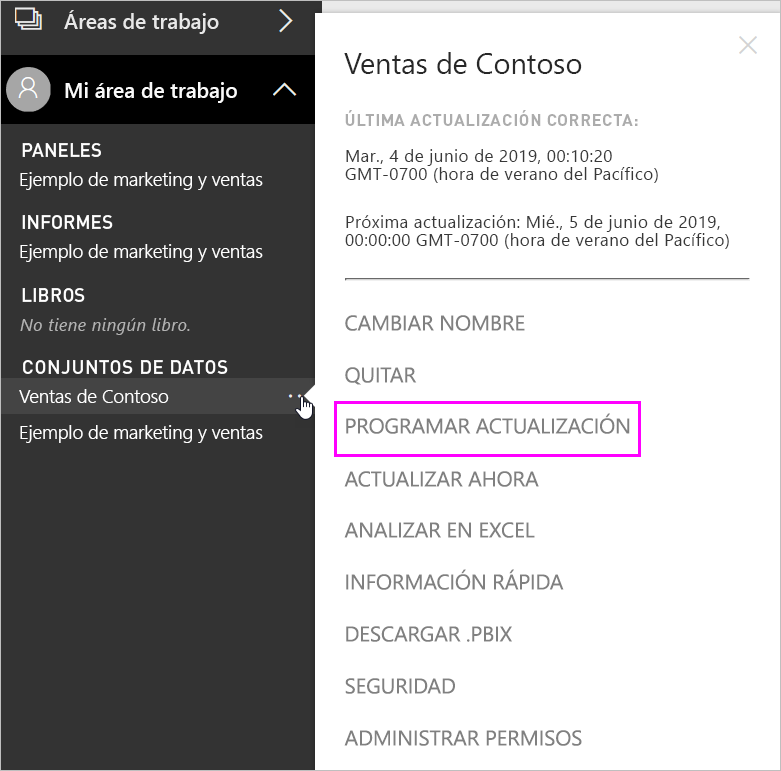
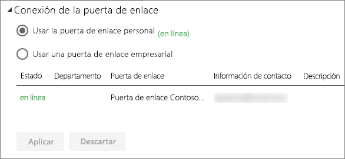
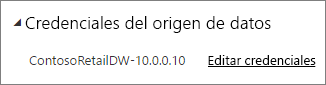
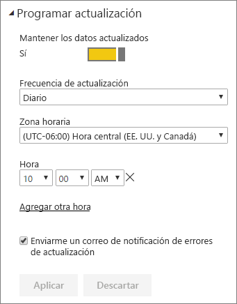

# Configuración de actualización programada

>[!NOTE]
>Después de dos meses de inactividad, se realiza una pausa en la actualización programada en el conjunto de datos. Para más información, consulte [*Actualización programada*](#scheduled-refresh) más adelante en este artículo.

En este artículo se describen las opciones disponibles para la actualización programada para [Puerta de enlace de datos local (modo personal)](service-gateway-personal-mode.md) y para la [Puerta de enlace de datos local](service-gateway-onprem.md). Las opciones de actualización se especifican en las siguientes áreas del servicio de Power BI: **Conexión de puerta de enlace**, **Credenciales del origen de datos** y **Programar actualización**. Examinaremos cada una de ellas. Para obtener más información sobre la actualización de datos, incluidas las limitaciones de las programaciones de actualización, consulte [Actualización de datos](refresh-data.md#data-refresh).

Para ir a la pantalla **Actualización programada**:

1. En el panel de navegación, en **Conjuntos de datos**, seleccione **Más opciones** (...) junto a uno de los conjuntos de datos que aparecen.
2. Seleccione **Programar actualización**.

    

## Conexión de puerta de enlace

Verá diferentes opciones dependiendo de si tiene una puerta de enlace personal o corporativa, en línea y disponible.

Si ninguna puerta de enlace está disponible, verá la opción **Conexión de puerta de enlace** deshabilitada. También verá un mensaje que indica cómo instalar la puerta de enlace personal.

Si tiene configurada una puerta de enlace personal, estará disponible para seleccionarla si está en línea. Mostrará sin conexión si no está disponible.

También puede seleccionar la puerta de enlace empresarial si está disponible para usted. Solo verá una puerta de enlace empresarial disponible si su cuenta aparece en la pestaña **Usuarios** del origen de datos configurado para una puerta de enlace dada.

## Credenciales del origen de datos

### Power BI Gateway - Personal

Si utiliza la puerta de enlace personal para actualizar los datos, debe proporcionar las credenciales para conectarse al origen de datos de back-end. Si se conecta a un paquete de contenido desde un servicio en línea, las credenciales especificadas para conectarse se transferirán a la actualización programada.

Solo es necesario que inicie sesión en un origen de datos la primera vez que use la actualización en ese conjunto de datos. Una vez introducidas, esas credenciales se conservan con el conjunto de datos.

> [!NOTE]
> En algunos métodos de autenticación, si la contraseña que se usa para iniciar sesión en un origen de datos expira o se modifica, será necesario cambiarla también en el origen de datos en **Credenciales del origen de datos**.

Cuando existe algún problema, suele deberse a que la puerta de enlace está sin conexión porque no pudo iniciar sesión en Windows e iniciar el servicio o porque Power BI no pudo iniciar sesión en los orígenes de datos para consultar los datos actualizados. Si se produce un error en la actualización, compruebe la configuración del conjunto de datos. Si el servicio de puerta de enlace está sin conexión, verá el error en **Estado**. Si Power BI no puede iniciar sesión en los orígenes de datos, verá un error en Credenciales del origen de datos.

### Puerta de enlace de datos local

Si usa la puerta de enlace de datos local para actualizar los datos, no es preciso que especifique sus credenciales, ya que el administrador de la puerta de enlace las define para el origen de datos.

> [!NOTE]
> Al conectarse a SharePoint local para la actualización de datos, Power BI solo admite los mecanismos de autenticación *Anonymous*, *Basic* y *Windows (NTLM o Kerberos)* . Power BI no admite *ADFS* ni ningún mecanismo de *autenticación basada en formularios* para la actualización de datos de los orígenes de datos de SharePoint local.

## Actualización programada

La sección **Actualización programada** es donde se definen las ranuras de frecuencia y hora para actualizar el conjunto de datos. Algunos orígenes de datos no requieren que una puerta de enlace se configure para la actualización; otros orígenes de datos requieren una puerta de enlace.

Cambie el valor del control deslizante **Mantener los datos actualizados** a **Sí** para configurar las opciones.

> [!NOTE]
> El objetivo es iniciar la actualización en un plazo de 15 minutos desde la franja de tiempo programada, pero puede producirse un retraso de hasta una hora si el servicio no puede asignar antes los recursos necesarios.

> [!NOTE]
> Después de dos meses de inactividad, se realiza una pausa en la actualización programada en el conjunto de datos. Se considera que un conjunto de datos está inactivo cuando ningún usuario ha visitado un panel o informe generado en el conjunto de datos. En ese momento, el propietario del conjunto de datos recibe un mensaje de correo electrónico en el que se le indica que la actualización programada está en pausa. La programación de la actualización del conjunto de datos se muestra como **deshabilitada**. Para reanudar la actualización programada, basta con volver a visitar cualquier panel o informe creado en el conjunto de datos.

## ¿Qué es compatible?

Algunos conjuntos de datos se admiten con diferentes puertas de enlace en la actualización programada. Esta es una referencia para comprender lo que está disponible.

### Power BI Gateway - Personal

**Power BI Desktop**

* Todos los orígenes de datos en línea que se muestran en **Obtener datos** y en el Editor de consultas de Power BI Desktop.
* Todos los orígenes de datos locales que se muestran en **Obtener datos** y en el Editor de consultas de Power BI Desktop, excepto el archivo Hadoop (HDFS) y Microsoft Exchange.

**Excel**

* Todos los orígenes de datos en línea que se muestran en Power Query.
* Todos los orígenes de datos locales que se muestran en Power Query, excepto el archivo Hadoop (HDFS) y Microsoft Exchange.
* Todos los orígenes de datos en línea que se muestran en Power Pivot.
* Todos los orígenes de datos locales que se muestran en Power Pivot, excepto el archivo Hadoop (HDFS) y Microsoft Exchange.

> [!NOTE]
> En Excel 2016 y versiones posteriores, Power Query aparece en la sección **Datos** de la cinta de opciones, en **Obtener y transformar datos**.

### Power BI Gateway

Para obtener información sobre los orígenes de datos admitidos, consulte [Orígenes de datos de Power BI](power-bi-data-sources.md).

## Solución de problemas
A veces, la actualización de datos no funciona según lo previsto. Normalmente se trata de un problema relacionado con una puerta de enlace. Consulte en los artículos de solución de problemas relacionados con la puerta de enlace las herramientas y los problemas conocidos.

- [Solución de problemas con la puerta de enlace de datos local](service-gateway-onprem-tshoot.md)
- [Solución de problemas de Power BI Gateway - Personal](service-admin-troubleshooting-power-bi-personal-gateway.md)

## Pasos siguientes

- [Actualizar datos en Power BI](refresh-data.md)  
- [Power BI Gateway - Personal](service-gateway-personal-mode.md)  
- [Puerta de enlace de datos local (modo personal)](service-gateway-onprem.md)  
- [Solución de problemas con la puerta de enlace de datos local](service-gateway-onprem-tshoot.md)  
- [Solución de problemas de Power BI Gateway - Personal](service-admin-troubleshooting-power-bi-personal-gateway.md)  

¿Tiene más preguntas? [Pruebe a preguntar a la comunidad de Power BI](https://community.powerbi.com/)