# Uso de conjuntos de datos compartidos en el Generador de informes de Power BI

Puede usar un conjunto de datos creado en Power BI Desktop como origen de datos para informes paginados del Generador de informes de Power BI. Imagínese este escenario: Ha creado un informe de Power BI en Power BI Desktop. Ha dedicado mucho tiempo a diseñar el modelo de datos y después ha creado un bonito informe de Power BI con todo tipo de excelentes objetos visuales. El informe tiene una matriz con muchas filas, por lo que tiene que desplazarse para verlas todas. Los lectores del informe quieren un informe que puedan imprimir, en el que se muestren todas las filas de esa matriz. Un informe paginado de Power BI lo puede hacer: imprimir una tabla o matriz que ocupe varias páginas, con encabezados y pies de página, y un diseño de página perfecto. Complementará el informe de Power BI Desktop. Quiere que se basen en los mismos datos exactos, sin discrepancias, por lo que usa el mismo conjunto de datos.

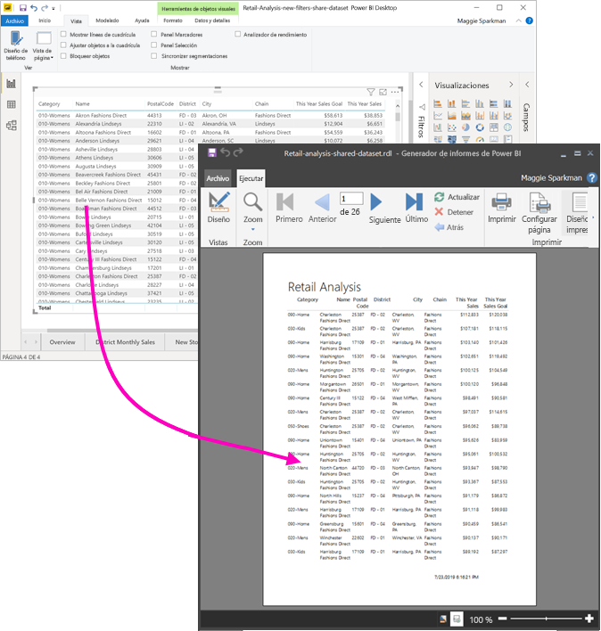

No es necesario que el conjunto de datos esté en un área de trabajo de una capacidad Premium, ni tampoco que sea miembro de esa área de trabajo. Solo debe tener [permiso de compilación](service-datasets-build-permissions.md) para el conjunto de datos. Para publicar el informe paginado, necesita una licencia de Power BI Pro. También necesita al menos un rol de colaborador para un área de trabajo en una capacidad Premium.

## Lo que necesita

Esta es una lista de lo que necesita y no necesita para usar un conjunto de datos compartido en el Generador de informes de Power BI.

- Generador de informes de Power BI. [Descargue e instale el Generador de informes de Power BI](https://go.microsoft.com/fwlink/?linkid=2086513).
- Para acceder a un conjunto de datos de Power BI, debe tener el permiso de compilación para el conjunto de datos. Más información sobre el [permiso de compilación](service-datasets-build-permissions.md).
- No necesita una licencia de Power BI Pro para crear un informe paginado en el Generador de informes. 
- Para publicar el informe paginado, necesita una licencia de Power BI Pro. También necesita al menos un rol de colaborador para un área de trabajo en una capacidad Premium. 
- Opcional: Si quiere seguir este artículo, descargue el archivo de Power BI Desktop [Ejemplo de análisis de minoristas.pbix](http://download.microsoft.com/download/9/6/D/96DDC2FF-2568-491D-AAFA-AFDD6F763AE3/Retail%20Analysis%20Sample%20PBIX.pbix), ábralo en Power BI Desktop y agregue una tabla con muchas columnas. En el panel **Formato**, desactive **Totales**. Después, publíquelo en un área de trabajo del servicio Power BI.

    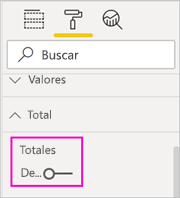

## Conexión al conjunto de datos de Power BI

1. Abra el Generador de informes de Power BI.
1. Seleccione **Iniciar sesión** en la esquina superior derecha del Generador de informes para iniciar sesión en la cuenta de Power BI.
1. En el panel Datos de informe, seleccione **Nuevo** > **Power BI Dataset Connection** (Conexión de conjunto de datos de Power BI).

    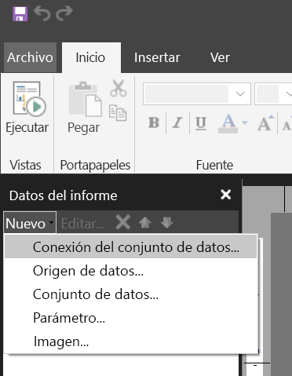

    > [!NOTE]
    > No se puede crear el origen de datos o el conjunto de datos para un conjunto de datos de Power BI mediante los asistentes para tablas, matrices o gráficos del Generador de informes. Después de crearlos, puede usar los asistentes para crear tablas, matrices o gráficos basados en ellos.

1. Busque el conjunto de datos o el área de trabajo donde reside > **Seleccionar**.
    Generador de informes rellena el nombre del conjunto de datos.

    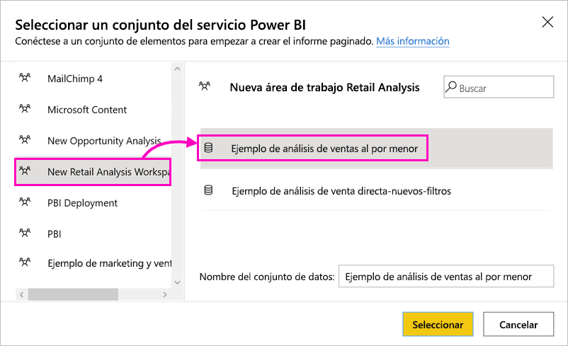
    
1. El conjunto de datos aparece en Orígenes de datos en el panel Datos de informe.

    

    Recuerde que se puede conectar a varios conjuntos de datos de Power BI y otros orígenes de datos en el mismo informe paginado.

## Obtención de la consulta para el conjunto de datos

Si quiere que los datos del informe de Power BI y del informe de Generador de informes sean los mismos, no basta con conectarse al conjunto de datos. También necesita la consulta que se basa en ese conjunto de datos.

1. Abra el informe de Power BI (.pbix) en Power BI Desktop.
1. Asegúrese de que tiene una tabla en el informe que contenga todos los datos que quiere en el informe paginado.

1. En la cinta **Vista**, seleccione **Analizador de rendimiento**.

    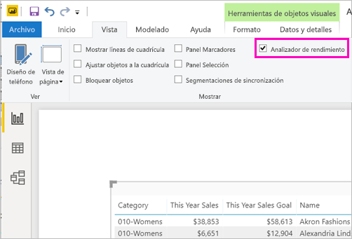

1. En el panel **Analizador de rendimiento**, seleccione **Iniciar grabación** y después **Actualizar objetos visuales**.

    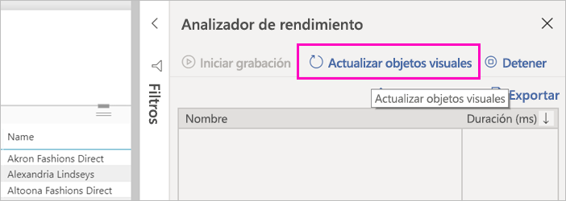

1. Expanda el signo más ( **+** ) situado junto al nombre de la tabla y seleccione **Copiar consulta**. La consulta es la fórmula DAX que necesita para el conjunto de datos en el Generador de informes de Power BI.

    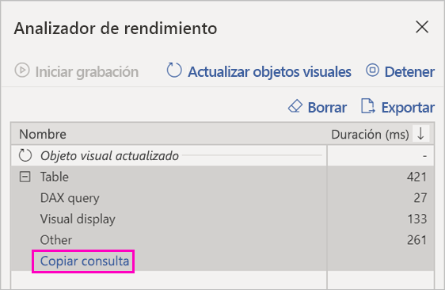

## Creación del conjunto de datos con la consulta

1. Vuelva al Generador de informes de Power BI.
1. Haga clic con el botón derecho en **Conjuntos de datos** y seleccione **Agregar conjunto de datos**.

    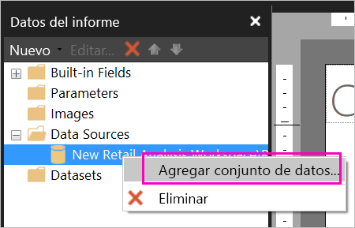

1. En Propiedades del conjunto de datos, asígnele un nombre y seleccione **Diseñador de consultas**.

4. Asegúrese de que **DAX** está seleccionado y anule la selección del icono **Modo de diseño**.

    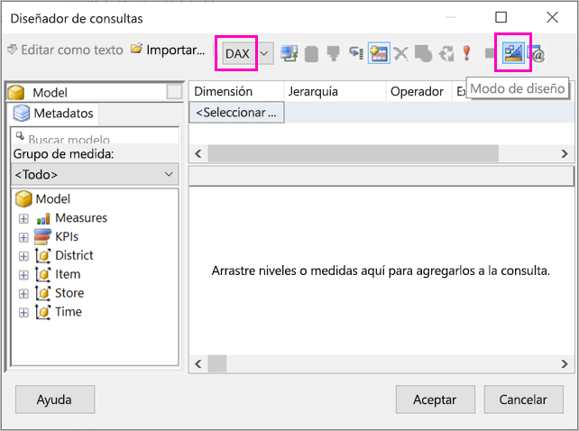

1. En el cuadro superior, pegue la consulta que ha copiado de Power BI Desktop.

1. Seleccione **Ejecutar consulta** (el signo de exclamación de color rojo, !) para asegurarse de que la consulta funciona. 

    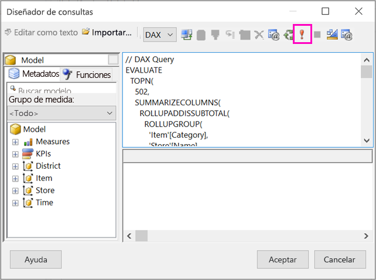

    Verá los resultados de la consulta en el cuadro inferior.

    

1. Seleccione **Aceptar**.

    Verá la consulta en la ventana **Consulta** del cuadro de diálogo **Propiedades del conjunto de datos**.

    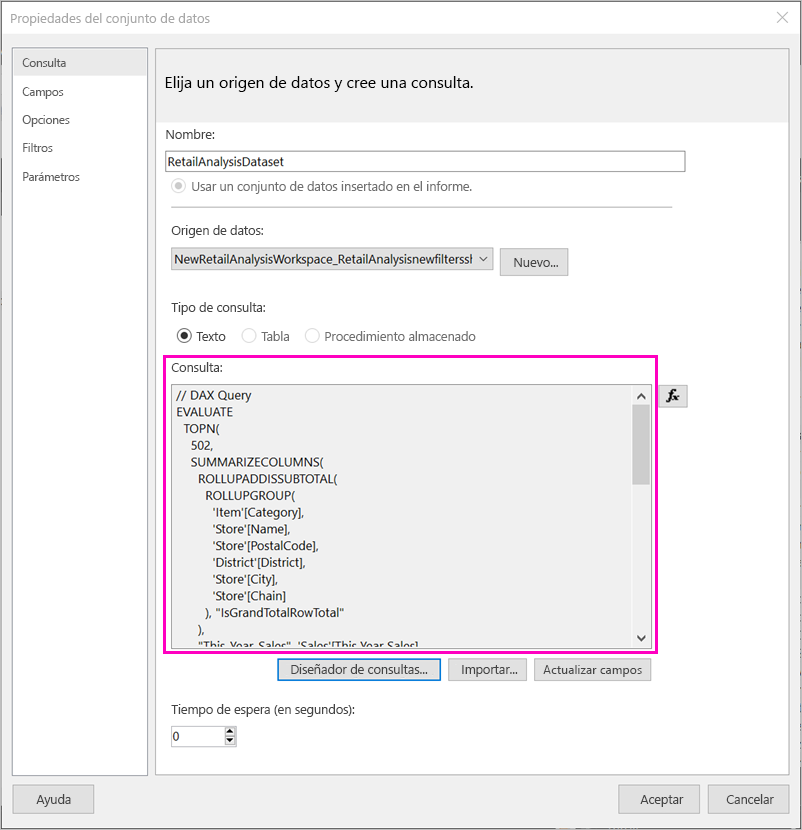

1. Seleccione **Aceptar**.

    Ahora verá el nuevo conjunto de datos con una lista de sus campos en el panel datos de informe.

    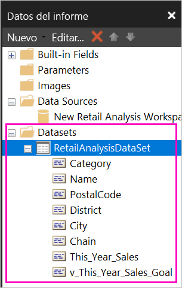

## Creación de una tabla en el informe

Una forma rápida de crear una tabla consiste en usar el Asistente para tablas.

1. En la cinta **Insertar**, seleccione **Tabla** > **Asistente para tablas**.

    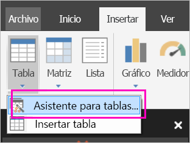

1. Elija el conjunto de datos que ha creado con la consulta DAX > **Siguiente**.

    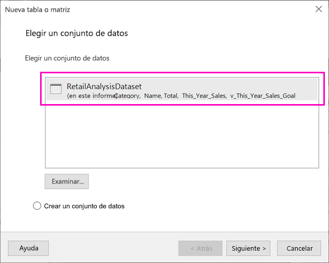

1. Para crear una tabla plana, seleccione los campos que quiera en **Campos disponibles**. Puede seleccionar varios campos a la vez si selecciona el primero que quiere, mantiene presionada la tecla Mayús y selecciona el último.

    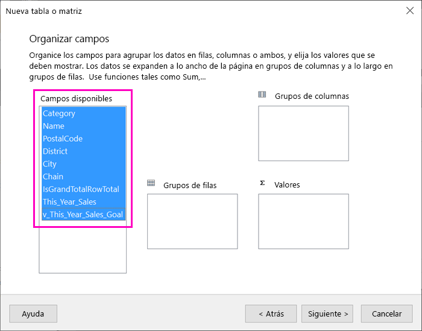

1. Arrastre los campos hasta el cuadro **Valores** > **Siguiente**.

    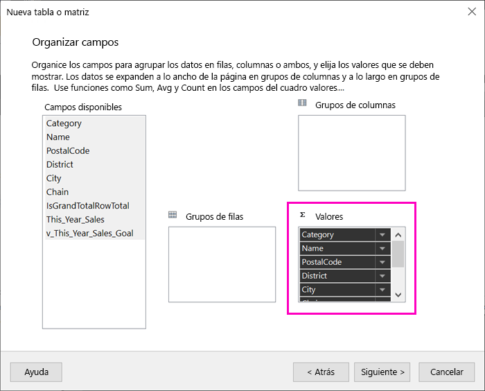

1. Elija las opciones de diseño que quiera > **Siguiente**.

1. Seleccione **Finalizar**.
    Verá la tabla en la vista Diseño.

    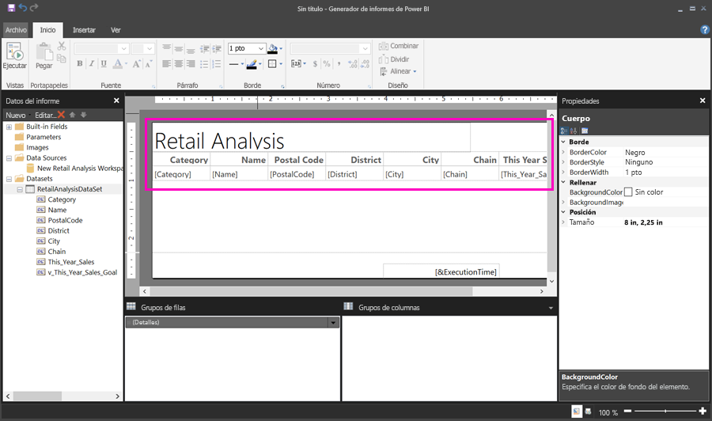

1. Seleccione **Haga clic para agregar un título** y agregue un título.

1. Seleccione **Ejecutar** para obtener una vista previa del informe.

    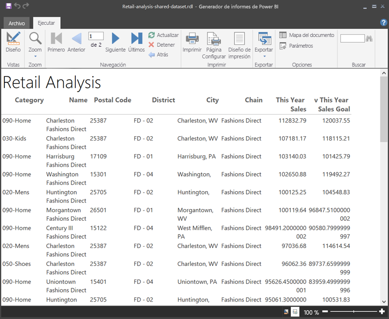

1. Seleccione **Diseño de impresión** para ver cómo se imprimirá el informe. 

    Este diseño de informe necesita algún retoque. Tiene 54 páginas porque las columnas y los márgenes hacen que la tabla tenga dos páginas de ancho.

    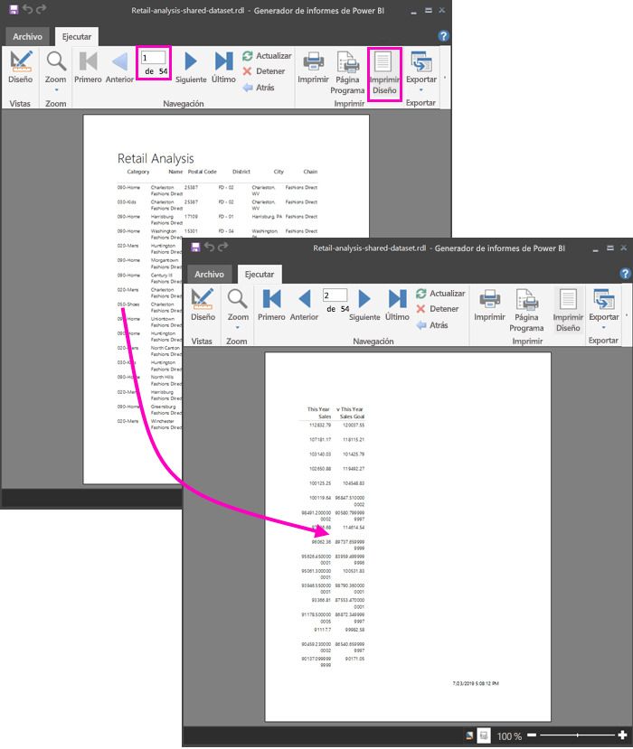

## Formato del informe

Tiene varias opciones de formato para hacer que la tabla quepa en una página. 

1. En el panel Propiedades puede restringir los márgenes de página. Si no ve el panel Propiedades, active la casilla **Propiedades** en la cinta **Vista**.

1. Seleccione el informe, no la tabla ni el título.
1. En el panel **Propiedades del informe**, en **Página**, expanda **Márgenes** y cambie cada uno a **0,75 pulgadas**.

    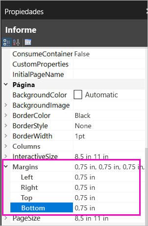

1. También puede hacer que las columnas sean más estrechas. Seleccione el borde de la columna y arrastre el lado derecho hacia la izquierda.

    

1. Otra opción consiste en asegurarse de que los valores numéricos tengan el formato correcto. Seleccione una celda con un valor numérico. 
    > [!TIP]
    > Para dar formato a más de una celda a la vez, mantenga presionada la tecla Mayús mientras selecciona las otras celdas.

    

1. En la cinta **Inicio**, en la sección **Número**, cambie el formato **Predeterminado** a un formato numérico como **Moneda**.

    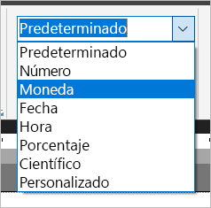

1. Cambie el estilo **Marcador de posición** a **Valores de ejemplo** para poder ver el formato en la celda. 

    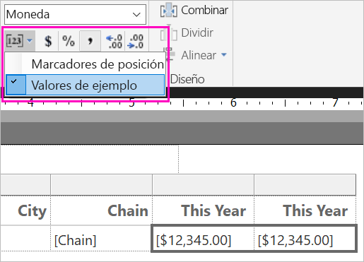

1. Si procede, en la sección **Número**, reduzca los decimales para ahorrar más espacio.

### Deshacerse de las páginas en blanco

Incluso si ha hecho que los márgenes y las columnas de la tabla sean más estrechos, es posible que acabe con páginas alternas en blanco. ¿Por qué? Debido a los cálculos matemáticos. 

Al sumar los márgenes de página que ha establecido, más el ancho del *cuerpo* del informe, debe ser menor que el ancho del formato del informe.

Por ejemplo, imagine que el informe tiene un formato de 8,5 x 11 pulgadas y que ha establecido los márgenes laterales en 0,75 pulgadas. Juntos, los dos márgenes suman 1,5 pulgadas, por lo que el cuerpo debe ser inferior a 7 pulgadas de ancho.

1. Seleccione el borde derecho de la superficie de diseño del informe y arrástrelo para que sea menor que el número deseado en la regla. 

    > [!TIP]
    > Puede establecerlo con más precisión en las propiedades de **Cuerpo**. En **Tamaño**, establezca la propiedad **Ancho**.

    

1. Seleccione **Ejecutar** para obtener una vista previa del informe y asegúrese de que se ha deshecho de las páginas en blanco. Ahora este informe solo tiene 26 páginas, en lugar de las 54 originales. Operación completada correctamente.

    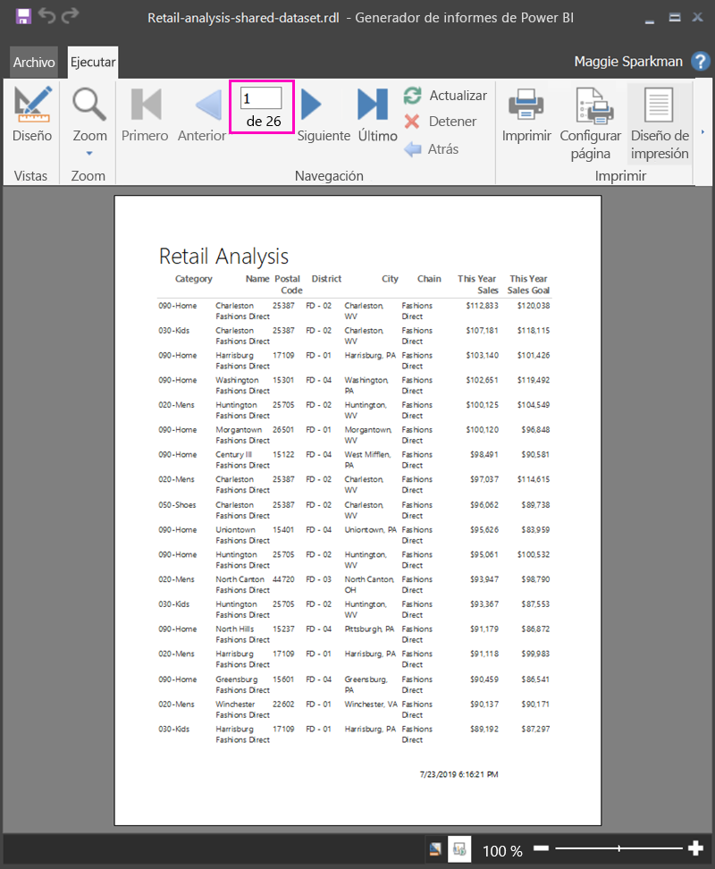

## Limitaciones y consideraciones 

- Para los conjuntos de datos que usan una conexión dinámica con Analysis Services, puede conectarse directamente mediante la conexión subyacente de Analysis Services en lugar de un conjunto de datos compartido.
- Los conjuntos de datos con la promoción Promocionado o Certificado aparecen en la lista de conjuntos de datos disponibles, pero no se marcan como tales. 

## Pasos siguientes

- [¿Qué son los informes paginados en Power BI Premium?](paginated-reports-report-builder-power-bi.md)