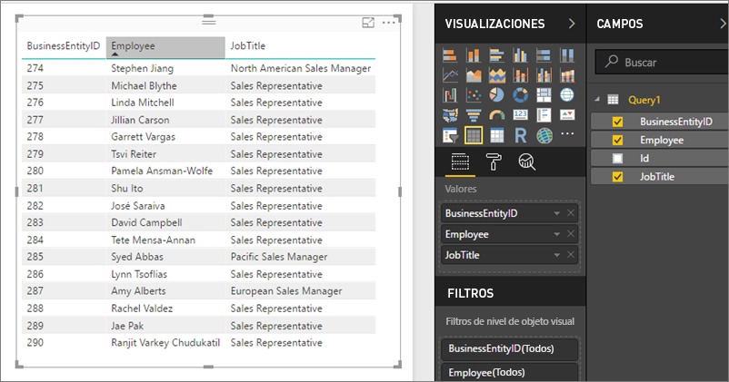

# Acceso a conjuntos de datos compartidos como fuentes de OData en Power BI Report Server
Puede tener acceso a conjuntos de datos compartidos desde Power BI Desktop con una fuente de OData.

1. Con la dirección URL de la fuente de OData, se conecta al origen de OData.
   
    
2. Después de conectar los datos en Power BI Desktop, puede modificarlos en el Editor de consultas.
   
    
3. Ahora puede usar los datos en el diseño de informes.
   
    

Asegúrese de usar las **Opciones avanzadas** para que pueda activar Abrir columnas de tipo y dar formato a las columnas según corresponda en Power Query para satisfacer sus necesidades.

Obtenga información sobre la [Conexión a fuentes de OData en Power BI Desktop](../desktop-connect-odata.md).

¿Tiene más preguntas? [Pruebe a preguntar a la comunidad de Power BI](https://community.powerbi.com/)

