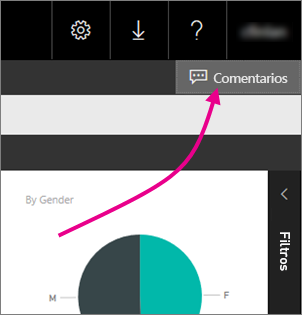
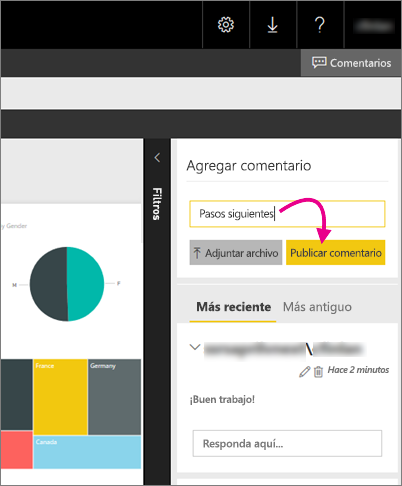

# Incorporación de comentarios a un informe de un servidor de informes
Puede agregar comentarios a los informes, incluidos los informes de Power BI, en el portal web de un servidor de informes. Los comentarios se integran en el informe, y cualquier usuario con los permisos adecuados puede verlos. Consulte la sección [Permisos](#permissions) que aparece a continuación para más información.

## Incorporación o visualización de comentarios
1. Abra un informe paginado o de Power BI de un servidor de informes.
2. En la esquina superior derecha, seleccione **Comentarios**.
   
    
   
    En el panel Comentarios, puede ver los comentarios existentes.
3. Escriba un comentario y haga clic en **Publicar comentario**.
   
    
   
    El comentario se muestra en el panel del portal web, junto con todos los comentarios anteriores. No aparecen con el informe en las aplicaciones móviles de Power BI.
   
   > [!TIP]
   > ¿Sabía lo siguiente? Puede [anotar informes de Power BI en las aplicaciones móviles de Power BI](../mobile-annotate-and-share-a-tile-from-the-mobile-apps.md) y compartir los informes anotados con otros usuarios.
   > 
   > 

## Permisos
Dependiendo de sus permisos, se pueden dar los siguientes casos:

* No ver los comentarios.
* Ver todos los comentarios, y publicar, editar y eliminar los suyos.
* Ver todos los comentarios; publicar, editar y eliminar los suyos; y eliminar los de otros.

## Pasos siguientes
* [Manual del usuario del servidor de informes de Power BI](user-handbook-overview.md)  

¿Tiene más preguntas? [Pruebe a preguntar a la comunidad de Power BI](https://community.powerbi.com/)

