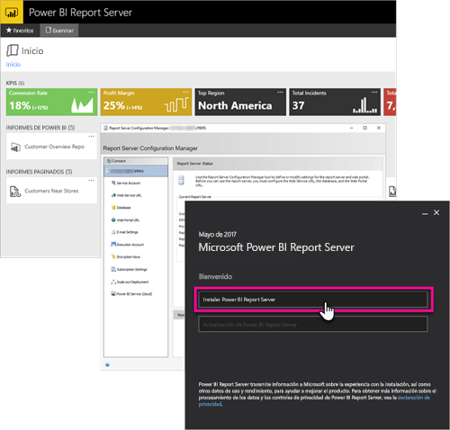

# Introducción al manual del desarrollador: servidor de informes de Power BI

Este es el manual del desarrollador para el servidor de informes de Power BI, una ubicación local para almacenar y administrar informes paginados, móviles o de Power BI.

En este manual se resaltan las opciones que, como desarrollador, tiene para trabajar con Power BI Report Server.

## Inserción

Puede insertar dentro de cualquier informe del servidor de informes de Power BI un iFrame agregando el parámetro querystring `?rs:Embed=true` a la dirección URL. Esta técnica sirve para informes de Power BI, así como para otros tipos de informes.

### Control del visor de informes

Para los informes paginados, puede aprovechar las ventajas del control de visor de informes. Con él, puede colocar el control dentro de una aplicación web o ventanas de .NET. Para más información, consulte [Introducción al control de visor de informes](https://docs.microsoft.com/sql/reporting-services/application-integration/integrating-reporting-services-using-reportviewer-controls-get-started).

## API

Dispone de varias opciones de API para interactuar con el servidor de informes de Power BI. Esta técnica incluye lo siguiente:

* [API de REST](rest-api.md)
* [Acceso de URL](https://docs.microsoft.com/sql/reporting-services/url-access-ssrs)
* [Proveedor de WMI](https://docs.microsoft.com/sql/reporting-services/wmi-provider-library-reference/reporting-services-wmi-provider-library-reference-ssrs)

También puede usar las [utilidades de PowerShell de código abierto](https://github.com/Microsoft/ReportingServicesTools) para administrar el servidor de informes.

> [!NOTE]
> Actualmente, las utilidades de PowerShell no son compatibles con los archivos de Power BI Desktop (.pbix).

## Extensiones personalizadas

La biblioteca de extensiones es un conjunto de clases, interfaces y tipos de valor que se incluyen en el servidor de informes de Power BI. Esta biblioteca proporciona acceso a la funcionalidad del sistema y está diseñada para ser la base en la que se pueden usar aplicaciones de Microsoft .NET Framework para extender los componentes del servidor de informes de Power BI.

Existen varios tipos de extensiones que puede crear.

* Extensiones de procesamiento de datos
* Extensiones de entrega
* Extensiones de representación para informes paginados
* Extensiones de seguridad

Para más información, consulte [Biblioteca de extensiones](https://docs.microsoft.com/sql/reporting-services/extensions/reporting-services-extension-library).

## Pasos siguientes

[Introducción al control de visor de informes](https://docs.microsoft.com/sql/reporting-services/application-integration/integrating-reporting-services-using-reportviewer-controls-get-started)  
[Building Applications Using the Web Service and the .NET Framework](https://docs.microsoft.com/sql/reporting-services/report-server-web-service/net-framework/building-applications-using-the-web-service-and-the-net-framework) (Creación de aplicaciones mediante el servicio web y .NET Framework)  
[Acceso de URL](https://docs.microsoft.com/sql/reporting-services/url-access-ssrs)  
[Biblioteca de extensiones](https://docs.microsoft.com/sql/reporting-services/extensions/reporting-services-extension-library)  
[Proveedor de WMI](https://docs.microsoft.com/sql/reporting-services/wmi-provider-library-reference/reporting-services-wmi-provider-library-reference-ssrs)

¿Tiene más preguntas? [Pruebe a preguntar a la comunidad de Power BI](https://community.powerbi.com/)