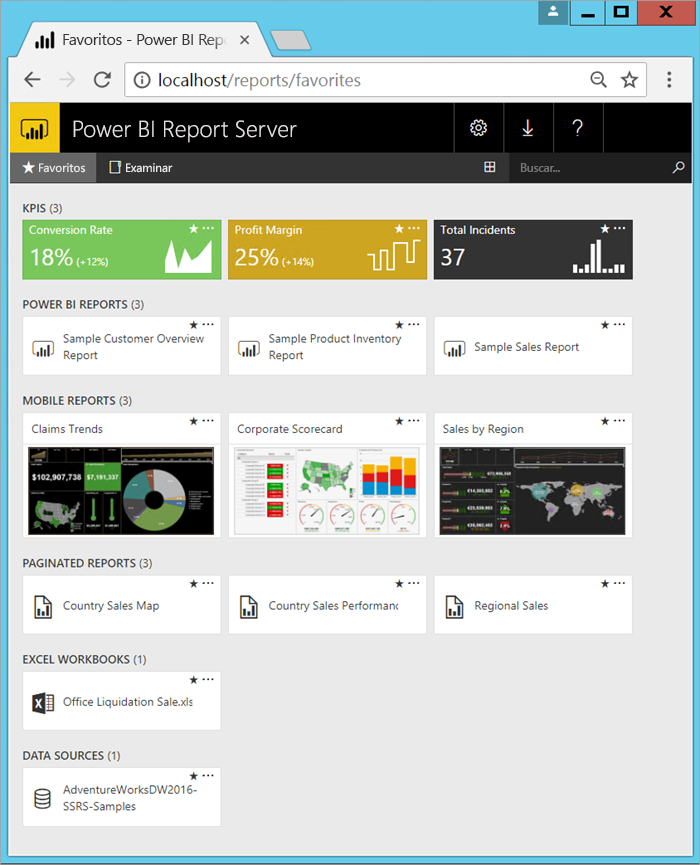

# ¿Qué es Power BI Report Server?

Power BI Report Server es un servidor de informes local con un portal web en el que se pueden mostrar y administrar informes y KPI, junto con las herramientas para crear informes, informes paginados, informes móviles y KPI de Power BI. Los usuarios pueden acceder a los informes de maneras diferentes: verlos en un explorador web o en un dispositivo móvil, o como un correo electrónico en su bandeja de entrada.

## Comparación de Power BI Report Server 
Power BI Report Server es similar a SQL Server Reporting Services y al servicio en línea Power BI, pero con algunas diferencias. Al igual que el servicio Power BI, Power BI Report Server hospeda informes de Power BI (.PBIX) y archivos de Excel. Al igual que Reporting Services, Power BI Report Server es local y hospeda los informes paginados (.RDL). Power BI Report Server es un superconjunto de Reporting Services: todo lo que puede hacer en Reporting Services, puede hacerlo con Power BI Report Server y más, con la adición de compatibilidad para los informes de Power BI. Vea [Comparación de Power BI Report Server y el servicio Power BI](compare-report-server-service.md) para obtener información detallada.

## Licencias de Power BI Report Server
Power BI Report Server está disponible con dos licencias distintas: [Power BI Premium](../service-premium.md) y [SQL Server Enterprise Edition](https://www.microsoft.com/sql-server/sql-server-2017-editions) con Software Assurance. Con una licencia de Power BI Premium, puede crear una implementación híbrida en la que se combine la nube y un entorno local.  

## Portal web
El punto de entrada de Power BI Report Server es un portal web seguro que puede ver en cualquier explorador moderno. Aquí, puede acceder a todos los informes y KPI. El contenido del portal web se organiza en una jerarquía de carpetas tradicional. En las carpetas, el contenido se agrupa por tipos: informes de Power BI, informes móviles, informes paginados, KPI y libros de Excel, además de conjuntos de datos compartidos y orígenes de datos compartidos que se usan como bloques de creación para los informes. Puede etiquetar favoritos para verlos en una sola carpeta. Y puede crear KPI en el portal web. 

Dependiendo de sus permisos, puede administrar el contenido en el portal web. Puede programar el procesamiento de informes, acceder a informes a petición y suscribirse a los informes publicados. Puede aplicar también su propia [marca](https://docs.microsoft.com/sql/reporting-services/branding-the-web-portal) personalizada al portal web. 

Obtenga más información sobre el [portal web de Power BI Report Server](https://docs.microsoft.com/sql/reporting-services/web-portal-ssrs-native-mode).

## Informes de Power BI
Cree informes de Power BI (.PBIX) con la versión de Power BI Desktop optimizada para el servidor de informes. A continuación, publíquelos y véalos en el portal web en su propio entorno.

Un informe de Power BI es una vista de varias perspectivas de un modelo de datos, con visualizaciones que representan diferentes hallazgos e información detallada de ese modelo de datos.  Un informe puede tener una sola visualización o páginas enteras de visualizaciones. Dependiendo de su rol, puede leer y explorar los informes, o puede crearlos para otras personas.

Instale [Power BI Desktop optimizado para Power BI Report Server](quickstart-create-powerbi-report.md).

## Informes paginados
Los informes paginados (.RDL) son informes con estilo de documento con visualizaciones, en los que las tablas se expanden horizontalmente y verticalmente para mostrar todos sus datos, avanzando de una página a otra según sea necesario. Son excelentes para generar documentos de diseño fijo y apariencia perfecta, optimizados para la impresión, como los archivos PDF y de Word.

Para crear informes de aspecto moderno mediante el [Generador de informes](https://docs.microsoft.com/sql/reporting-services/report-builder/report-builder-in-sql-server-2016) o el Diseñador de informes en [SQL Server Data Tools (SSDT)](https://docs.microsoft.com/sql/reporting-services/tools/reporting-services-in-sql-server-data-tools-ssdt).

## Informes móviles de Reporting Services
Los informes móviles se conectan a datos locales y tienen un diseño dinámico que se adapta a diferentes dispositivos y distintas maneras de contenerlos. Puede crearlos con el Publicador de informes móviles de Microsoft SQL Server.

Obtenga más información sobre los [Informes móviles de Reporting Services](https://docs.microsoft.com/sql/reporting-services/mobile-reports/create-mobile-reports-with-sql-server-mobile-report-publisher). 

## Características de programación del servidor de informes
Saque provecho de las características de programación de Power BI Report Server para que pueda extender y personalizar la funcionalidad de informes, con API para integrar o extender el procesamiento de datos e informes en aplicaciones personalizadas.

Más [documentación para desarrolladores del servidor de informes](https://docs.microsoft.com/sql/reporting-services/reporting-services-developer-documentation).

## Pasos siguientes
[Instalar un servidor de informes de Power BI](install-report-server.md)  
[Instalación del Generador de informes](https://docs.microsoft.com/sql/reporting-services/install-windows/install-report-builder)  

¿Tiene más preguntas? [Pruebe a preguntar a la comunidad de Power BI](https://community.powerbi.com/)

