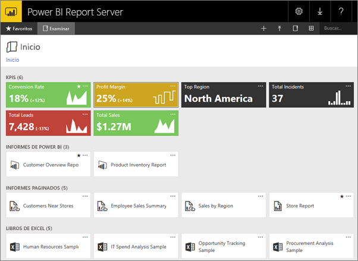
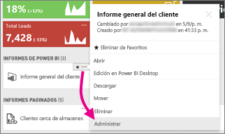
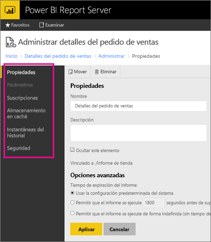

# Administración de contenido en el portal web 
El portal web del servidor de informes de Power BI es una ubicación local para visualizar, almacenar y administrar informes de Power BI, informes para móviles e informes paginados e indicadores KPI.

Puede ver el portal web en cualquier explorador moderno. En el portal web, los informes y los KPI se organizan en carpetas y puede marcarlos como favoritos. También puede almacenar libros de Excel en él. Desde el portal web, puede iniciar las herramientas que necesite para crear informes:

* **Informes de Power BI** creados con Power BI Desktop: se pueden ver en el portal web y en las aplicaciones móviles de Power BI.
* **Informes paginados** creados en el generador de informes: documentos de aspecto moderno y diseño fijo optimizados para la impresión.
* **KPI** creado justo en el portal web.

En el portal web puede examinar las carpetas del servidor de informes o buscar informes concretos. Puede ver un informe, sus propiedades generales y copias anteriores del informe capturadas en el historial del informe. Dependiendo de sus permisos, es posible que pueda suscribirse a informes que se entregan en la bandeja de entrada del correo electrónico o en una carpeta compartida en el sistema de archivos.

## Roles y permisos del portal web
El portal web es una aplicación que se ejecuta en un explorador. Al iniciar el portal web, las páginas, los vínculos y las opciones que aparecen varían en función de los permisos que tenga en el servidor de informes. Si está asignado a un rol con permisos completos, tiene acceso al conjunto completo de menús y páginas de la aplicación para administrar un servidor de informes. Si está asignado a un rol con permisos para ver y ejecutar informes, solo verá los menús y páginas que necesite para esas actividades. Puede tener distintas asignaciones de roles para distintos servidores de informes, o incluso para los distintos informes y carpetas en un único servidor de informes.

## Iniciar el portal web
1. Abra su explorador web.
   
    Consulte la lista de [exploradores web y versiones admitidas](browser-support.md).
2. En la barra de direcciones, escriba la dirección URL del portal web.
   
    La dirección URL predeterminada es *http://[NombreDeEquipo]/reports*.
   
    El servidor de informes puede estar configurado para utilizar un puerto específico. Por ejemplo, *http://[NombreDeEquipo]:80/Reports* o *http://[NombreDeEquipo]:8080/Reports*
   
    El portal web agrupa los elementos en estas categorías:
   
   * KPI
   * Informes móviles
   * Informes paginados
   * Informes de Power BI Desktop
   * Libros de Excel
   * Conjuntos de datos
   * Orígenes de datos
   * Recursos

## Administrar elementos en el portal web
El servidor de informes de Power BI ofrece control detallado de los elementos que se almacenan en el portal web. Por ejemplo, puede configurar las suscripciones, almacenamiento en caché, instantáneas y seguridad de informes paginados individuales.

1. Seleccione los puntos suspensivos (...) en la esquina superior derecha de un elemento y, a continuación, seleccione **Administrar**.
   
    
2. Elija la propiedad u otra característica que desea establecer.
   
    
3. Seleccione **Aplicar**.

Puede consultar más información sobre cómo [trabajar con suscripciones en el portal web](https://docs.microsoft.com/sql/reporting-services/working-with-subscriptions-web-portal).

## Pasos siguientes
[¿Qué es Power BI Report Server?](get-started.md)

¿Tiene más preguntas? [Pruebe a preguntar a la comunidad de Power BI](https://community.powerbi.com/)

