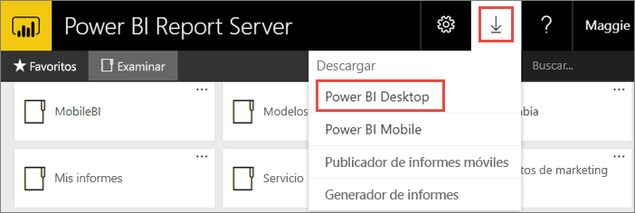
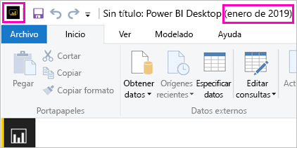
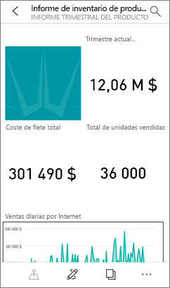

# Instalar Power BI Desktop optimizado para el servidor de informes de Power BI

Aprenda a instalar Power BI Desktop optimizado para el servidor de informes de Power BI.

Para crear informes de Power BI para Power BI Report Server, debe descargar e instalar Power BI Desktop optimizado para Power BI Report Server. Esta es una versión de Power BI Desktop distinta de la que se usa con el servicio Power BI. Por ejemplo, la versión de Power BI Desktop del servicio Power BI incluye características en versión preliminar que no están presentes en la versión de Power BI Report Server hasta que se publican. Es necesario usar esta versión para asegurarse de que el servidor de informes puede interactuar con una versión conocida de los informes y el modelo. 

La buena noticia es que puede instalar en paralelo Power BI Desktop y una versión optimizada para Power BI Report Server en el mismo equipo.

## Descarga e instalación de Power BI Desktop

La mejor manera de asegurarse de que tiene la versión más actualizada de Power BI Desktop optimizado para Power BI Report Server es iniciarlo desde el portal web de su servidor de informes.

1. En el portal web de Report Server, seleccione la flecha **Descargar** > **Power BI Desktop**.

    

    O bien, vaya directamente a [Microsoft Power BI Desktop](https://go.microsoft.com/fwlink/?linkid=2055039) (optimizado para Power BI Report Server, enero de 2019) en el Centro de descarga de Microsoft.

2. En la página del Centro de descarga, seleccione **Descargar**.

3. En función de su equipo, seleccione: 

    - **PBIDesktopRS.msi** (versión de 32 bits).

    - **PBIDesktopRS_x64.msi** (versión de 64 bits).

1. Después de descargar el instalador, ejecute el asistente para la instalación de Power BI Desktop (enero de 2019).

2. Al final del proceso de instalación, seleccione **Iniciar Power BI Desktop ahora**.

    Se inicia automáticamente y está listo para funcionar.

## Comprobación relativa al uso de una versión correcta
Comprobar que esté usando la versión correcta de Power BI Desktop es muy sencillo: solo tiene que echar un vistazo a la pantalla de inicio o a la barra de título de Power BI Desktop. En la barra de título se indican el mes y el año de la versión. Además, los colores del logotipo de Power BI aparecen invertidos, es decir, amarillo sobre negro en lugar de negro sobre amarillo.

La versión de Power BI Desktop para el servicio Power BI no indica el mes y el año en la barra de título.

## Asociación de extensión de archivo
Si instala Power BI Desktop y una versión optimizada para Power BI Report Server en la misma máquina, la instalación más reciente de Power BI Desktop será la que esté asociada a los archivos .pbix. Así pues, al hacer doble clic en un archivo .pbix, se iniciará la versión de Power BI Desktop que haya instalado más recientemente.

Si tiene Power BI Desktop e instala una versión optimizada para Power BI Report Server, los archivos .pbix se abrirán en esta última versión de forma predeterminada. Si quiere que Power BI Desktop sea la opción predeterminada para abrir un archivo .pbix, reinstale [Power BI Desktop desde Microsoft Store](http://aka.ms/pbidesktopstore).

Siempre puede abrir la versión de Power BI Desktop que desea usar en primer lugar. Y, después, abra el archivo desde Power BI Desktop.

Al editar un informe de Power BI desde Power BI Report Server, así como al crear un nuevo informe de Power BI desde el portal web, siempre se abre la versión correcta de Power BI Desktop.

## Consideraciones y limitaciones

Los informes de Power BI de Power BI Report Server, del servicio Power BI (http://app.powerbi.com)) y de las aplicaciones móviles de Power BI actúan prácticamente igual, pero hay algunas características diferentes.

### En un explorador

Los informes del servidor de informes de Power BI admiten todas las visualizaciones, entre las que se incluyen:

* Objetos visuales personalizados

Los informes del servidor de informes de Power BI no admiten:

* Objetos visuales de R
* Mapas de ArcGIS
* Rutas de navegación
* Características de la versión preliminar de Power BI Desktop

### En las aplicaciones móviles de Power BI

Los informes del servidor de informes de Power BI admiten toda la funcionalidad básica en las [aplicaciones móviles de Power BI](../consumer/mobile/mobile-apps-for-mobile-devices.md), lo que incluye:

* [Diseño del informe en el teléfono](../desktop-create-phone-report.md): puede optimizar un informe para las aplicaciones móviles de Power BI. En teléfonos móviles, los informes optimizados presentan una disposición especial y el icono .
  
    

Los informes del servidor de informes de Power BI no admiten estas características en las aplicaciones móviles de Power BI:

* Objetos visuales de R
* Mapas de ArcGIS
* Objetos visuales personalizados
* Rutas de navegación
* Geofiltrado o códigos de barras

## Power BI Desktop para versiones anteriores de Power BI Report Server

Si la versión de Power BI Report Server es anterior, se necesita la versión correspondiente de Power BI Desktop. Aquí tiene la versión anterior.

- Microsoft Power BI Desktop ([optimizado para Power BI Report Server; agosto de 2018](https://www.microsoft.com/download/details.aspx?id=57271))

## Pasos siguientes

Una vez que Power BI Desktop se ha instalado, puede empezar a crear informes de Power BI.

[Creación de un informe de Power BI para Power BI Report Server](quickstart-create-powerbi-report.md)  
[¿Qué es Power BI Report Server?](get-started.md)

¿Tiene más preguntas? [Pruebe a preguntar a la comunidad de Power BI](https://community.powerbi.com/)
