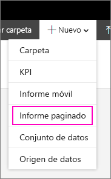
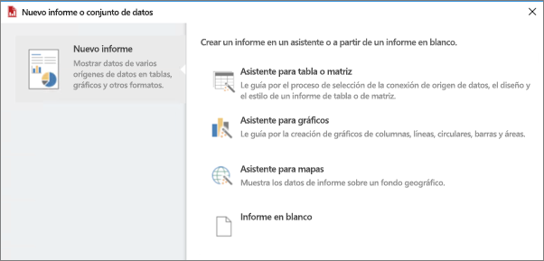

# Instalación de Report Builder: Power BI Report Server

Report Builder es una aplicación independiente que el usuario o un administrador pueden instalar en el equipo. Puede instalarla desde el Centro de descarga de Microsoft o Power BI Report Server.  

¿Busca ayuda con la instalación de Report Builder para el servicio Power BI? Consulte [Generador de informes paginados de Power BI](../report-builder-power-bi.md).
  
Un administrador normalmente instala y configura Power BI Report Server, concede permiso para descargar Report Server desde el portal web y administra las carpetas y los permisos para los informes y los conjuntos de datos compartidos guardados en el servidor de informes. Para obtener más información sobre la administración de Power BI Report Server, consulte [Introducción a la administración de Power BI Report Server](admin-handbook-overview.md).  
  
## Requisitos del sistema
  
 Consulte la sección **Requisitos del sistema** en la [página de descarga de Report Builder](https://go.microsoft.com/fwlink/?LinkID=734968) en el Centro de descarga de Microsoft.
 
## Instalación de Report Builder desde un portal web
  
Puede instalar Report Builder desde un portal web de Power BI Report Server. Quizás ya haya instalado el Generador de informes para crear informes para un servidor SSRS. Puede usar la misma versión del Generador de informes para crear informes para el servidor de informes de Power BI. Si aún no lo ha instalado, el proceso es sencillo.

1. En el portal web de Power BI Report Server, seleccione **Nuevo** > **Informe paginado**.
   
    
   
    Si no ha instalado aún Report Builder, se iniciará el asistente de Report Builder de Microsoft.  
  
3.  Acepte los términos del contrato de licencia y seleccione **Siguiente**.  
 
5.  Haga clic en **Instalar** para completar la instalación de Report Builder.  

2. Una vez instalado, el Generador de informes se abre en la pantalla **Nuevo informe o conjunto de datos**.
   
    
 

##   Instalación de Report Builder desde el Centro de descarga  
  
1.  En la [página de Report Builder del Centro de descarga de Microsoft](https://go.microsoft.com/fwlink/?LinkID=734968), seleccione **Descargar**.  
  
2.  Cuando se haya terminado de descargar Report Builder, seleccione **Ejecutar**.  
  
     Se iniciará el asistente de Report Builder de Microsoft.  
  
3.  Acepte los términos del contrato de licencia y seleccione **Siguiente**.  
 
5.  Haga clic en **Instalar** para completar la instalación de Report Builder.  
 

## Pasos siguientes

[¿Qué es Power BI Report Server?](get-started.md)
