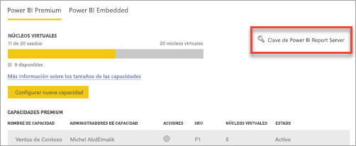
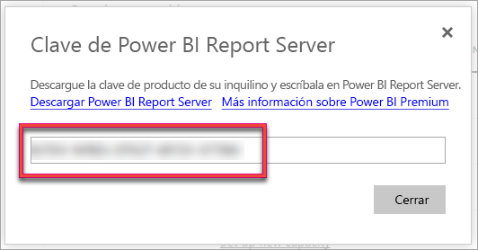
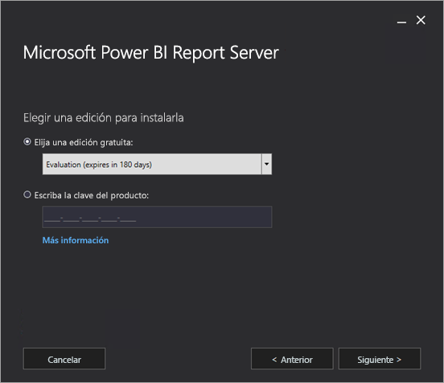
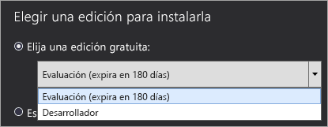
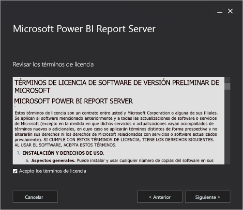
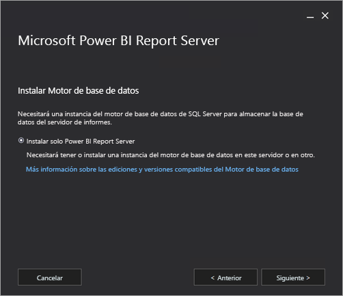
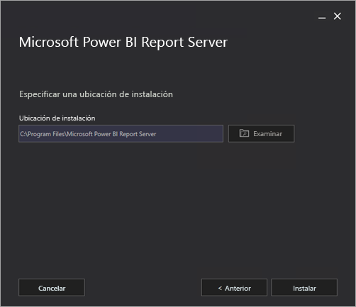
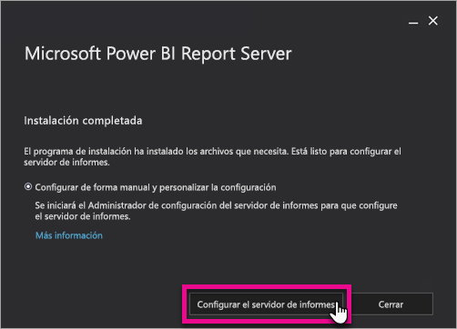
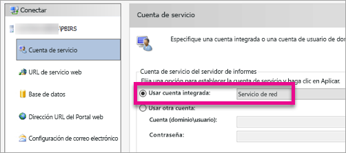
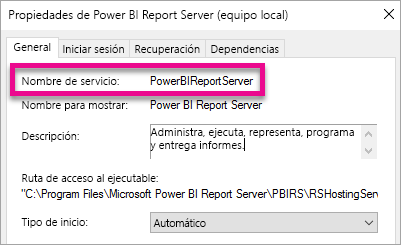

# Instalar Power BI Report Server

Aprenda a instalar un servidor de informes de Power BI.

## Descargar Power BI Report Server

En la página [Generación local de informes con Power BI Report Server](https://powerbi.microsoft.com/report-server/), seleccione **Descargar evaluación gratuita**.

Cuando ejecute el archivo PowerBIReportServer.exe, seleccione la evaluación gratuita o escriba la clave del producto. Siga leyendo para más información.

## Antes de la instalación

Antes de instalar Power BI Report Server, se recomienda que revise el tema [Requisitos de hardware y software para instalar el servidor de informes de Power BI](system-requirements.md).

 > [!IMPORTANT]
 > Aunque puede instalar Power BI Report Server en un entorno que tenga un controlador de dominio de solo lectura (RODC), este servicio necesita acceso a un controlador de dominio de lectura y escritura para funcionar correctamente. Si Power BI Report Server solo tiene acceso a un RODC, pueden producirse errores al intentar administrar el servicio.

### Clave de producto del servidor de informes de Power BI

Puede obtener la clave de producto de Power BI Report Server de dos orígenes diferentes:

- Power BI Premium
- Software Assurance (SA) de SQL Server Enterprise

Siga leyendo para más información.

#### Power BI Premium

Si ha comprado Power BI Premium, en la pestaña **Configuración de Premium** del portal de administración de Power BI, tiene acceso a la clave de producto de Power BI Report Server. El portal de administración solo está disponible para los administradores globales o los usuarios a quienes se les haya asignado el rol de administrador del servicio Power BI.

Al seleccionar **Clave de Power BI Report Server**, se muestra un cuadro de diálogo con la clave de producto. Puede copiarla y usarla en la instalación.

#### Software Assurance (SA) de SQL Server Enterprise

Si tiene un contrato de SA de SQL Server Enterprise, puede obtener la clave de producto en el [Centro de servicios de licencias por volumen](https://www.microsoft.com/Licensing/servicecenter/).

## Instalación del servidor de informes

Instalar Power BI Report Server es muy fácil. Solo hay que seguir unos pocos pasos para instalar los archivos.

No es necesario tener un servidor de motor de base de datos de SQL Server disponible en el momento de la instalación. Necesitará uno para configurar Reporting Services después de la instalación.

1. Busque la ubicación de PowerBIReportServer.exe e inicie el instalador.

2. Seleccione **Install Power BI Report Server** (Instalar servidor de informes de Power BI).

    
3. Elija una edición para instalar y seleccione **Siguiente**.

    

    Puede elegir las ediciones Evaluation o Developer.

    

    En caso contrario, escriba la clave de producto que obtuvo en el servicio Power BI o en el Centro de servicio de licencias por volumen. Para más información sobre cómo conseguir la clave de producto, consulte la sección anterior [Antes de la instalación](#before-you-install).
4. Lee y acepte los términos y condiciones de la licencia y seleccione **Siguiente**.

    
5. Debe tener un motor de base de datos disponible para almacenar la base de datos del servidor de informes. Seleccione **Siguiente** para instalar solo el servidor de informes.

    
6. Especifique la ubicación de instalación del servidor de informes. Seleccione **Instalar** para continuar.

    

    La ruta predeterminada es C:\Archivos de programa\Microsoft Power BI Report Server.

7. Después de una instalación correcta, seleccione **Configure Report Server** (Configurar servidor de informes) para iniciar el Administrador de configuración de Reporting Services.

    

## Configuración del servidor de informes

Después de seleccionar **Configurar el servidor de informes** en el programa de instalación, aparece el Administrador de configuración de Reporting Services. Para más información, consulte [Reporting Services Configuration Manager](https://docs.microsoft.com/sql/reporting-services/install-windows/reporting-services-configuration-manager-native-mode) (Administrador de configuración de Reporting Services).

Para completar la configuración inicial de Reporting Services, tendrá que [crear una base de datos de servidor de informes](https://docs.microsoft.com/sql/reporting-services/install-windows/ssrs-report-server-create-a-report-server-database). Se necesita un servidor de base de datos de SQL Server para completar este paso.

### Crear una base de datos en un servidor diferente

Si va a crear la base de datos del servidor de informes en un servidor de base de datos de otro equipo, cambie la cuenta de servicio del primero por una credencial que se reconozca en el segundo. 

De forma predeterminada, el servidor de informes usa la cuenta de servicio virtual. Si intenta crear una base de datos en un servidor diferente, es posible que reciba el siguiente error en el paso de aplicación de derechos de conexión.

`System.Data.SqlClient.SqlException (0x80131904): Windows NT user or group '(null)' not found. Check the name again.`

Para solucionar el error, puede cambiar la cuenta de servicio a Servicio de red o a una cuenta de dominio. Al cambiar la cuenta de servicio a Servicio de red, se aplican derechos en el contexto de la cuenta de la máquina del servidor de informes.

Para más información, consulte [Configure the report server service account](https://docs.microsoft.com/sql/reporting-services/install-windows/configure-the-report-server-service-account-ssrs-configuration-manager) (Configurar la cuenta de servicio del servidor de informes).

## Servicio de Windows

Se crea un servicio de Windows como parte de la instalación. Se muestra como **Servidor de informes de Power BI**. El nombre del servicio es **PowerBIReportServer**.

## Reservas de dirección URL predeterminadas

Las reservas de dirección URL están compuestas por un prefijo, el nombre de host, el puerto y el directorio virtual:

| Parte | Descripción |
| --- | --- |
| Prefijo |El prefijo predeterminado es HTTP. Si instaló antes un certificado de Capa de sockets seguros (SSL), el programa de instalación intenta crear reservas de dirección URL que usan el prefijo HTTPS. |
| Nombre de host |El nombre de host predeterminado es un carácter comodín seguro (+). Especifica que el servidor de informes acepta cualquier solicitud HTTP en el puerto designado para cualquier nombre de host que se resuelva en el equipo, lo que incluye `https://<computername>/reportserver`, `https://localhost/reportserver` o `https://<IPAddress>/reportserver.` |
| Puerto |El puerto predeterminado es 80. Si usa cualquier otro puerto, tiene que agregarlo explícitamente a la dirección URL al abrir el portal web en una ventana del explorador. |
| Directorio virtual |De forma predeterminada, los directorios virtuales se crean en el formato de servidor de informes para el servicio web del servidor de informes y de informes para el portal web. Para el servicio web del servidor de informes, el directorio virtual predeterminado es **reportserver**. Para el portal web, el directorio virtual predeterminado es **reports**. |

Un ejemplo de cadena de dirección URL completa podría ser la siguiente:

* `https://+:80/reportserver`, proporciona acceso al servidor de informes.
* `https://+:80/reports`, proporciona acceso al portal web.

## Firewall

Si va a acceder al servidor de informes desde un equipo remoto, asegúrese de haber configurado las reglas de firewall, si hay uno presente.

Abra el puerto TCP que haya configurado para la dirección URL del servicio web y la del portal web. De forma predeterminada, se configuran en el puerto TCP 80.

## Configuración adicional

* Para configurar la integración con el servicio Power BI, de modo que pueda anclar elementos de informe a un panel de Power BI, consulte el artículo sobre la [integración con el servicio Power BI](https://docs.microsoft.com/sql/reporting-services/install-windows/power-bi-report-server-integration-configuration-manager).
* Para configurar el correo electrónico para el procesamiento de suscripciones, consulte los artículos sobre la [configuración de correo electrónico](https://docs.microsoft.com/sql/reporting-services/install-windows/e-mail-settings-reporting-services-native-mode-configuration-manager) y la [entrega de correo electrónico en un servidor de informes](https://docs.microsoft.com/sql/reporting-services/subscriptions/e-mail-delivery-in-reporting-services).
* Para configurar el portal web para poder acceder a él en un equipo de informes a fin de ver y administrar informes, consulte [Configure a firewall for report server access](https://docs.microsoft.com/sql/reporting-services/report-server/configure-a-firewall-for-report-server-access) (Configurar un firewall para el acceso al servidor de informes) y [Configure a report server for remote administration](https://docs.microsoft.com/sql/reporting-services/report-server/configure-a-report-server-for-remote-administration) (Configurar un servidor de informes para la administración remota).
* Para obtener detalles sobre cómo establecer las propiedades del sistema del servidor de informes en SQL Server Management Studio, consulte [Propiedades del servidor (página Opciones avanzadas)](https://docs.microsoft.com/sql/reporting-services/tools/server-properties-advanced-page-reporting-services). A menos que especifique lo contrario, las opciones se aplican tanto a Power BI Report Server como a SQL Server Reporting Services.

## Pasos siguientes

[Información general de administrador](admin-handbook-overview.md)  
[Ubicación de la clave de producto del servidor de informes](find-product-key.md)  
[Instalar Power BI Desktop optimizado para el servidor de informes de Power BI](install-powerbi-desktop.md)  
[Verify a Reporting Services Installation](https://docs.microsoft.com/sql/reporting-services/install-windows/verify-a-reporting-services-installation) (Comprobar una instalación de Reporting Services)  
[Configure the report server service account](https://docs.microsoft.com/sql/reporting-services/install-windows/configure-the-report-server-service-account-ssrs-configuration-manager) (Configurar la cuenta de servicio del servidor de informes)  
[Configure report server URLs](https://docs.microsoft.com/sql/reporting-services/install-windows/configure-report-server-urls-ssrs-configuration-manager) (Configurar direcciones URL del servidor de informes)  
[Configure a report server database connection](https://docs.microsoft.com/sql/reporting-services/install-windows/configure-a-report-server-database-connection-ssrs-configuration-manager) (Configurar una conexión de base de datos del servidor de informes)  
[Inicializar un servidor de informes](https://docs.microsoft.com/sql/reporting-services/install-windows/ssrs-encryption-keys-initialize-a-report-server)  
[Configurar conexiones SSL en un servidor de informes](https://docs.microsoft.com/sql/reporting-services/security/configure-ssl-connections-on-a-native-mode-report-server)  
[Configure windows service accounts and permissions](https://docs.microsoft.com/sql/database-engine/configure-windows/configure-windows-service-accounts-and-permissions) (Configurar permisos y cuentas del servicio de Windows)  
[Compatibilidad del explorador con el servidor de informes de Power BI](browser-support.md)

¿Tiene más preguntas? [Pruebe a preguntar a la comunidad de Power BI](https://community.powerbi.com/)