# <a name="quickstart-embed-a-power-bi-report-server-report-using-an-iframe-in-sharepoint-server"></a>Inicio rápido: Inserción de un informe de Power BI Report Server con un elemento iFrame en SharePoint Server

En este inicio rápido obtendrá información sobre cómo insertar un informe de Power BI Report Server mediante el uso de un elemento iFrame en una página de SharePoint. Si trabaja con SharePoint Online, Power BI Report Server debe ser de acceso público. En SharePoint Online, el elemento web de Power BI que funciona con el servicio Power BI no funcionará con Power BI Report Server. 

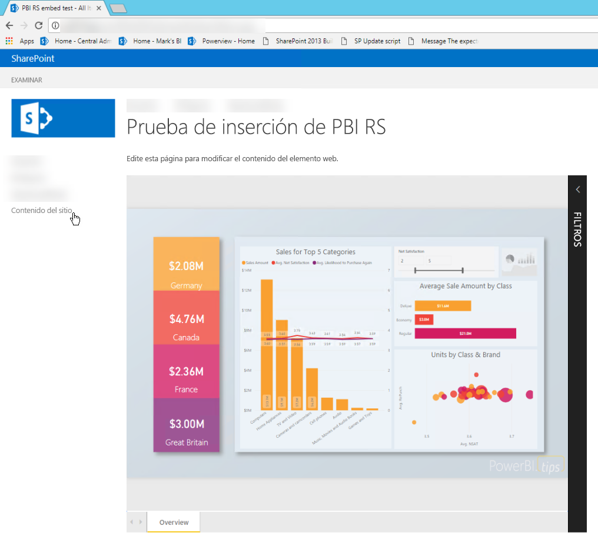
## <a name="prerequisites"></a>Requisitos previos
* Debe tener [Power BI Report Server](https://powerbi.microsoft.com/en-us/report-server/) instalado y configurado.
* Necesitará tener instalado [Power BI Desktop optimizado para Power BI Report Server](install-powerbi-desktop.md).
* Debe tener un entorno de [SharePoint](https://docs.microsoft.com/en-us/sharepoint/install/install) instalado y configurado.

## <a name="creating-the-power-bi-report-server-report-url"></a>Creación de la dirección URL del informe de Power BI Report Server

1. Descargue el ejemplo de GitHub: [demostración de blog](https://github.com/Microsoft/powerbi-desktop-samples).

    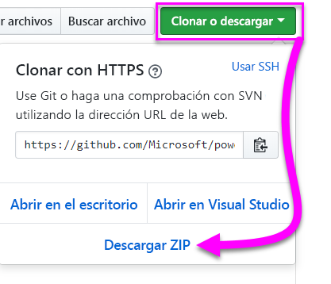

2. Abra el archivo PBIX de ejemplo desde GitHub en **Power BI Desktop optimizado para Power BI Report Server**.

    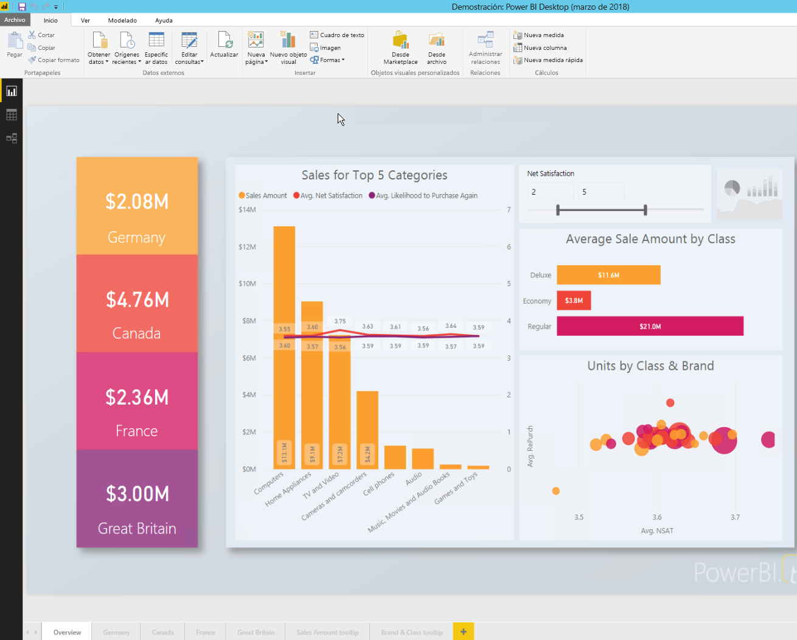

3. Guarde el informe en **Power BI Report Server**. 

    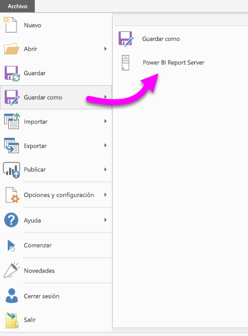

4. Vea el informe en el **portal web**.

    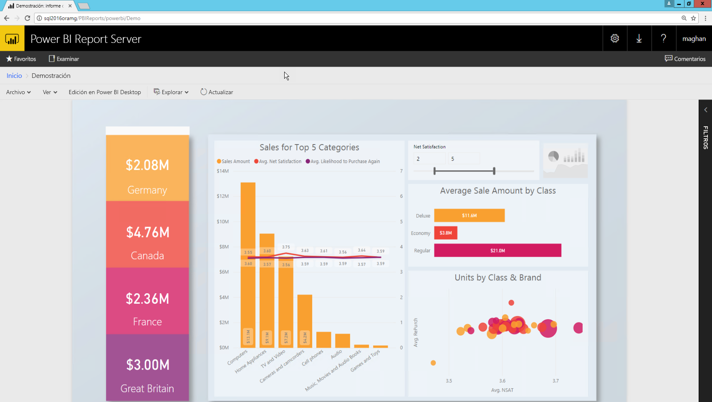

### <a name="capturing-the-url-parameter"></a>Captura del parámetro de dirección URL

Cuando tenga la dirección URL, puede crear un iFrame en una página de SharePoint para hospedar el informe. Para cualquier dirección URL de informes de Power BI Report Server, puede agregar un parámetro de cadena de consulta de `?rs:embed=true` para insertar el informe en un elemento iFrame. 

   Por ejemplo:
    ``` 
    http://myserver/reports/powerbi/Sales?rs:embed=true
    ```
## <a name="embedding-a-power-bi-report-server-report-in-a-sharepoint-iframe"></a>Inserción de un informe de Power BI Report Server con un elemento iFrame en SharePoint

1. Vaya a la página **Contenidos del sitio** de SharePoint.

    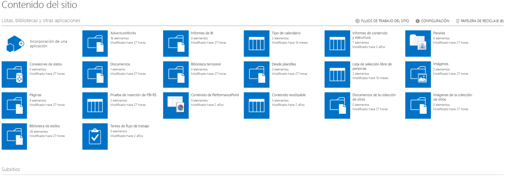

2. Elija la página donde desea agregar el informe.

    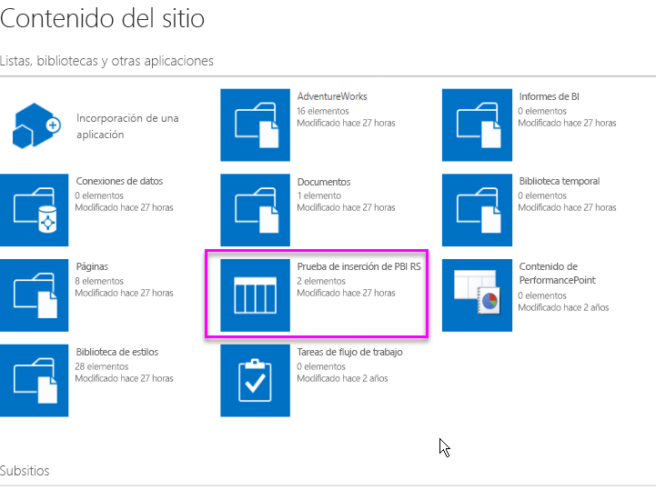

3. Seleccione el icono de engranaje en la parte superior derecha y seleccione **Editar página**.

    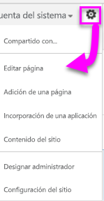

4. Seleccione **Agregar elemento web**.

    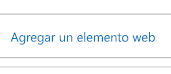

5. En **Categorías**, seleccione **Medios y contenido**, en **Elementos**, seleccione **Editor de contenido** y, a continuación, seleccione **Agregar**.

    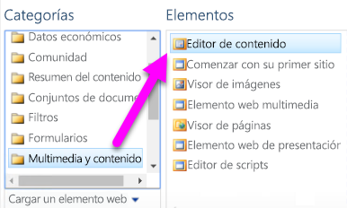 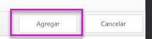

6. Seleccione **Click here to add new content** (Haga clic aquí para agregar contenido nuevo).

    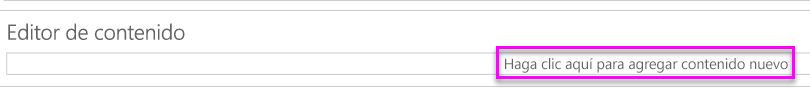

7. En la cinta de opciones, seleccione la pestaña **Aplicar formato al texto** y luego seleccione **Editar origen**.

     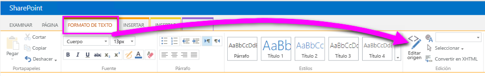

8. En la ventana Editar origen, pegue el código del elemento iFrame y seleccione Aceptar.

    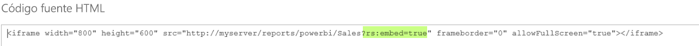

     Por ejemplo:
     ```
     <iframe width="800" height="600" src="http://myserver/reports/powerbi/Sales?rs:embed=true" frameborder="0" allowFullScreen="true"></iframe>
     ```

9. En la cinta de opciones, seleccione la pestaña **Página** y luego seleccione **Detener la edición**.

    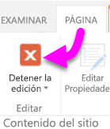

10. Ahora debería ver el informe en la página.

    

## <a name="next-steps"></a>Pasos siguientes

[Inicio rápido: Creación de un informe de Power BI para el servidor de informes de Power BI](quickstart-create-powerbi-report.md)  
[Inicio rápido: Creación de un informe paginado para el servidor de informes de Power BI](quickstart-create-paginated-report.md)  

¿Tiene más preguntas? [Pruebe a preguntar a la comunidad de Power BI](https://community.powerbi.com/) 