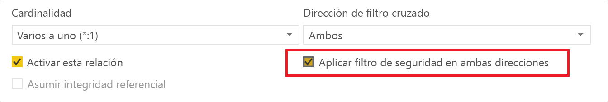
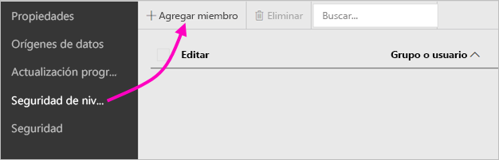
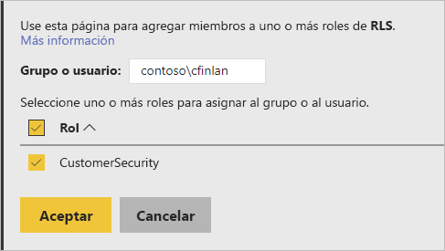
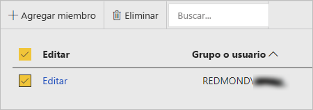

# Seguridad de nivel de fila (RLS) en Power BI Report Server

La configuración de Seguridad de nivel de fila (RLS) en Power BI Report Server puede provocar la restricción del acceso a los datos para determinados usuarios. Los filtros restringen el acceso a los datos en el nivel de fila y se pueden definir en roles.  Si usa los permisos predeterminados de Power BI Report Server, cualquier usuario que tenga permisos de publicador o administrador de contenido en el informe de Power BI podrá asignar miembros a los roles del informe en cuestión.    

Puede configurar RLS para los informes que se han importado en Power BI con Power BI Desktop. También puede configurar RLS en los informes que usan DirectQuery, como SQL Server.  Tenga en cuenta que RLS no se respetará si su conexión DirectQuery usa la autenticación integrada para lectores de informes. En el caso de las conexiones dinámicas de Analysis Services, puede configurar Seguridad de nivel de fila en el modelo local. La opción de seguridad no se muestra para conjuntos de datos de conexión dinámica. 

[!INCLUDE [rls-desktop-define-roles](../includes/rls-desktop-define-roles.md)]

## Filtrado cruzado bidireccional

De forma predeterminada, el filtrado de Seguridad de nivel de fila se lleva a cabo mediante filtros unidireccionales, independientemente de si las relaciones se establecen de forma unidireccional o bidireccional. Puede habilitar manualmente un filtro cruzado bidireccional con Seguridad de nivel de fila.

- Seleccione la relación y marque la casilla de verificación  **Aplicar filtro de seguridad en ambas direcciones** . 

    

Active esta casilla al implementar  [Seguridad de nivel de fila dinámica](https://docs.microsoft.com/sql/analysis-services/supplemental-lesson-implement-dynamic-security-by-using-row-filters) en función del nombre de usuario o el Id. de inicio de sesión. 

Para obtener más información, vea las notas del producto [Filtrado cruzado bidireccional con DirectQuery en Power BI Desktop](../desktop-bidirectional-filtering.md) y [Protección del modelo semántico tabular de BI](http://download.microsoft.com/download/D/2/0/D20E1C5F-72EA-4505-9F26-FEF9550EFD44/Securing%20the%20Tabular%20BI%20Semantic%20Model.docx).

[!INCLUDE [rls-desktop-view-as-roles](../includes/rls-desktop-view-as-roles.md)]

## Adición de miembros a roles 

Después de guardar el informe en Power BI Report Server, puede administrar la seguridad o agregar o quitar miembros del servidor. Solo los usuarios con permisos de publicador o administrador de contenido para el informe tienen la opción de Seguridad de nivel de fila disponible y sin sombrear.

 Si el informe no tiene los roles necesarios, deberá abrirlo en Power BI Desktop, agregar o modificar los roles y volver a guardarlo en Power BI Report Server. 

1. En Power BI Desktop, guarde el informe en Power BI Report Server. Deberá usar la versión de Power BI Desktop optimizada para Power BI Report Server.
2. En Power BI Report Service, seleccione los puntos suspensivos (**…**) junto al informe. 

3. Seleccione **Administrar** > **Seguridad de nivel de fila**. 

     

    En la página **Seguridad de nivel de fila**, puede agregar miembros a un rol que haya creado en Power BI Desktop.

5. Para agregar un miembro, seleccione **Agregar miembro**.

1. Escriba el usuario o grupo en el cuadro de texto en el formato de nombre de usuario (DOMINIO\usuario) y seleccione los roles que quiera asignarles. Este miembro tiene que estar dentro de su organización.   

    

    Según cómo haya configurado Active Directory, también podrá escribir el nombre principal de usuario. En ese caso, el servidor de informes mostrará el nombre de usuario correspondiente en la lista.

1. Haga clic en **Aceptar** para aplicarlo.   

8. Para quitar miembros, marque la casilla situada junto a sus nombres y seleccione **Eliminar**.  Puede eliminar varios miembros al mismo tiempo. 

    

## username() y userprincipalname()

Puede aprovechar las ventajas de las funciones DAX username() o userprincipalname() dentro del conjunto de datos. Puede usarlas dentro de expresiones en Power BI Desktop. Al publicar el modelo, Power BI Report Server las usará.

En Power BI Desktop, username() devolverá un usuario con el formato de DOMINIO\Usuario y userprincipalname() lo devolverá con el formato de user@contoso.com.

En Power BI Report Server, tanto username() y como userprincipalname() devuelven el nombre principal de usuario (UPN) del usuario, con un aspecto similar al de la dirección de correo electrónico.

Si usa la autenticación personalizada en Power BI Report Server, se devolverá el formato de nombre de usuario que haya configurado para los usuarios.  

## Limitaciones 

Estas son las limitaciones actuales para Seguridad de nivel de fila en los modelos de Power BI. 

Los usuarios que hayan elegido que los informes usen la función DAX username() podrán observar un comportamiento diferente; ahora, se devolverá el nombre principal de usuario (UPN), excepto al usar DirectQuery con la seguridad integrada.  Puesto que en este escenario no se respeta RLS, el comportamiento será el mismo.

Solo puede definir RLS en conjuntos de datos creados con Power BI Desktop. Para habilitar RLS en conjuntos de datos creados con Excel, debe convertir primero los archivos en archivos de Power BI Desktop (PBIX). Obtenga más información sobre la [conversión de archivos de Excel](../desktop-import-excel-workbooks.md).

Solo se admiten las conexiones Extract, Transform, Load (ETL) y DirectQuery que usen credenciales almacenadas. Las conexiones dinámicas con Analysis Services y las conexiones DirectQuery que usen la autenticación integrada se gestionarán en el origen de datos subyacente. 

Si usa la seguridad integrada con DirectQuery, es posible que sus usuarios observen que:
- La característica RLS está inhabilitada y se devuelven todos los datos.
- Los usuarios no pueden actualizar sus asignaciones de roles y reciben un error en la página Administrar RLS.
- En el caso de la función DAX de nombre de usuario, continuará recibiendo el nombre de usuario como DOMINIO\usuario. 

Los autores de informes no tendrán acceso para ver los datos del informe en Power BI Report Server hasta que se asignen algún rol según corresponda tras cargar el informe. 

 

## PREGUNTAS MÁS FRECUENTES 

### ¿Puedo crear estos roles para orígenes de datos de Analysis Services? 

Puede hacerlo si importa los datos a Power BI Desktop. Si usa una conexión dinámica, no podrá configurar RLS en el servicio Power BI. RLS se define en el modelo local de Analysis Services. 

### ¿Puedo usar RLS para limitar las columnas o medidas accesibles por mis usuarios? 

No. Si un usuario tiene acceso a una fila de datos determinada, ese usuario puede ver todas las columnas de datos de esa fila. 

### ¿Permite RLS ocultar datos detallados pero dar acceso a datos resumidos en objetos visuales? 

No, aunque proteja las filas de datos individuales, los usuarios siempre pueden ver los detalles o los datos resumidos. 

### ¿Puedo agregar nuevos roles en Power BI Desktop si ya tengo roles existentes y miembros asignados? 

Sí, si ya tiene definidos roles existentes y miembros asignados en Power BI Report Server, podrá realizar roles adicionales y volver a publicar el informe sin que ello afecte a las asignaciones actuales. 
 

## Pasos siguientes

[¿Qué es Power BI Report Server?](get-started.md) 
[Información general de administrador](admin-handbook-overview.md)  

¿Tiene más preguntas? [Pruebe a preguntar a la comunidad de Power BI](https://community.powerbi.com/)