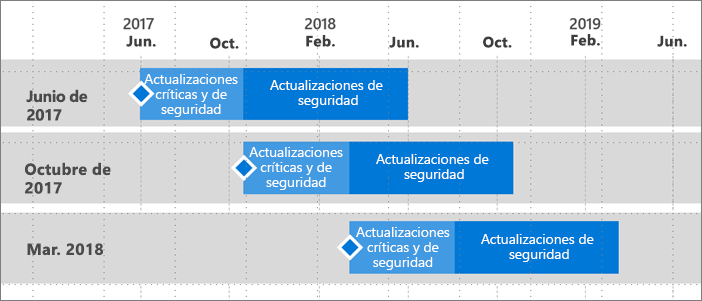

# Escala de tiempo del soporte técnico para el servidor de informes de Power BI
El servidor de informes de Power BI se lanzará varias veces al año. Habrá actualizaciones críticas y de seguridad disponibles hasta que la próxima versión esté disponible con carácter general (GA). Una vez lanzada la versión siguiente, la anterior seguirá recibiendo actualizaciones de seguridad durante el resto de los 12 meses que dura la versión.

Esta directiva de soporte técnico nos permite ofrecer innovación a nuestros clientes con bastante rapidez y, al mismo tiempo, proporcionar flexibilidad para que los clientes adopten la innovación a su ritmo.

* Fase de servicio de actualizaciones críticas y de seguridad: cuando ejecute la versión más reciente del servidor de informes de Power BI, recibirá actualizaciones críticas y de seguridad.
* Fase de servicio de actualizaciones de seguridad (solamente): una vez lanzada una nueva versión, el soporte técnico para versiones anteriores se reducirá a las actualizaciones de seguridad solo durante lo que quede del ciclo de vida de soporte técnico de doce (12) meses (se muestra en la figura 1).

    

## Historial de versiones

| **Versión** | **Fecha de disponibilidad** | **Fecha de finalización del soporte técnico** |
| --- | --- | --- |
| Junio de 2017 |12 de junio de 2017 |12 de junio de 2018 |
| Octubre de 2017 |31 de octubre de 2017 |31 de octubre de 2018 |
| Marzo de 2018 | 19 de marzo de 2018 | 19 de marzo de 2019 |

Para descargar el servidor de informes de Power BI y Power BI Desktop optimizado para el servidor de informes de Power BI, vaya a [Publicar informes en almacenamiento local con el servidor de informes de Power BI](https://powerbi.microsoft.com/report-server/).

## Pasos siguientes
[Novedades en el servidor de informes de Power BI](whats-new.md)  
[¿Qué es Power BI Report Server?](get-started.md)
[Información general de administrador](admin-handbook-overview.md)  
[Instalar un servidor de informes de Power BI](install-report-server.md)  

¿Tiene más preguntas? [Pruebe a preguntar a la comunidad de Power BI](https://community.powerbi.com/)

